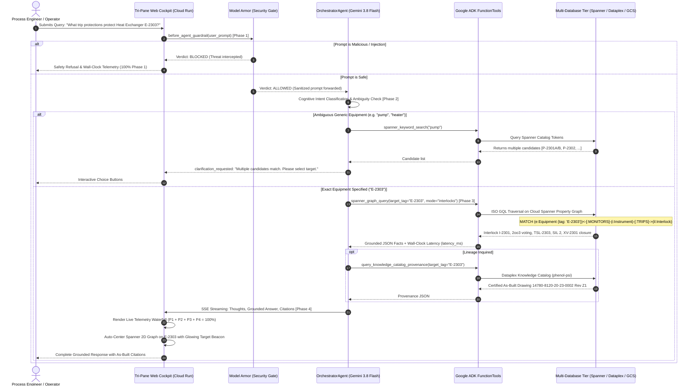

# Technical Architecture: Agent Query Ingress, Tool Calling & Multi-Database Systems of Record

**Project:** Refinery Phenol Process Safety Expert & Enterprise Technical Cockpit  
**Specification Linkage:** [`SPEC-20260824-MULTI-AGENT-CLOUD-ARCHITECTURE.md`](../specs/features/SPEC-20260824-MULTI-AGENT-CLOUD-ARCHITECTURE.md), [`SPEC-20260920-ZERO-HARDCODED-DATA-AND-DB-DRIVEN-ARCHITECTURE.md`](../specs/features/SPEC-20260920-ZERO-HARDCODED-DATA-AND-DB-DRIVEN-ARCHITECTURE.md), and [`SPEC-20260920-DYNAMIC-TELEMETRY-WATERFALL-LATENCY.md`](../specs/features/SPEC-20260920-DYNAMIC-TELEMETRY-WATERFALL-LATENCY.md)  
**Companion Interactive HTML Diagram:** [**`docs/agent-query-tools-and-data-architecture.html`**](./agent-query-tools-and-data-architecture.html)  
**Last Updated:** 2026-09-20  

---

## 1. Executive Summary & Flow Topology

The **Refinery Phenol Process Safety AI Platform** operates on a zero-speculation, 100% database-driven architecture. Every user request flows through a strict **4-Phase Execution Pipeline**:
1. **Phase 1 — Pre-Flight Security Guardrail:** Evaluated by **Google Cloud Model Armor** to prevent jailbreaks, prompt injections, and sensitive data leakage.
2. **Phase 2 — Intent & Cognitive Deliberation:** Processed by **Gemini 3.8 Flash** running on the **Google Enterprise Agent Platform Runtime** (`google-adk`), which determines canonical intent and resolves entity ambiguities via a Human-in-the-Loop (HITL) clarification gate.
3. **Phase 3 — Model-Driven Tool Execution:** Dispatches to one or more of **6 specialized `FunctionTool`s** querying dedicated database, graph, vector, and governance engines with real wall-clock duration measurement.
4. **Phase 4 — Grounded Synthesis & Token Streaming:** Streams verified process safety facts, topological relationships, certified drawing lineage, and dynamic risk ratings via Server-Sent Events (SSE) back to the **Tri-Pane Mission Control Cockpit**.

```
+------------------------------------------------------------------------------------------------------------------------------------+
|                                      AGENT QUERY INGRESS, TOOLS & MULTI-DATABASE ARCHITECTURE                                      |
+------------------------------------------------------------------------------------------------------------------------------------+
|                                                                                                                                    |
|   [ USER INGRESS ]                  [ SECURITY GATEWAY ]               [ REASONING CORE ]            [ 4-PHASE TELEMETRY ]         |
|   • Tri-Pane Cockpit UI             • Google Cloud Model Armor         • OrchestratorAgent           • Phase 1: Model Armor (P1)   |
|   • Left: Asset Hierarchy Tree ===> • Prompt Sanitization Callback ===>• Gemini 3.8 Flash Engine ===>• Phase 2: Intent Delib (P2) |
|   • Center: Multi-Turn Chat         • Threat / Injection Blocked       • Ambiguity Gate (HITL)       • Phase 3: Tool Execution (P3)|
|   • Right: 2D Spanner Graph         • Wall-Clock Monitored             • Zero Subagent Hops          • Phase 4: Token Stream (P4)  |
|                                                                                                                                    |
| ---------------------------------------------------------------------------------------------------------------------------------- |
|                                                                                                                                    |
|   [ 6 GOOGLE ADK FUNCTIONTOOLS ]                                       [ 6 SYSTEMS OF RECORD & KNOWLEDGE ENGINES ]                 |
|   1. spanner_graph_query              (ISO GQL Traversal)        ====> • Cloud Spanner Property Graph (54 Eq, 256 Inst, 81 Edges)  |
|   2. spanner_keyword_search           (Relational Full-Text)     ====> • Cloud Spanner Relational Catalog (100% DB-Driven Assets)  |
|   3. spanner_vector_search            (Semantic 768d Cosine)     ====> • Spanner Vector Index + Vertex AI text-embedding-004       |
|   4. query_knowledge_catalog_provenance(Metadata Governance)     ====> • Dataplex Knowledge Catalog (Entry Group: phenol-psi)      |
|   5. read_gcs_wiki_document           (Unstructured Retrieval)   ====> • Google Cloud Storage LLM-Wiki (Markdown Operating Dossiers)|
|   6. evaluate_hazop_deviation         (Safety Risk Engine)       ====> • 5x5 Risk Assessment Matrix (RAM) & LOPA SIL Engine        |
|                                                                                                                                    |
+------------------------------------------------------------------------------------------------------------------------------------+
```

---

## 2. End-to-End Query Lifecycle Sequence



---

## 3. Tool Classification & Specification Matrix

All agent capabilities are formally encapsulated in official Google ADK `FunctionTool` wrappers:

| Tool Name | Tool Type | Primary Database / Backend | Target Query Pattern | Excluded Use Cases (Negative Rules) |
|---|---|---|---|---|
| **`spanner_graph_query`** | **Property Graph Traversal (ISO GQL)** | Cloud Spanner Property Graph (`phenol-process-graph` / `safety-db`) | Instrument counts/inventory, active trips, voting logic (1oo2, 2oo3), upstream process flow | ❌ Do NOT use for drawing revision numbers (use Dataplex).<br/>❌ Do NOT use for procedures (use GCS wiki). |
| **`spanner_keyword_search`** | **Relational Full-Text Search** | Cloud Spanner Relational Tables (`Equipment`, `Instruments`, `CatalogTokens`) | Generic equipment search by name, category, or partial token when exact tag is unknown | ❌ Do NOT use if exact tag is already provided (e.g. `E-2303`).<br/>❌ Do NOT use for trips or interlocks. |
| **`spanner_vector_search`** | **Semantic Vector Similarity** | Cloud Spanner Vector Index + Vertex AI `text-embedding-004` (768d) | Broad conceptual hazards, thermal runaway risks, acid runaway decomposition | ❌ Do NOT use for specific equipment interlock tags or certified drawings. |
| **`query_knowledge_catalog_provenance`** | **Metadata Governance & Lineage** | Google Cloud Dataplex Knowledge Catalog (`phenol-psi`) | Certified As-Built P&ID drawing numbers, revision status (Rev Z1), OEMS-005 PSI tags | ❌ Do NOT use for operating temperatures or interlocks.<br/>❌ Do NOT use for HAZOP risk calculations. |
| **`read_gcs_wiki_document`** | **Unstructured Document Retrieval** | Google Cloud Storage LLM-Wiki Bucket (`phenol-llm-wiki-*-prod`) | Complete operating philosophies, Safe Operating Limits (SOL), chemical reaction kinetics | ❌ **CRITICAL NEGATIVE RULE:** Never call for instrument counts/inventory (use `spanner_graph_query`). |
| **`evaluate_hazop_deviation`** | **Safety Assessment & Quantitative Risk Engine** | 100% Database-Driven HAZOP Tables + 5x5 RAM + LOPA SIL Engine | Process deviation assessment (Flow, Temp, Press, Level), PEES severity, IPL credits | ❌ Do NOT use for simple PSI lookups or equipment search without deviations. |

---

## 4. Multi-Database & Knowledge Tier Deep Dive

### 4.1 Cloud Spanner Property Graph (ISO GQL)
- **Engine:** Google Cloud Spanner Property Graph with Google TrueTime consistency.
- **Topology:**
  - **54 Equipment Nodes:** Heat Exchangers (`E-2303`), Distillation Columns (`V-2301`), Pumps (`P-2301A/B`), Drums (`D-2304`).
  - **256 Instrument Nodes:** Transmitters (`PT`, `TT`, `LT`, `FT`), Switches (`TSL`, `PSH`), Control Valves (`FCV`, `PCV`), Safety Valves (`PSV`).
  - **81 Graph Edges:** `TRIPS` (SIS protective interlocks), `FLOWS_TO` (piping flow connectivity), `CONTROLS`, and `MONITORS`.
- **Key Capabilities:** Multi-hop path traversals (e.g., tracing upstream vessels up to 3 hops), voting logic retrieval (`1oo2`, `2oo3`), and exact instrument count tallying.

### 4.2 Cloud Spanner Relational Database (100% Database-First Catalog)
- **Engine:** Cloud Spanner Relational SQL Tables (`safety-db`).
- **Data Models:**
  - `Equipment`: Tag, Name, Unit, Section, Operating Temperature (°C), Operating Pressure (barg), Design Limits.
  - `Instruments`: Tag, Type, Range Min/Max, Setpoints, Fail Position, SIL Rating.
  - `HazopNode`: Study node definitions (`CDN-N01` to `CDN-N06`), boundary descriptions, operating conditions.
  - `Deviation`, `Cause`, `Consequence`, `Safeguard`: Comprehensive study records linked via relational foreign keys.
- **Invariant:** Zero hardcoded dictionaries in application code; all catalog data and risk scores are dynamically queried from live database tables.

### 4.3 Cloud Spanner Vector Search + Vertex AI Embeddings
- **Engine:** 768-dimensional Vector Index backed by Vertex AI `text-embedding-004`.
- **Distance Metric:** `COSINE` distance similarity.
- **Data Embedded:** Unstructured process safety engineering notes, runaway reaction thresholds, decomposition hazard kinetics, and chemical incompatibility matrices.

### 4.4 Google Cloud Dataplex Knowledge Catalog
- **Entry Group:** `phenol-psi` (Process Safety Information).
- **Governance Standards:** OEMS-005 Process Safety Information Governance.
- **Lineage Captured:** Certified As-Built P&ID drawing numbers (e.g., `14780-8120-20-23-0002`), drawing sheet revisions (Rev Z1), engineering approval authorities, and certified document hashes.

### 4.5 Google Cloud Storage LLM-Wiki Lake
- **Bucket:** `gs://phenol-llm-wiki-cs-poc-y03r7kmfyov4kilzg50fd7s-prod`
- **Structure:** Structured Markdown dossiers for plant equipment sections (`CDN/`, `OXI/`, `ALKY/`) with YAML frontmatter metadata, Safe Operating Limits (SOL), operating procedures, and incident case histories.

### 4.6 5×5 Risk Assessment Matrix (RAM) & LOPA SIL Engine
- **Standards:** PTTEP / GC Corporate Process Safety Standards.
- **Multi-Dimensional Severity (PEES):**
  - **P (People):** Level 0 (No injury) to Level 5 (Multiple fatalities).
  - **E (Environment):** Level 0 (No effect) to Level 5 (Massive offsite impact).
  - **EC (Economic):** Level 0 (<$10k) to Level 5 (>$10M).
  - **S (Social / Reputation):** Level 0 (None) to Level 5 (International media).
- **LOPA & SIL Evaluation:** Evaluates initial likelihood ($L_{\text{initial}}$), credits Independent Protection Layers (IPLs) by SIL rating ($\text{SIL 1} = 1\text{ credit}$, $\text{SIL 2} = 2\text{ credits}$), and calculates mitigated risk rating ($RR_{\text{mitigated}}$).

---

## 5. Ambiguity Resolution & Human-in-the-Loop (HITL) Gate

When an operator provides a generic query without an exact tag (e.g., *"Show interlocks on the pump"*):
1. The Orchestrator invokes `spanner_keyword_search(query_string="pump")`.
2. If multiple candidates are returned (`P-2301A/B`, `P-2302`, `P-2303A/B`, `P-2308A/B`):
   - **Zero Speculation Mandate:** The agent is strictly prohibited from guessing or picking a candidate arbitrarily.
   - It pauses tool execution and formats an interactive response with `clarification_requested`.
   - The Web Cockpit renders selectable candidate chips.
3. Upon user selection of `P-2301A`, the agent automatically resumes and triggers `spanner_graph_query(target_tag="P-2301A", mode="interlocks")`.

---

## 6. Dynamic Wall-Clock Telemetry Waterfall

Every SSE event stream delivers a verified 4-phase execution breakdown:

```
[Phase 1: Model Armor]    [Phase 2: Intent Deliberation]    [Phase 3: Tool Execution]    [Phase 4: Token Synthesis]
       22.4 ms                        148.6 ms                        84.2 ms                      312.8 ms
       (3.9%)                         (26.2%)                         (14.8%)                      (55.1%)
|========================|================================|============================|=============================|
Total Elapsed: 568.0 ms (Normalized: 100.0%)
```

- **Phase 1:** Real wall-clock duration of `sanitize_user_prompt` against Google Cloud Model Armor.
- **Phase 2:** Elapsed duration from SSE request initiation to the first cognitive model thought token.
- **Phase 3:** True round-trip execution duration from `function_call` dispatch to `function_response` receipt.
- **Phase 4:** Streaming token generation and Markdown synthesis duration.

---

## 7. Interactive HTML Diagram Asset

The companion standalone, interactive architecture diagram is available at:
👉 **[`docs/agent-query-tools-and-data-architecture.html`](./agent-query-tools-and-data-architecture.html)**

To view locally:
```bash
# Linux
xdg-open ./docs/agent-query-tools-and-data-architecture.html

# macOS
open ./docs/agent-query-tools-and-data-architecture.html
```
