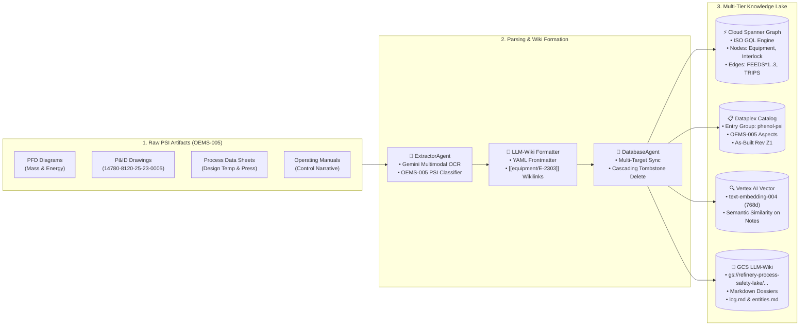
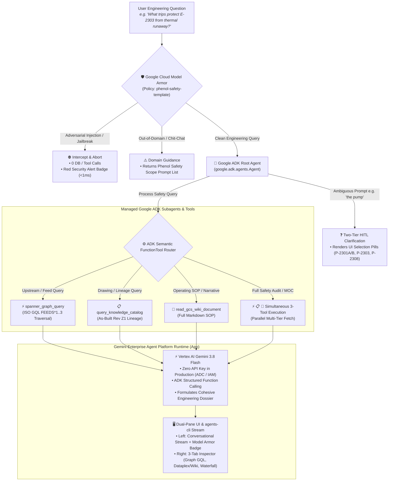

# Technical Architecture: Refinery Phenol Process Safety & Multi-Agent AI Platform

**Project:** Refinery Phenol Process Safety Expert & Enterprise Technical Cockpit  
**Specification Reference:** [`specs/features/SPEC-20260824-MULTI-AGENT-CLOUD-ARCHITECTURE.md`](../specs/features/SPEC-20260824-MULTI-AGENT-CLOUD-ARCHITECTURE.md) & [`specs/features/SPEC-20260918-JOURNEY-1-EXPLORER-REDESIGN.md`](../specs/features/SPEC-20260918-JOURNEY-1-EXPLORER-REDESIGN.md)  
**Companion Interactive HTML Diagram:** [**`docs/architecture.html`**](./architecture.html)  
**Detailed Query & Tools Deep Dive:** [**`docs/agent-query-tools-and-data-architecture.md`**](./agent-query-tools-and-data-architecture.md) ([Interactive HTML](./agent-query-tools-and-data-architecture.html))

---

## �� Executive Overview

The **Refinery Phenol Process Safety Platform** is an enterprise-grade AI system designed for process engineers and safety specialists in petrochemical manufacturing. It unifies high-hazard process safety information (PSI) across **Cumene Oxidation, Concentration, and Cleavage Sections (CDN / OXI / ALKY)**, governed under **OEMS-005** process safety management standards.

```
+-------------------------------------------------------------------------------------------------------------------------+
|                                    REFINERY PHENOL PROCESS SAFETY ARCHITECTURE MAP                                      |
+-------------------------------------------------------------------------------------------------------------------------+
|                                                                                                                         |
|   [ RAW ENGINEERING PSI ]          [ MULTIMODAL PARSING & WIKI ]                 [ 4 STORAGE TIERS ]                    |
|   • PFD Flow Diagrams              • Extractor ADK Agent (OCR)           ======> • Cloud Spanner Graph (ISO GQL)        |
|   • P&ID As-Built Drawings   ===>  • LLM-Wiki Formatter (Frontmatter)    ======> • Dataplex Knowledge Catalog           |
|   • Process Data Sheets            • Database ADK Agent (Spanner Sync)   ======> • Vertex AI Vector Search (Embeddings) |
|   • Operating SOP Manuals                                                ======> • GCS LLM-Wiki Markdown Lake           |
|                                                                                                                         |
| ----------------------------------------------------------------------------------------------------------------------- |
|                                                                                                                         |
|   [ USER & CLI INGRESS ]           [ GOOGLE ADK AGENT RUNTIME ]                  [ 3-TAB DEEP TECHNICAL INSPECTOR ]     |
|   • Mission Control Dual-Pane UI   • Root Orchestrator (google.adk.Agent)        • Tab 1: Spanner Knowledge Graph & GQL |
|   • agents-cli CLI & A2A     ===>  • Model Armor before_agent_callback   ======> • Tab 2: Dataplex Lineage & GCS Wiki   |
|   • Ambiguous Tag Prompts          • Managed ADK Subagents & FunctionTools       • Tab 3: Observability Latency Waterfall|
|   • agents-cli eval & deploy       • Gemini Enterprise Agent Platform Runtime    • Vertex AI Gemini 3.8 Flash (ADC IAM) |
|                                                                                                                         |
+-------------------------------------------------------------------------------------------------------------------------+
```

---

## 1. Raw Engineering Data Ingestion & Multi-Database Storage



### 1.1 Ingestion Flow Details

1. **Document Ingestion & OCR (`ExtractorAgent`):**
   - Ingests native PDFs or scanned raster drawings.
   - Leverages **Gemini Multimodal OCR** to extract tabular data (mass balances, design temperatures, instrument setpoints) and line connectivity.
   - Classifies documents into OEMS-005 categories (`pfd`, `pid`, `data_sheets`, `operating_manuals`, `safeguards`).

2. **LLM-Wiki Formatting (`LLM-Wiki Formatter`):**
   - Converts parsed tabular and unstructured text into standardized **Markdown documents** enriched with YAML frontmatter metadata and bi-directional `[[wikilinks]]`:
   ```markdown
   ---
   entity_type: equipment
   tag: E-2303
   name: Preflash Column Steam Heater
   unit: CDN
   psi_category: 4
   source_drawings: ["14780-8120-25-23-0005_Z1.pdf"]
   ---
   # E-2303: Preflash Column Steam Heater
   Heats bottoms from [[equipment/E-2302A/B]] feeding into [[equipment/V-2301]].
   Active trips: [[interlock/TXSHH-0502A/B]] triggering [[valve/UXV-0501]].
   ```

3. **Multi-Target Atomic Synchronization (`DatabaseAgent`):**
   - The `DatabaseAgent` synchronizes the extracted wiki markdown across all 4 database engines atomically using Google Cloud Spanner **TrueTime**:
     - **Cloud Spanner Graph:** Upserts nodes (`Equipment`, `Unit`, `ChemicalHazard`, `InstrumentInterlock`) and inserts directed property graph edges (`FEEDS`, `PROTECTS`, `TRIPS`, `LOCATED_IN`).
     - **Dataplex Knowledge Catalog:** Creates/updates entries under entry group `phenol-psi`, attaching OEMS-005 metadata aspects and tracking As-Built certification revisions (`Rev Z1`).
     - **Vertex AI Vector Search:** Embeds unstructured text chunks and operating narrative descriptions using `text-embedding-004` (768 dimensions) for semantic retrieval.
     - **Google Cloud Storage (GCS):** Uploads the human- and agent-readable Markdown files to `gs://refinery-process-safety-lake/wiki/` and appends mutation logs to `wiki/log.md`.

---

## 2. Journey 1 Mission Control Cockpit, Security Shield & Synthesis



### 2.1 Dynamic Semantic Tool Gating Rules

The Orchestrator inspects the semantic nature of the query and routes it to the exact required storage systems:

| Query Type | Example Prompt | Tools Dispatched by Retriever | Storage System Queried |
|---|---|---|---|
| **Upstream Feed Topology** | `Show all equipment feeding into Preflash Column V-2301` | `spanner_graph_query` (`mode="upstream"`) + `query_knowledge_catalog_provenance` | **Cloud Spanner Graph** (ISO GQL `FEEDS*1..3` traversal) & **Dataplex** |
| **Drawing Provenance & Lineage** | `Show source drawings and Knowledge Catalog metadata for E-2303` | `query_knowledge_catalog_provenance` | **Dataplex Knowledge Catalog** (OEMS-005 aspects & As-Built Rev Z1) |
| **Operating Procedure / SOP** | `Read the full operating procedure for E-2303 from GCS wiki` | `read_gcs_wiki_document` | **Google Cloud Storage (GCS)** (Markdown wiki reader) |
| **Comprehensive Safety Audit / MOC** | `Perform a full safety audit on Steam Heater E-2303` | `spanner_graph_query` + `query_knowledge_catalog_provenance` + `read_gcs_wiki_document` | **All 3 Storage Tiers Simultaneously in Parallel** |
| **Ambiguous Tag / HITL** | `show me interlocks on the pump` | `ClarificationManager` (No tools initially) | **Interactive UI Clarification Card** (P-2301A/B, P-2303A/B, P-2308A/B) |

---

### 2.2 Production Authentication: Zero Gemini API Key Architecture

In accordance with enterprise Google Cloud security governance:
1. **Google Cloud Vertex AI Application Default Credentials (ADC):**
   - In production (`PROD_*`), the application communicates with Gemini 3.8 Flash via **Google Cloud Vertex AI** (`GOOGLE_GENAI_USE_VERTEXAI=true`).
   - Authentication is handled exclusively through **Cloud Run Service Account IAM** (`roles/aiplatform.user`), eliminating developer API keys, secret rotation vulnerabilities, and key leakage risks.
2. **Google Cloud Model Armor Inline Protection:**
   - Evaluates incoming prompts against policy `phenol-safety-armor-template` in `< 1ms`.
   - Blocks prompt injections, safety bypass attempts (`override sil rating`), and jailbreaks prior to LLM or database invocation.
3. **Decoupled Topology & Multi-Target Deployment (`scripts/deploy.sh`):**
   - Configured via a single unified `.env` file (documented in `.env.example`).
   - **Frontend (Google Cloud Run):** Strictly hosts the Single-Page Application Web Cockpit (`server/static/index.html`) and serves as a lightweight SSE streaming proxy. Zero local model reasoning occurs in Cloud Run.
   - **Backend (Gemini Enterprise Agent Platform):** Deployed to Vertex AI Reasoning Engines (`agent_runtime`) via official **`agents-cli deploy`**. Hosts the ADK Multi-Agent hierarchy, connects to Spanner Graph, GCS Wiki, Dataplex, Model Armor, and Vertex AI Gemini 3.8 Flash.
   - **Automated Deployment Pipeline:** `./scripts/deploy.sh [nonprod|prod]` coordinates the decoupled stack:
     - `--agents-cli` (default): Deploys the AI reasoning backend to Gemini Enterprise Agent Platform via `agents-cli deploy`.
     - `--app`: Deploys the Frontend Web Cockpit container to Cloud Run, automatically wired to the backend `AGENT_ENGINE_RESOURCE_NAME`.
     - `--all`: Deploys the backend via `agents-cli`, captures the new runtime ID, and deploys Cloud Run frontend pointing to it.
     ```bash
     # Deploy backend Reasoning Engine
     ./scripts/deploy.sh prod --agents-cli

     # Deploy frontend Cloud Run web cockpit
     ./scripts/deploy.sh prod --app
     ```

---

## 3. Interactive Asset Preview

To view the standalone interactive dark-themed SVG architecture diagram in your browser:

```bash
# Linux
xdg-open ./docs/architecture.html

# macOS
open ./docs/architecture.html
```
