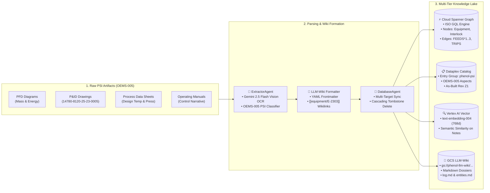
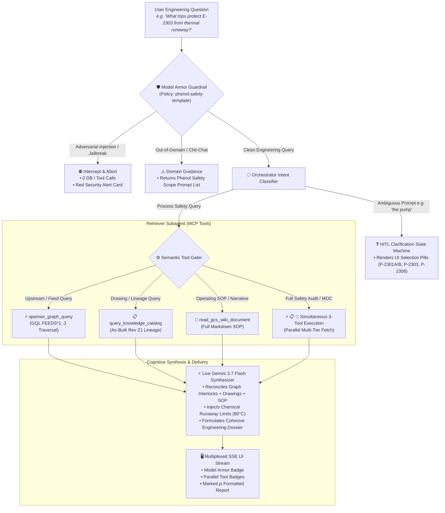

# Technical Architecture: Data Ingestion, Multi-Tier Storage & Multi-Agent Retrieval Synthesis

**Project:** PTT Global Chemical (PTT GC) Phenol Process Safety & HAZOP AI Platform  
**Specification Reference:** [`specs/features/SPEC-20260824-MULTI-AGENT-CLOUD-ARCHITECTURE.md`](../specs/features/SPEC-20260824-MULTI-AGENT-CLOUD-ARCHITECTURE.md)  
**Companion Interactive HTML Diagram:** [**`docs/architecture.html`**](./architecture.html)

---

## 🧭 Executive Overview

This document provides a technical walkthrough and architectural mapping of:
1. **Raw Data Ingestion & Storage Architecture:** How raw engineering artifacts (PFDs, P&IDs, Data Sheets, Manuals) are classified, structured into **LLM-Wiki** Markdown format, and synchronized across **Cloud Spanner Graph**, **Dataplex Knowledge Catalog**, **Vertex AI Vector Search**, and **Google Cloud Storage (GCS)**.
2. **Query Parsing, Semantic Tool Gating & Multi-Tier LLM Synthesis:** How incoming user queries pass through **Google Cloud Model Armor**, how semantic intents dictate dynamic tool routing, and how retrieved data across all storage tiers is synthesized by **Gemini 3.7 Flash** into cohesive, cited process safety dossiers.

```
+-------------------------------------------------------------------------------------------------------------------------+
|                                    PTT GC PHENOL PROCESS SAFETY ARCHITECTURE MAP                                        |
+-------------------------------------------------------------------------------------------------------------------------+
|                                                                                                                         |
|   [ RAW ENGINEERING PSI ]          [ MULTIMODAL PARSING & WIKI ]                 [ 4 STORAGE TIERS ]                    |
|   • PFD Flow Diagrams              • ExtractorAgent (OCR + Parser)       ======> • Cloud Spanner Graph (ISO GQL)        |
|   • P&ID As-Built Drawings   ===>  • LLM-Wiki Formatter (Frontmatter)    ======> • Dataplex Knowledge Catalog           |
|   • Process Data Sheets            • DatabaseAgent (Spanner Sync)        ======> • Vertex AI Vector Search (Embeddings) |
|   • Operating SOP Manuals                                                ======> • GCS LLM-Wiki Markdown Lake           |
|                                                                                                                         |
| ----------------------------------------------------------------------------------------------------------------------- |
|                                                                                                                         |
|   [ USER QUERY INGRESS ]           [ SECURITY & ORCHESTRATION ]                  [ TOOL GATING & LIVE GEMINI SYNTHESIS ]|
|   • "What trips protect E-2303?"   • Model Armor Shield (<1ms)                   • Semantic Tool Gater (Upstream/Lineage)|
|   • "Show equipment feeding..."    • Semantic Intent Classifier          ======> • RetrieverAgent (MCP Tool Calls)      |
|   • "the pump" (Ambiguous)   ===>  • Clarification State Machine (HITL)  ======> • Live Gemini 3.7 Flash Synthesizer    |
|   • Prompt Injection Attack        • Red Block Alert (0 Tool Calls)              • Multiplexed SSE UI Delivery          |
|                                                                                                                         |
+-------------------------------------------------------------------------------------------------------------------------+
```

---

## 1. Raw Engineering Data Ingestion & Multi-Database Storage



### 1.1 Ingestion Flow Details

1. **Document Ingestion & OCR (`ExtractorAgent`):**
   - Ingests native PDFs or scanned raster drawings.
   - Leverages **Gemini 2.5 Flash Multimodal OCR** to extract tabular data (mass balances, design temperatures, instrument setpoints) and line connectivity.
   - Classifies documents into OEMS-005 categories (`pfd`, `pid`, `data_sheets`, `operating_manuals`, `safeguards`).

2. **LLM-Wiki Formatting (`LLM-Wiki Formatter`):**
   - Converts parsed tabular and unstructured text into standardized **Markdown documents** enriched with YAML frontmatter metadata and bi-directional `[[wikilinks]]`:
   ```markdown
   ---
   entity_type: equipment
   tag: E-2303
   name: Preflash Column Steam Heater
   unit: CDN
   psi_category: 4
   source_drawings: ["14780-8120-25-23-0005_Z1.pdf"]
   ---
   # E-2303: Preflash Column Steam Heater
   Heats bottoms from [[equipment/E-2302A/B]] feeding into [[equipment/V-2301]].
   Active trips: [[interlock/TXSHH-0502A/B]] triggering [[valve/UXV-0501]].
   ```

3. **Multi-Target Atomic Synchronization (`DatabaseAgent`):**
   - The `DatabaseAgent` synchronizes the extracted wiki markdown across all 4 database engines atomically using Google Cloud Spanner **TrueTime**:
     - **Cloud Spanner Graph:** Upserts nodes (`Equipment`, `Unit`, `ChemicalHazard`, `InstrumentInterlock`) and inserts directed property graph edges (`FEEDS`, `PROTECTS`, `TRIPS`, `LOCATED_IN`).
     - **Dataplex Knowledge Catalog:** Creates/updates entries under entry group `phenol-psi`, attaching OEMS-005 metadata aspects and tracking As-Built certification revisions (`Rev Z1`).
     - **Vertex AI Vector Search:** Embeds unstructured text chunks and operating narrative descriptions using `text-embedding-004` (768 dimensions) for semantic retrieval.
     - **Google Cloud Storage (GCS):** Uploads the human- and agent-readable Markdown files to `gs://phenol-llm-wiki/wiki/equipment/` and appends mutation logs to `wiki/log.md`.

---

## 2. Query Parsing, Semantic Tool Dispatching & Multi-Tier Synthesis



### 2.1 Dynamic Semantic Tool Gating Rules

The Orchestrator inspects the semantic nature of the query and routes it to the exact required storage systems:

| Query Type | Example Prompt | Tools Dispatched by Retriever | Storage System Queried |
|---|---|---|---|
| **Upstream Feed Topology** | `Show all equipment feeding into Preflash Column V-2301` | `spanner_graph_query` (`mode="upstream"`) + `query_knowledge_catalog_provenance` | **Cloud Spanner Graph** (ISO GQL `FEEDS*1..3` traversal) & **Dataplex** |
| **Drawing Provenance & Lineage** | `Show source drawings and Knowledge Catalog metadata for E-2303` | `query_knowledge_catalog_provenance` | **Dataplex Knowledge Catalog** (OEMS-005 aspects & As-Built Rev Z1) |
| **Operating Procedure / SOP** | `Read the full operating procedure for E-2303 from GCS wiki` | `read_gcs_wiki_document` | **Google Cloud Storage (GCS)** (Markdown wiki reader) |
| **Comprehensive Safety Audit / MOC** | `Perform a full safety audit on Steam Heater E-2303` | `spanner_graph_query` + `query_knowledge_catalog_provenance` + `read_gcs_wiki_document` | **All 3 Storage Tiers Simultaneously in Parallel** |
| **Ambiguous Tag / HITL** | `show me interlocks on the pump` | `ClarificationManager` (No tools initially) | **Interactive UI Clarification Card** (P-2301A/B, P-2303A/B, P-2308A/B) |

---

### 2.2 Live Gemini 3.7 Flash Cognitive Synthesis

When data returns from the Retriever subagent:
1. **Context Packaging:** The Orchestrator aggregates the raw JSON results from Spanner Graph (interlock switches, voting, valve actions), Dataplex (certified drawing numbers), and GCS Wiki (chemical kinetics, thermal limits).
2. **Zero-Hallucination Prompting:** Gemini 3.7 Flash is given system instructions to ground exclusively on the returned context payload. It synthesizes a unified engineering response:
   - Identifies specific hazard limits (e.g. CHP thermal runaway onset at **80.0°C**).
   - Explains **1oo2 voting logic** and final control elements (**dual steam isolation valves `UXV-0501` and `UXV-0502` in series**).
   - Cites certified As-Built drawing references (`14780-8120-25-23-0005_Z1.pdf`).

---

## 3. Interactive Asset Preview

To view the standalone interactive dark-themed SVG architecture diagram in your browser:

```bash
# Linux
xdg-open ./docs/architecture.html

# macOS
open ./docs/architecture.html
```
