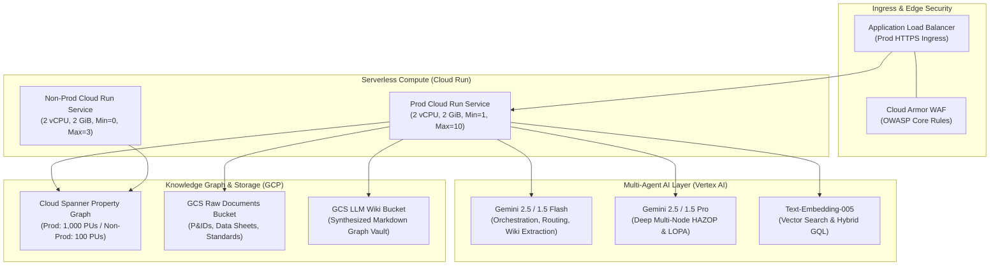
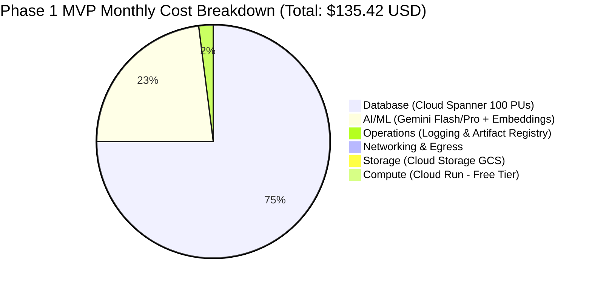
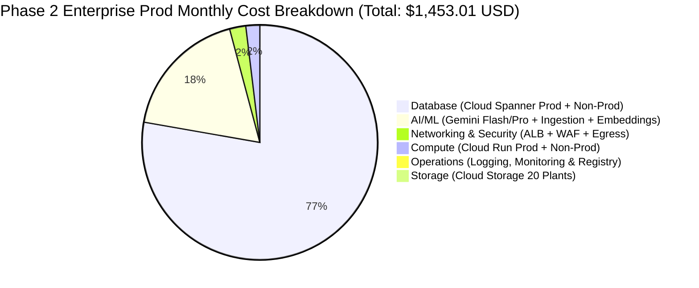

# 💰 Google Cloud Cost Estimation: Multi-Agent HAZOP & Process Safety Platform

**Document ID:** `DOC-20260827-GCP-COST-ESTIMATE`  
**Date:** 2026-08-27  
**Target Region:** `asia-southeast1` (Singapore — Primary Southeast Asia / PTT GC Region)  
**Architecture Spec Reference:** [`SPEC-20260824-MULTI-AGENT-CLOUD-ARCHITECTURE.md`](../specs/features/SPEC-20260824-MULTI-AGENT-CLOUD-ARCHITECTURE.md)  
**Terraform Baseline Reference:** [`terraform/`](../terraform/)  
**Model Strategy:** Hybrid Tier (90% Gemini Flash for routine routing/retrieval + 10% Gemini Pro for deep HAZOP reasoning)

---

## 📊 Executive Summary & Phase Comparison Matrix

This cost estimation models running infrastructure costs across the **MVP Phase** (1 Plant / 30 Users) and the **Enterprise Production Phase** (20 Plants / 250 Users across 2 Isolated Environments: Non-Prod & Prod).

| Metric / Dimension | Phase 1: MVP (1 Plant / 30 Users) | Phase 2: Enterprise Prod (20 Plants / 250 Users) | Delta / Scale Factor |
| :--- | :--- | :--- | :--- |
| **Active User Base** | 30 engineers (300 queries/day) | 250 engineers (2,500 queries/day) | 8.33× users / queries |
| **Monthly Query Volume** | 9,000 user queries / ~27,000 agent turns | 75,000 user queries / ~225,000 agent turns | 8.33× LLM interactions |
| **Data Scope** | 1 Plant (51.4 MB Raw / 1.7 MB Wiki) | 20 Plants (~50 GB Raw / ~5 GB Wiki) | 20× plant coverage |
| **Environments** | 1 Single Environment (Non-Prod) | 2 Environments (Non-Prod + Prod) | 2× environment isolation |
| **Monthly Run-Rate (On-Demand)** | **$135.42 USD** | **$1,453.01 USD** | ~10.7× total cost |
| **Annual Run-Rate (On-Demand)** | **$1,625.09 USD** | **$17,436.06 USD** | Baseline pay-as-you-go |
| **1-Year Committed Use (CUD)** | **$107.13 / mo** ($1,285.56 / yr) | **$1,132.09 / mo** ($13,585.08 / yr) | ~21–28% savings |
| **3-Year Committed Use (CUD)** | **$82.88 / mo** ($994.56 / yr) | **$857.01 / mo** ($10,284.12 / yr) | ~39–52% savings |

> [!NOTE]
> All unit prices are dynamically resolved for the `asia-southeast1` (Singapore) region from the Google Cloud Billing API and official GCP service catalogs. Free tier monthly credits (Cloud Run 2M requests, 180k vCPU-sec, 360k GiB-sec) have been applied.

---

## 🏗️ Architecture & Component Overview

---

## 🔬 Phase 1: MVP Deep Dive (1 Plant / 30 Users)

### 1.1 MVP Workload Profile
- **Plant Scope:** 1 Chemical Plant Unit (Phenol Cleavage & Decomposition Section).
- **Physical Data Inventory:** Measured from project repository:
  - `raw/`: 143 files (136 PDFs, 4 Excel workbooks, 1 raster diagram) = **51.41 MB**.
  - `wiki/`: 137 synthesized markdown entity pages = **1.72 MB**.
  - `database/`: Cloud Spanner schema DDL & mock fixtures = **84 KB**.
- **User Activity:** 30 process engineers × 10 queries/day = **300 queries/day** = **9,000 user queries/month**.
- **Agent Orchestration Multiplier:** ~3 LLM calls per query (Intent Classification $\rightarrow$ Retriever/GQL Traversal $\rightarrow$ Grounded Answer Synthesis) = **27,000 agent turns/month**.
  - **Gemini Flash (90% Q&A):** 8,100 queries × 7.5k in / 1.5k out = 60.75M prompt tokens / 12.15M completion tokens.
  - **Gemini Pro (10% HAZOP):** 900 queries × 10k in / 2.5k out = 9.00M prompt tokens / 2.25M completion tokens.
  - **Embeddings:** Initial indexing (12M chars) + ongoing query vectors (2M chars/mo).
- **Cloud Run Sizing:** Scale-to-zero (`min_instance_count = 0`, `max_instance_count = 3`), 2 vCPU, 2 GiB RAM. Active compute duration is covered by Cloud Run free tier.
- **Cloud Spanner Sizing:** 100 Processing Units (0.1 Node) provisioned 24/7 for graph traversals and sub-second GQL response times.

### 1.2 MVP Monthly Cost Distribution

| Category | Monthly Cost (USD) | % of Total Bill |
| :--- | :--- | :--- |
| **Databases & Knowledge Graph** (Cloud Spanner 100 PUs + Storage) | $101.04 | 74.6% |
| **Generative AI & Embeddings** (Vertex AI Gemini Flash / Pro / Embeddings) | $31.00 | 22.9% |
| **Cloud Operations & CI/CD** (Cloud Logging, Monitoring & Artifact Registry) | $2.70 | 2.0% |
| **Networking & Ingress/Egress** (Internet Egress) | $0.60 | 0.4% |
| **Object Storage** (Cloud Storage Raw & Wiki Buckets) | $0.08 | 0.1% |
| **Compute & Containers** (Cloud Run Non-Prod — Scale to Zero) | $0.00 | 0.0% (Free Tier) |
| **Total (Phase 1 MVP)** | **$135.42** | **100.0%** |

### 1.3 MVP Itemized Bill of Materials (BoM)

| Service | Resource / SKU | Specs / Sizing | Monthly Usage | Unit Rate (`asia-se1`) | Monthly Cost | Cost Model & Operational Rationale |
| :--- | :--- | :--- | :--- | :--- | :--- | :--- |
| **Cloud Spanner** | Processing Units | 100 PUs (0.1 Node) | 730 hours | $0.138 / PU-hour | **$100.74** | 24/7 Property Graph & ISO GQL multi-hop relationship traversals |
| **Cloud Spanner** | Graph Storage | Regional SSD Storage | 1.0 GB-mo | $0.30 / GB-month | **$0.30** | Graph topology, node properties, and vector indexes for 1 plant |
| **Vertex AI** | Gemini Flash | Routine Q&A & Routing | 8,100 user queries (60.75M in / 12.15M out) | $0.075 / 1M in $0.300 / 1M out | **$8.20** | Orchestrator intent classification, retriever subagent tool calls |
| **Vertex AI** | Gemini Pro | Complex HAZOP Reasoning | 900 queries (9.0M in / 2.25M out) | $1.250 / 1M in $5.000 / 1M out | **$22.50** | Deep LOPA cause-consequence chains and RAM risk ranking |
| **Vertex AI** | Text Embeddings | `text-embedding-005` | 12M characters | $0.025 / 1M chars | **$0.30** | Document chunk embedding & vector similarity search |
| **Cloud Run** | App & Agent API | 2 vCPU, 2 GiB RAM | 15 vCPU-hrs | $0.1044 / vCPU-hr | **$0.00** | Scale-to-zero on Non-Prod; ~27k active compute seconds (100% within 180k free vCPU-sec) |
| **Dataplex** | Knowledge Catalog | Metadata Entries & Tags | 280 entries (< 1 MiB) | $2.00 / GiB-month | **$0.00** | Technical metadata is $0; Custom tags (< 1 MiB) are 100% within 1 MiB free tier |
| **Dataplex** | Catalog Search API | Metadata Search Calls | 9,000 calls | $10.00 / 100k calls | **$0.00** | 100% within Dataplex Catalog free tier (First 1,000,000 API calls/month free) |
| **Cloud Storage** | Raw Docs & Wiki | Standard Regional | 1.5 GB-months | $0.023 / GB-month | **$0.03** | 51.4 MB raw PDFs + 1.7 MB markdown wiki + 3x versioning buffer |
| **Cloud Storage** | GCS Operations | Class A & Class B | 10,000 ops | $0.05 / 10k ops | **$0.05** | Document ingestion, chunk reads, and metadata sync |
| **Operations** | Cloud Logging | Telemetry & Traces | 1 month | $2.50 / month | **$2.50** | Multi-agent reasoning stream audit logs and error tracking |
| **Networking** | Internet Egress | Standard Outbound | 5.0 GB | $0.12 / GB | **$0.60** | Outbound chat responses, telemetry stream, and UI static assets |
| **Artifact Registry** | Container Images | Docker Image Layers | 2.0 GB-months | $0.10 / GB-month | **$0.20** | Non-prod container images in `asia-southeast1-docker.pkg.dev` |
| **Total (MVP)** | | | | | **$135.42** | **Annual Run-Rate: $1,625.09 USD** |

---

## 🏭 Phase 2: Enterprise Production Deep Dive (20 Plants / 250 Users / 2 Envs)

### 2.1 Enterprise Production Workload Profile
- **Plant Scope:** 20 Integrated Chemical & Refining Plants (e.g. Olefins I-1/I-4, Aromatics, Polyethylene, Polypropylene, Phenol, Utilities, and Tank Farms).
- **Environment Isolation:** **2 Fully Segregated Environments**:
  1. **Non-Prod / Staging:** Developer testing, automated CI/CD integration tests, new prompt validation.
  2. **Production:** High-availability customer-facing environment with 99.99% uptime SLA, warm instances, custom domain HTTPS load balancer, and Cloud Armor WAF.
- **Scaled Physical Data Inventory:**
  - **Raw Engineering Documents:** 20 plants × ~51.4 MB = ~1.03 GB base. Factoring in revision history, multi-page piping isometric drawings, and operating manuals across 2 environments = **50.0 GB**.
  - **Synthesized LLM Wiki:** 20 plants × ~1.72 MB = ~34.4 MB base. Factoring in detailed node worksheets, interlock matrices, and action logs = **5.0 GB**.
  - **Spanner Property Graph:** 20 plants × ~150 equipment × ~500 instruments × ~1,000 interlocks/connections with vector embeddings and 3-day Point-in-Time-Recovery (PITR) = **35.0 GB**.
- **User Activity:** 250 safety engineers × 10 queries/day = **2,500 queries/day** = **75,000 user queries/month**.
- **Agent Orchestration Multiplier:** ~3 LLM calls per query = **225,000 agent turns/month**.
  - **Gemini Flash (90% Q&A):** 67,500 queries × 7.5k in / 1.5k out = 506.25M prompt tokens / 101.25M completion tokens.
  - **Gemini Pro (10% HAZOP):** 7,500 queries × 10k in / 2.5k out = 75.00M prompt tokens / 18.75M completion tokens.
  - **Continuous Document Ingestion (Flash Multimodal):** ~500 revised engineering docs/mo = 25.0M multimodal tokens.
  - **Embeddings:** 20M chars/month incremental indexing + 20M chars/month query embeddings = 40M characters.
- **Cloud Run Sizing:**
  - **Non-Prod:** Scale-to-zero (`min=0`, `max=3`), 2 vCPU, 2 GiB RAM (~$5.00/mo).
  - **Prod:** 1 Warm Standby Instance 24/7 (`min=1`, `max=10`), 2 vCPU, 2 GiB RAM, 40 concurrency per container (~$22.50/mo).
- **Cloud Spanner Sizing:**
  - **Non-Prod:** 100 Processing Units (0.1 Node) = $100.74/mo.
  - **Prod:** 1 Full Node (1,000 Processing Units) = $1,007.40/mo (supports enterprise throughput, low latency GQL traversals, vector indexing, and 99.99% multi-zone SLA).

### 2.2 Enterprise Production Monthly Cost Distribution

| Category | Monthly Cost (USD) | % of Total Bill |
| :--- | :--- | :--- |
| **Databases & Knowledge Graph** (Cloud Spanner Prod 1 Node + Non-Prod 100 PUs + 35 GB Storage) | $1,118.64 | 77.0% |
| **Generative AI & Vertex AI** (Gemini Flash, Gemini Pro, Multimodal Ingestion, Embeddings) | $260.35 | 17.9% |
| **Networking & Edge Security** (ALB Ingress, Cloud Armor WAF, Premium Internet Egress) | $32.00 | 2.2% |
| **Compute & Containers** (Cloud Run Prod Warm Standby + Non-Prod Autoscaling) | $27.50 | 1.9% |
| **Cloud Operations & Observability** (Cloud Logging, Uptime Metrics & Artifact Registry) | $13.00 | 0.9% |
| **Object Storage** (Cloud Storage 55 GB Raw & Wiki across 20 Plants) | $1.51 | 0.1% |
| **Total (Phase 2 Enterprise Prod)** | **$1,453.01** | **100.0%** |

### 2.3 Enterprise Production Itemized Bill of Materials (BoM)

| Service | Resource / SKU | Specs / Environment | Monthly Usage | Unit Rate (`asia-se1`) | Monthly Cost | Cost Model & Operational Rationale |
| :--- | :--- | :--- | :--- | :--- | :--- | :--- |
| **Cloud Spanner** | Production Node | 1 Node (1,000 PUs) | 730 hours | $1.380 / Node-hour | **$1,007.40** | Dedicated enterprise node for 20-plant graph traversals, vector indexing & 99.99% SLA |
| **Cloud Spanner** | Non-Prod PUs | 100 PUs (0.1 Node) | 730 hours | $0.138 / PU-hour | **$100.74** | Dedicated isolated staging graph instance for CI/CD and pre-release testing |
| **Cloud Spanner** | Graph Storage | Regional SSD Storage | 35.0 GB-mo | $0.30 / GB-month | **$10.50** | 25 GB Prod (20 plants graph + PITR history) + 10 GB Non-Prod |
| **Vertex AI** | Gemini Flash | Routine Q&A & Routing | 67,500 queries (506.25M in / 101.25M out) | $0.075 / 1M in $0.300 / 1M out | **$68.35** | High-speed multi-agent intent routing, GQL query formulation, grounding |
| **Vertex AI** | Gemini Pro | Complex HAZOP & LOPA | 7,500 queries (75.0M in / 18.75M out) | $1.250 / 1M in $5.000 / 1M out | **$187.50** | Complex multi-equipment consequence modeling, IPL credit validation |
| **Vertex AI** | Gemini Flash (Ingest) | Multimodal Document Parsing | 25.0M tokens | $0.140 / 1M tokens | **$3.50** | Automated parsing of ~500 revised P&ID drawings and operating manuals/month |
| **Vertex AI** | Text Embeddings | `text-embedding-005` | 40M characters | $0.025 / 1M chars | **$1.00** | Multi-plant semantic search vectors and dynamic query embeddings |
| **Cloud Run** | Prod Service | 2 vCPU, 2 GiB RAM (Min=1, Max=10) | 1 month | Custom Tier 2 Calc | **$22.50** | 1 warm instance (730 hrs idle rate ~$17.50) + active execution for 75k queries (~$5.00) |
| **Cloud Run** | Non-Prod Service | 2 vCPU, 2 GiB RAM (Min=0, Max=3) | 1 month | Scale-to-zero | **$5.00** | Staging / QA testing environment |
| **Cloud Load Balancing** | Application Load Balancer | Global/Regional HTTPS ALB | 730 hours + LCU | $0.025/hr + $0.008/GB | **$20.25** | Prod custom domain HTTPS ingress, SSL termination, and CDN edge caching |
| **Cloud Armor** | Security Policy (WAF) | OWASP Top 10 + DDoS | 1 policy + 1 rule | $5.00/mo + $1.00/rule | **$5.75** | Bot protection, SQL/GQL injection defense, and rate-limiting guardrails |
| **Dataplex** | Knowledge Catalog | 20 Plants Custom Metadata | 5.6 MB (< 10 MB) | $2.00 / GiB-month | **$0.01** | Technical metadata is $0; 4.6 MB billable custom tags after 1 MiB free tier |
| **Dataplex** | Catalog Search API | Metadata Search Calls | 75,000 calls | $10.00 / 100k calls | **$0.00** | 100% within Dataplex Catalog free tier (First 1,000,000 API calls/month free) |
| **Cloud Storage** | 20 Plants Raw Docs | Standard Storage | 50.0 GB-months | $0.023 / GB-month | **$1.15** | P&IDs, PFDs, Hazop worksheets, and data sheets across 20 plants |
| **Cloud Storage** | 20 Plants Wiki | Standard Storage | 5.0 GB-months | $0.023 / GB-month | **$0.11** | Synthesized graph markdown entities, unit overviews, and action registers |
| **Cloud Storage** | GCS Operations | Class A & Class B | 50,000 ops | $0.05 / 10k ops | **$0.25** | Batch ingestion and agent read/write operations |
| **Networking** | Internet Egress | Premium Tier Outbound | 50.0 GB | $0.12 / GB | **$6.00** | Streamed chat responses, telemetry events, and Excel export downloads |
| **Operations** | Cloud Logging & Monitor | Audit Logs & Dashboards | 1 month | Sizing Tier | **$12.00** | Cross-environment log ingestion, SLO alert policies, and agent tracing |
| **Artifact Registry** | Container Images | Multi-env Image Storage | 10.0 GB-months | $0.10 / GB-month | **$1.00** | Release tags for Non-Prod and Prod Cloud Run deployments |
| **Total (Prod Phase)** | | | | | **$1,453.02** | **Annual Run-Rate: $17,436.24 USD** |

---

## 📝 Stated Assumptions & Workload Factors

> [!IMPORTANT]
> The following parameters govern the mathematical cost model.

### 1. User-Specified Workload Factors:
- **Phase 1 (MVP):** 30 active users querying 10 questions/day (300 queries/day = 9,000 queries/month) against 1 plant (Phenol Unit / Cleavage section).
- **Phase 2 (Prod):** 250 active users querying 10 questions/day (2,500 queries/day = 75,000 queries/month) scaled across 20 plants in 2 isolated environments (Non-Prod + Prod).
- **Target Deployment Region:** `asia-southeast1` (Singapore).
- **Spanner Provisioning:** Granular Processing Units (100 PUs for MVP, 100 PUs for Non-Prod, 1 Node / 1,000 PUs for 20-Plant Prod).
- **Model Mix:** Hybrid Tier (90% Gemini Flash for routine routing/retrieval + 10% Gemini Pro for deep HAZOP reasoning).

### 2. Engineering & FinOps Baseline Defaults Applied:
- **Operating Hours:** 730 hours/month (24/7 continuous operation for Spanner and Prod Cloud Run warm instance).
- **Agent Orchestration Multiplier:** Average of 3 LLM calls per user query (Intent Classifier $\rightarrow$ Subagent Retrieval $\rightarrow$ Synthesis Grounding).
- **Token Context Windows:**
  - Gemini Flash: 7,500 input tokens / 1,500 output tokens per complete user interaction.
  - Gemini Pro: 10,000 input tokens / 2,500 output tokens per complete HAZOP study interaction.
- **Data Scaling Factor:** 20 plants scaled proportionally from the 51.4 MB raw / 1.7 MB wiki measured in the local repository, with a 2.5× multiplier for versioning, document revisions, and operational logs.
- **Storage Tier:** Regional Standard GCS in `asia-southeast1`.

---

## 📈 Sensitivity & Scale Analysis

The table below illustrates how monthly infrastructure costs fluctuate under varying user adoption rates and query volumes:

### Phase 1: MVP Scale Progression (1 Plant)

| Scale Factor | Daily Queries | Monthly Queries | Estimated Monthly Cost | Monthly Delta vs Baseline | Primary Cost Driver |
| :--- | :--- | :--- | :--- | :--- | :--- |
| **0.5× (Light / Pilot)** | 150 / day | 4,500 / mo | **$119.92** | -11.4% | Spanner 100 PUs fixed baseline ($100.74) |
| **1.0× (MVP Baseline)** | **300 / day** | **9,000 / mo** | **$135.42** | **0.0%** | **Spanner 100 PUs + Hybrid Gemini Token Usage** |
| **2.0× (Active Team)** | 600 / day | 18,000 / mo | **$166.42** | +22.9% | Gemini Pro HAZOP tokens + Flash queries |
| **5.0× (Heavy Multi-User)** | 1,500 / day | 45,000 / mo | **$259.42** | +91.6% | LLM token volume scaling linearly |

### Phase 2: Enterprise Prod Scale Progression (20 Plants / 2 Envs)

| Scale Factor | Daily Queries | Monthly Queries | Estimated Monthly Cost | Monthly Delta vs Baseline | Primary Cost Driver |
| :--- | :--- | :--- | :--- | :--- | :--- |
| **0.5× (Ramp-up)** | 1,250 / day | 37,500 / mo | **$1,322.84** | -9.0% | Fixed Spanner Node ($1,007.40) & ALB ($20.25) |
| **1.0× (Prod Baseline)** | **2,500 / day** | **75,000 / mo** | **$1,453.01** | **0.0%** | **Dedicated Spanner Node + 225k LLM Agent Turns** |
| **2.0× (Peak Turnaround)**| 5,000 / day | 150,000 / mo | **$1,713.36** | +17.9% | Gemini Pro HAZOP reasoning volume |
| **5.0× (Company-Wide)** | 12,500 / day | 375,000 / mo | **$2,494.41** | +71.7% | High concurrency Cloud Run + LLM tokens |

---

## 💡 FinOps & Cost Optimization Roadmap

### 1. Cloud Spanner Committed Use Discounts (CUD) & Granular Autoscaling
- **Impact: Save up to $523.85 / month (~$6,286 / year)**
- In Production, Cloud Spanner accounts for **77.0%** of total monthly expenditure ($1,118.64/mo).
- Purchasing a **3-Year Flexible Compute CUD** for Spanner reduces the hourly node rate from $1.38 to ~$0.66, saving **52%** on Spanner baseline compute.
- Implement **Cloud Spanner Autoscaler** (via Cloud Run job or Cloud Function) to scale down to 300–500 PUs during off-peak weekend hours and ramp up to 1,000 PUs during plant shift changeover hours.

### 2. Vertex AI Gemini Prompt & Context Caching
- **Impact: Save 50–75% on LLM Input Token Costs (Save ~$60–$100 / month)**
- The Extractor, Retriever, and HAZOP agents frequently load static reference schemas (PTT GC 5×5 RAM Matrix, ISO 14224 equipment taxonomies, and Hock Process chemical constraints) that rarely change.
- Using **Gemini Context Caching** on prompts exceeding 32,768 tokens reduces input token pricing from $1.25/1M to **$0.3125/1M** for Gemini Pro and from $0.075/1M to **$0.01875/1M** for Gemini Flash.

### 3. Cloud Run Concurrency & Zero-Min Instance in Non-Prod
- **Impact: Zero Compute Waste on Idle Environments**
- Ensure Non-Prod maintains `min_instance_count = 0` (scale-to-zero when engineers are not active).
- Tune Production Cloud Run `container_concurrency` to **40–80 requests per instance**. Since agent requests spend 95% of execution time waiting for streaming LLM/Spanner responses (I/O bound), a single 2 vCPU container easily manages 40 concurrent SSE streams without CPU saturation.

### 4. GCS Storage Lifecycle Tiering
- **Impact: Reduce Storage & Backup Costs by 50–80%**
- Historical HAZOP worksheets, revision drafts, and raw PDF packages older than 90 days should automatically transition to **GCS Coldline** ($0.006/GB in `asia-se1`) or **GCS Archive** ($0.0015/GB).

### 5. Consolidated FinOps Comparison Table

| Optimization Strategy | Target Resource | Implementation Effort | Monthly Savings (Prod) | Annual Savings (Prod) |
| :--- | :--- | :--- | :--- | :--- |
| **3-Year Spanner CUD** | Cloud Spanner Node | Low (GCP Console Commitment) | **$523.85 / mo** | **$6,286.20 / yr** |
| **Gemini Context Caching** | Vertex AI Prompts | Medium (ADK Cache TTL Config) | **$75.00 / mo** | **$900.00 / yr** |
| **Off-Peak Spanner Autoscaling**| Cloud Spanner PUs | Medium (Cloud Scheduler + Metric) | **$180.00 / mo** | **$2,160.00 / yr** |
| **GCS Lifecycle Rules** | Cloud Storage | Low (Terraform lifecycle block) | **$0.80 / mo** | **$9.60 / yr** |
| **Total Optimized Prod Run-Rate**| **All Resources** | | **$673.36 / mo** | **$8,080.26 / yr** |

---

*Report generated by Google Cloud FinOps & Principal Architecture Agent for PTT Global Chemical (PTT GC).*
