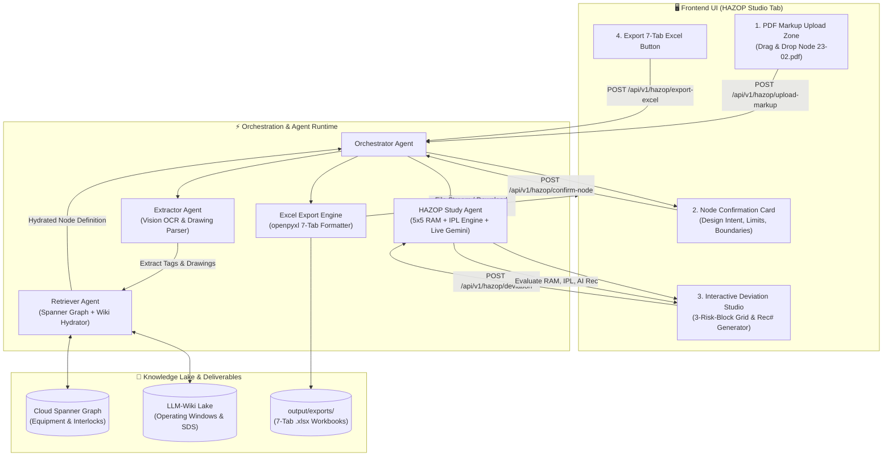

# Technical Design Document: HAZOP Study User Journey, P&ID Markup Ingestion & 7-Tab Excel Export

**Project:** Refinery Phenol Process Safety & HAZOP AI Platform  
**Specification Document:** [`specs/features/SPEC-20260831-HAZOP-MARKUP-INGESTION-AND-STUDY-LIFECYCLE.md`](../specs/features/SPEC-20260831-HAZOP-MARKUP-INGESTION-AND-STUDY-LIFECYCLE.md)  
**Governing Standard:** `hazop-example/HAZOP-SKILLS.md` & Refinery OEMS-005 / RAM `W-(Q-MP)-002 R2`  
**Reference Examples:** `hazop-example/Node 23-02.pdf`, `hazop-example/Node 23-03.pdf`, `hazop-example/2026-06-18_CDN-N02_HAZOP-worksheet.xlsx`, `hazop-example/2026-06-18_CDN-N03_HAZOP-worksheet.xlsx`  
**Date:** 2026-08-31  

---

## 🧭 Executive Summary

This design document formalizes the updated user journey and multi-agent architecture for the **HAZOP Study Agent**. 

### Key Architectural Mandates:
1. **User-Defined Study Area by PDF Markup:** The user uploads engineer-annotated P&ID PDFs (e.g., `Node 23-02.pdf`). The system parses the drawing sheets, color-coded node boundaries, and equipment tags, and **MUST confirm the node definition with the user before proceeding to deviation analysis**.
2. **Follows Skill & Schema Directives (No Speculative Replication):** The agent strictly enforces the `HAZOP-SKILLS.md` 9-step study lifecycle, anti-bias rule, and 3-risk-block framework without copying or predicting past study conclusions unattended.
3. **Audit-Ready 7-Tab Excel Deliverable:** Generates standardized Refinery HAZOP workbooks matching `hazop-example/*.xlsx`.

---

## 1. End-to-End User Journey Walkthrough

```
+-------------------------------------------------------------------------------------------------------------------------+
|                                    HAZOP AGENT: 5-STAGE USER JOURNEY ARCHITECTURE                                       |
+-------------------------------------------------------------------------------------------------------------------------+
|                                                                                                                         |
|   [ 1. MARKUP UPLOAD ]              [ 2. EXTRACTION & HYDRATION ]             [ 3. HITL CONFIRMATION GATE ]             |
|   • User uploads Node 23-02.pdf      • Gemini Vision / PDF Parser              • Agent renders <NodeConfirmationCard />  |
|   • Specifies Unit (e.g. CDN)        • Extracts drawings, tags, boundaries     • Engineer confirms/adjusts boundaries    |
|                                      • Hydrates operating limits from wiki     • Unlocks Step 4 Deviation Analysis      |
|                                                                                                                         |
| ----------------------------------------------------------------------------------------------------------------------- |
|                                                                                                                         |
|   [ 4. INTERACTIVE DEVIATION LOOP WITH 3 MANDATORY HITL GATES ]               [ 5. CLOSE-OUT & 7-TAB EXCEL EXPORT ]     |
|   • Guideword Presentation (Flow, Temp, Press...)                             • Aggregates SIS/ESD Interlocks (Rollup)  |
|   • [HITL Gate 1]: Review & Adjust 1st Risk Assessment (PEES & Likelihood)    • Populates Master Action Register (Rec#) |
|   • [HITL Gate 2]: Review & Accept Safety Measures (IPL Credit Validation)    • openpyxl compiles 7-Tab GC Workbook     |
|   • [HITL Gate 3]: Review & Accept 2nd Risk Assessment & AI Recommendations   • Downloads .xlsx matching reference      |
|                                                                                                                         |
+-------------------------------------------------------------------------------------------------------------------------+
```

---

## 2. Multi-Agent Collaboration & Data Flow



---

## 3. Detailed Component Specifications

### 3.1 P&ID Markup Parsing & Hydration (`agents/hazop/markup_parser.py`)
- **Inputs:** Binary PDF buffer from user upload (e.g. `Node 23-02.pdf`).
- **Extraction Targets:**
  - `markup_label`: Drawing label (e.g. `Node 23-02`).
  - `colour_code`: Annotation highlight color (e.g. `Yellow` for N02, `Green` for N03).
  - `node_id`: Normalized node identifier (e.g. `CDN-N02`).
  - `pid_drawings`: Primary drawings (e.g. `14780-8120-25-23-0005`, `-0005A`).
  - `boundary_crossings`: Adjacent drawing boundaries (e.g. `-0004`, `-0007`).
  - `equipment_tags`: Equipment enclosed within boundary (`E-2302A/B`, `E-2303`, `D-2308`, `P-2308A/B`).
- **Hydration:** Queries the Wiki knowledge base to automatically retrieve:
  - Design intent and safe operating parameters (itemized per equipment tag: Design Condition & Operating Condition side by side).
  - Chemical hazard flags (CHP concentration, decomposition temperature 80°C).

### 3.2 Human-in-the-Loop Node Confirmation Gate (`<NodeConfirmationCard />`)
- Visual display of:
  - Node Title, Color Badge, and Drawing References.
  - Inlet Boundaries & Outlet Boundaries with tie-in points.
  - Side-by-side Design vs. Operating Conditions table.
  - Any open boundary questions requiring engineer confirmation.
- Actions:
  - **"Confirm Node Boundaries"** (Advances to Stage 4).
  - **"Edit Boundaries / Notes"** (Allows manual adjustments).

### 3.3 3-Risk-Block Deviation Engine with 3 Human-in-the-Loop (HITL) Gates

The interactive deviation loop incorporates **three mandatory human-in-the-loop checkpoints** for every deviation row:

1. **HITL Gate 1: 1st Risk Assessment Review & Adjustment (Without Safeguards)**
   - **Agent Action:** Proposes unmitigated PEES Severity ($P, En, Ec, S \in [1..5]$) and Initial Likelihood ($L_{\text{init}} \in [1..5]$), computing the Initial Risk Rating from the 5×5 RAM.
   - **Human Review & Action:** Rendered in `<InitialRiskCard />`. The engineer reviews the causal endpoint, can adjust any PEES dimension or initial likelihood, and clicks **"Confirm 1st Risk Assessment"**.
   
2. **HITL Gate 2: Safety Measure Introduction & IPL Acceptance**
   - **Agent Action:** Queries Spanner Graph & Wiki to retrieve existing safeguards (tags, setpoints, SIS trip actions) and calculates IPL credits deterministically:
     - SIL 1: -1 Likelihood level
     - SIL 2: -2 Likelihood levels
     - SIL 3: -3 Likelihood levels
     - Non-IPL (Alarms, SOPs, Relief valves): 0 Likelihood credit (IPL = 0)
   - **Human Review & Action:** Rendered in `<SafeguardsCard />`. The engineer inspects the proposed safeguards, can add missing safeguards, modify IPL assignments, or remove non-independent measures, then clicks **"Accept Safety Measures"**.

3. **HITL Gate 3: 2nd Risk Assessment & Recommendation Acceptance (Mitigated Risk)**
   - **Agent Action:** Evaluates Mitigated Likelihood ($L_{\text{mit}} = \max(1, L_{\text{init}} - \sum \text{IPL})$) and Mitigated Risk Rating ($S_{\text{mit}} \equiv S_{\text{init}}$). If Mitigated Risk $\ge$ **Medium**, the Live Gemini AI synthesizer generates a structured recommendation (`Action Verb + Specific Target + Purpose`).
   - **Human Review & Action:** Rendered in `<MitigatedRiskRecommendationCard />`. The engineer reviews the mitigated risk rating and AI recommendation, can edit the recommendation text, assign engineering discipline/owner, and clicks **"Accept & Commit to Worksheet"**.

- **Residual Risk (Block 3):** Populated during post-study Action Close-out once recommendations are implemented.

### 3.4 7-Tab Excel Workbook Exporter (`agents/hazop/excel_exporter.py`)
Generates 7 sheets styled exactly like `hazop-example/*.xlsx`:
1. **`Cover Page`**
2. **`HAZOP Information`**
3. **`WorkSheet Index`**
4. **`WorkSheet <Node>`** (27 Columns, grouped 2-tier headers, freeze panes, color-coded risk cells)
5. **`Action Items`** (Full recommendation register)
6. **`Risk Ranking`** (5x5 RAM matrix + PEES severity definitions)
7. **`Interlock-ESD Summary`** (All credited SIS trips)

---

## 4. Safety Invariants & Acceptance Criteria

1. **Anti-Bias Invariant:** The system MUST halt if prior Phenol HAZOP reports exist in `raw/`.
2. **Node Boundary Invariant:** Node analysis CANNOT proceed without confirmed boundaries from the user.
3. **Severity Invariance:** Initial Severity $\equiv$ Mitigated Severity $\equiv$ Residual Severity.
4. **Exact Workbook Fidelity:** The exported `.xlsx` must be fully openable in Excel with identical tab names, headers, and color styling.
