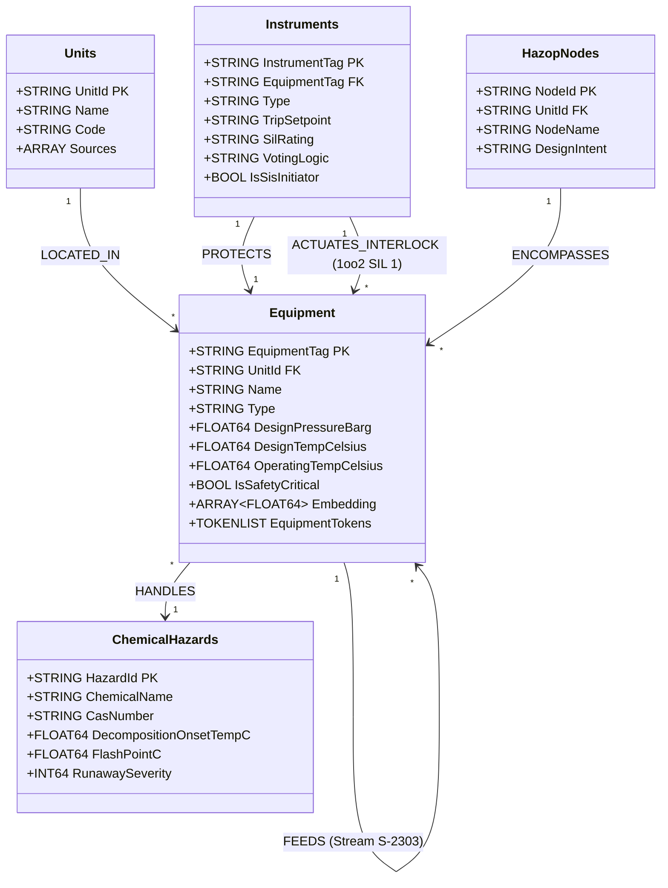
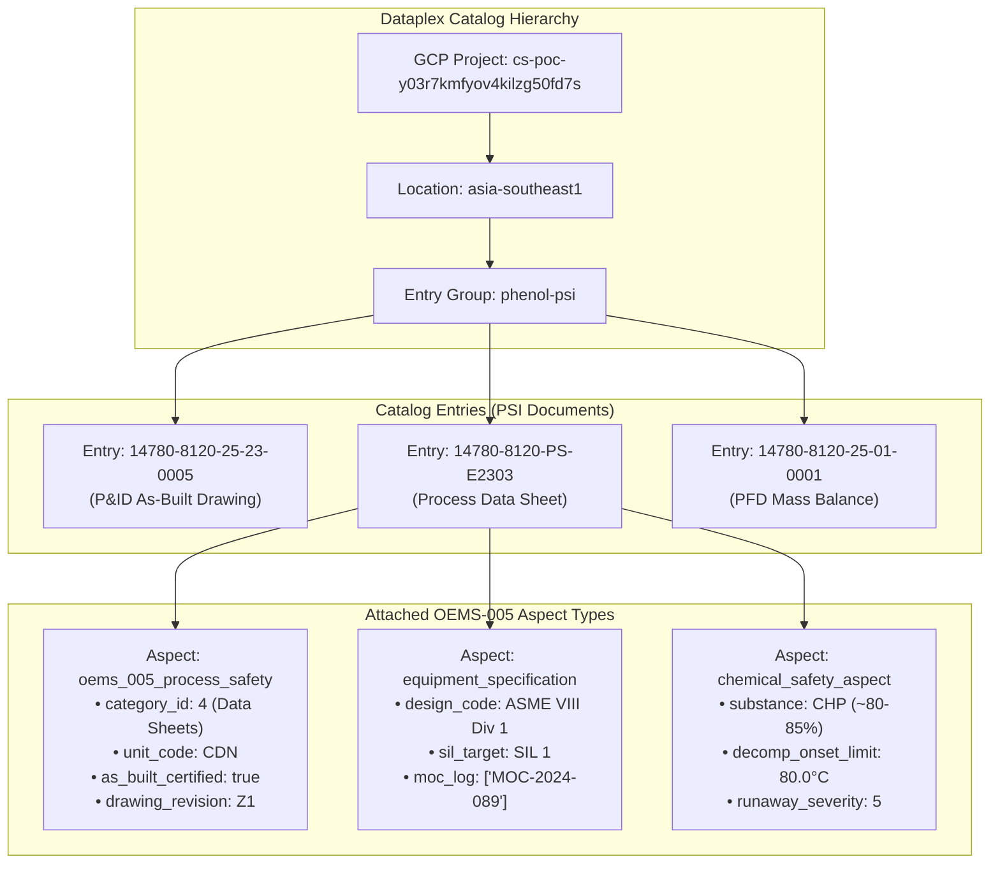

# Deep Dive: Cloud Spanner Property Graph & Dataplex Knowledge Catalog Schema Architecture

**Project:** PTT Global Chemical (PTT GC) Phenol Process Safety Platform  
**Specification Reference:** [`specs/features/SPEC-20260824-MULTI-AGENT-CLOUD-ARCHITECTURE.md`](../specs/features/SPEC-20260824-MULTI-AGENT-CLOUD-ARCHITECTURE.md) Section 3.2  
**Companion Interactive HTML Diagram:** [**`docs/spanner-graph-and-knowledge-catalog-architecture.html`**](./spanner-graph-and-knowledge-catalog-architecture.html)

---

## 1. Google Cloud Spanner Property Graph Architecture (ISO GQL Standard)

Cloud Spanner Property Graph provides a graph database engine with Google's **TrueTime** distributed consistency. In this platform, process equipment, piping flows, instrument loops, safety interlocks, and chemical hazards are modeled as a connected graph.



---

### 1.1 Spanner DDL Schema & Graph Definition

```sql
-- Node Table: Equipment
CREATE TABLE Equipment (
  EquipmentTag STRING(64) NOT NULL,
  UnitId STRING(32) NOT NULL,
  Name STRING(128) NOT NULL,
  Type STRING(32) NOT NULL, -- Vessel, HeatExchanger, Pump, Column, Reactor
  DesignPressureBarg FLOAT64,
  DesignTempCelsius FLOAT64,
  OperatingPressureBarg FLOAT64,
  OperatingTempCelsius FLOAT64,
  Material STRING(64),
  MarkdownUri STRING(256),
  DescriptionSummary STRING(MAX),
  Embedding ARRAY<FLOAT64>(vector_length=>768),
  EquipmentTokens TOKENLIST AS (
    TOKENIZE_FULLTEXT(EquipmentTag || ' ' || Name || ' ' || IFNULL(DescriptionSummary, ''))
  ) HIDDEN,
  IsDeleted BOOL NOT NULL DEFAULT (false),
  UpdatedAt TIMESTAMP OPTIONS (allow_commit_timestamp = true),
) PRIMARY KEY (EquipmentTag);

-- Node Table: Instruments & SIS Interlocks
CREATE TABLE Instruments (
  InstrumentTag STRING(64) NOT NULL,
  EquipmentTag STRING(64) NOT NULL,
  Type STRING(32) NOT NULL, -- PT, TT, FT, LT, PSV, CV, Analyzer
  CalibratedRange STRING(64),
  TripSetpoint STRING(64),
  SilRating STRING(16),     -- None, SIL 1, SIL 2, SIL 3
  VotingLogic STRING(16),   -- 1oo1, 1oo2, 2oo3
  IsSisInitiator BOOL NOT NULL DEFAULT (false),
  IsDeleted BOOL NOT NULL DEFAULT (false),
) PRIMARY KEY (InstrumentTag);

-- Edge Table: Process Piping Topology
CREATE TABLE EquipmentFlows (
  FromEquipmentTag STRING(64) NOT NULL,
  ToEquipmentTag STRING(64) NOT NULL,
  StreamId STRING(64) NOT NULL,
  PRIMARY KEY (FromEquipmentTag, ToEquipmentTag, StreamId),
  FOREIGN KEY (FromEquipmentTag) REFERENCES Equipment(EquipmentTag),
  FOREIGN KEY (ToEquipmentTag) REFERENCES Equipment(EquipmentTag)
);

-- Edge Table: Safety Interlock Actuation
CREATE TABLE InstrumentActuations (
  InitiatorInstrumentTag STRING(64) NOT NULL,
  TargetEquipmentTag STRING(64) NOT NULL,
  InterlockAction STRING(64) NOT NULL, -- e.g. "TRIP_CLOSE_UXV"
  PRIMARY KEY (InitiatorInstrumentTag, TargetEquipmentTag),
  FOREIGN KEY (InitiatorInstrumentTag) REFERENCES Instruments(InstrumentTag),
  FOREIGN KEY (TargetEquipmentTag) REFERENCES Equipment(EquipmentTag)
);

-- Property Graph Definition (ISO GQL Standard)
CREATE PROPERTY GRAPH PhenolProcessSafetyGraph
  NODE TABLES (
    Units,
    Equipment WHERE IsDeleted = false,
    Instruments WHERE IsDeleted = false,
    ChemicalHazards,
    HazopNodes WHERE IsDeleted = false
  )
  EDGE TABLES (
    EquipmentFlows
      SOURCE KEY (FromEquipmentTag) REFERENCES Equipment(EquipmentTag)
      DESTINATION KEY (ToEquipmentTag) REFERENCES Equipment(EquipmentTag)
      LABEL FEEDS,
    InstrumentActuations
      SOURCE KEY (InitiatorInstrumentTag) REFERENCES Instruments(InstrumentTag)
      DESTINATION KEY (TargetEquipmentTag) REFERENCES Equipment(EquipmentTag)
      LABEL ACTUATES_INTERLOCK
  );
```

---

## 2. Google Cloud Dataplex Knowledge Catalog Architecture

Dataplex Knowledge Catalog provides a unified metadata management lake under the `phenol-psi` entry group, attaching **OEMS-005 Aspect Types** to certified drawing entries.



---

### 2.1 OEMS-005 Aspect Definitions & Fields

#### 1. `oems_005_process_safety_aspect`
- **`category_id` (INT64):** OEMS-005 Process Safety Information Category (1 to 14):
  - `1`: Process Chemistry & Hazardous Substances
  - `2`: Safe Operating Limits & Consequence of Deviations
  - `3`: Process Flow Diagrams (PFD)
  - `4`: Piping & Instrumentation Diagrams (P&ID) & Process Data Sheets
  - `5`: Materials of Construction & Corrosion Allowances
- **`unit_code` (STRING):** `CDN` (Concentration), `OXI` (Oxidation), `ALKY` (Alkylation), `CLEAVAGE`.
- **`as_built_certified` (BOOL):** `true` for field-verified P&IDs.
- **`drawing_revision` (STRING):** Revision code (`Z1`, `A1`, `B2`).
- **`engineering_custodian` (STRING):** `PTT GC Phenol Asset Reliability Dept`.

#### 2. `equipment_specification_aspect`
- **`design_code` (STRING):** `ASME Section VIII Div 1` / `API 650` / `API 610`.
- **`design_pressure_barg` (FLOAT64):** Maximum design pressure.
- **`design_temp_celsius` (FLOAT64):** Maximum design temperature.
- **`sil_target` (STRING):** `SIL 1`, `SIL 2`, `SIL 3` safety integrity level target.
- **`moc_change_log` (ARRAY<STRING>):** Audit log of Management of Change numbers.

#### 3. `chemical_safety_aspect`
- **`hazardous_substance` (STRING):** `Cumene Hydroperoxide (~80-85 wt%)`.
- **`decomposition_limit_celsius` (FLOAT64):** `80.0°C` onset runaway threshold.
- **`runaway_hazard_severity` (INT64):** Severity rating on PTT GC RAM Matrix (`5` = Extreme).
- **`required_cooling` (STRING):** `Reliable Emergency Bus Power Supply`.

---

## 3. Cross-Storage Keying & Data Lineage Bridge

To achieve zero data drift across systems, all three storage tiers are joined on common immutable identifiers:

```
+-----------------------------------------------------------------------------------------------+
|                                  CROSS-STORAGE JOIN KEYS                                      |
+--------------------------+------------------------------+-------------------------------------+
| Cloud Spanner Graph      | Dataplex Knowledge Catalog   | Google Cloud Storage (GCS) LLM-Wiki |
+--------------------------+------------------------------+-------------------------------------+
| EquipmentTag ('E-2303')  | linked_equipment: ['E-2303'] | wiki/equipment/E-2303.md            |
| InstrumentTag ('TXSHH')  | linked_instruments: [...]    | frontmatter.instruments: [...]      |
| UnitId ('CDN')           | unit_code: 'CDN'             | wiki/unit/CDN.md                    |
| StreamId ('S-2303')      | linked_streams: ['S-2303']   | [[stream/S-2303]] wikilinks         |
+--------------------------+------------------------------+-------------------------------------+
```

---

### 🖥️ Interactive Asset Preview:
```bash
xdg-open ./docs/spanner-graph-and-knowledge-catalog-architecture.html
```
