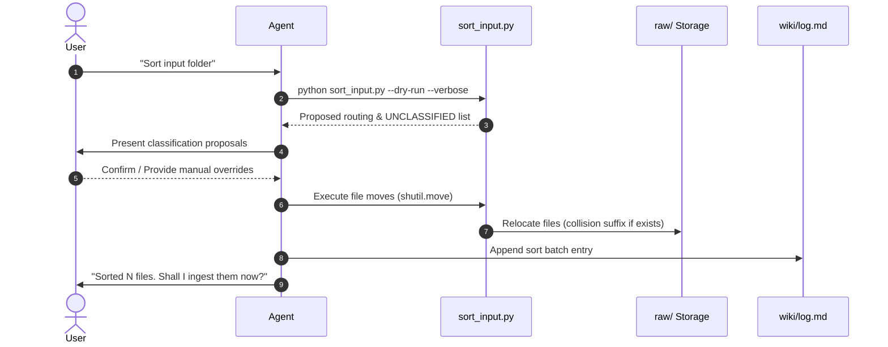
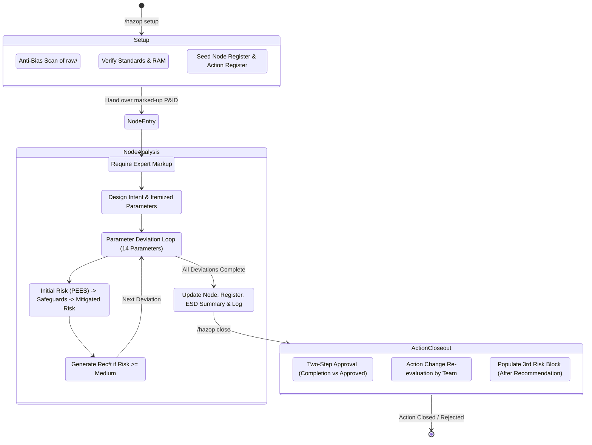
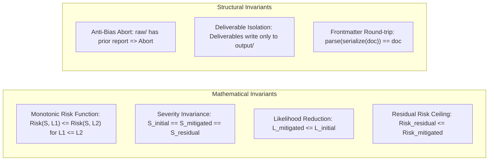

# Baseline Specification Document: Phenol Process Expert & HAZOP Safety Agent

**Document ID:** `SPEC-BASELINE-20260824-SYSTEM-OVERVIEW`  
**System Name:** Phenol Process Expert (LLM Wiki & HAZOP Safety Agent)  
**Target Facility:** Refinery Operations Ltd. — Train II, Map Ta Phut, Thailand  
**Process Technology:** Hock Process (UOP Cumene Oxidation & Cleavage)  
**Status:** Approved Baseline  
**Governing Standard:** Spec-Driven Development (SDD) Brownfield Protocol (`_agents/rules/spec_driven_development.md`)  
**Last Updated:** 2026-08-24  

---

## 1. Executive Summary & Problem Domain

### 1.1 Context & Background
The **Phenol Process Expert** is a persistent, AI-maintained engineering knowledge base and interactive process safety agent designed for chemical process specialists and safety engineers at petrochemical facilities. Operating specifically on the **Refinery Phenol Train II** plant in Map Ta Phut, Thailand (engineered by POSCO Engineering under license from UOP / Honeywell), the application synthesizes complex process safety information (PSI) spanning Process Flow Diagrams (PFDs), Piping & Instrumentation Diagrams (P&IDs), Process/Equipment Data Sheets, General Operating Manuals (GOM), Safety Data Sheets (SDS), and corporate safety standards into an interconnected knowledge graph.

### 1.2 Core Problem Statement
Process engineering and Hazard and Operability (HAZOP) studies face critical operational challenges:
1. **Knowledge Fragmentation:** Vital process limits, equipment design ratings, interlock logic, and operating windows are scattered across hundreds of dense PDF documents, spreadsheets, and CAD drawings.
2. **Ephemeral Context in LLM Chatbots:** Generic conversational AI tools suffer from hallucination, lack persistent memory, cannot perform compounding multi-document synthesis, and fail to ground engineering assertions in verified plant documentation.
3. **Auditability & Regulatory Rigor in HAZOP Studies:** Traditional HAZOP analysis requires strict compliance with corporate and statutory risk standards (e.g., Refinery OEMS and DIW regulations). Ad-hoc LLM generation of HAZOP worksheets is prone to anchoring bias, unjustified risk reductions, missing cause-consequence chains, and non-defensible safeguard credits.

### 1.3 System Mission & Objectives
- **Persistent Compounding Knowledge (LLM Wiki Pattern):** Transform raw engineering documents into a living, cross-referenced Markdown wiki where every new document enriches existing equipment, unit, stream, procedure, and hazard pages.
- **Strict Grounding & Citation:** Ensure every technical answer cites exact wiki entities and source documents. If data is absent or contradictory, the system explicitly flags the gap rather than speculating.
- **Standards-Bound HAZOP Facilitation:** Drive an interactive, node-by-node, deviation-by-deviation HAZOP study lifecycle governed by Refinery Group corporate standards (`P-(Q-MP)-OEMS-005`, `W-(Q-MP)-002`, `SG-(Q-MP)-014`), generating audit-ready worksheets, action registers, and Excel deliverables.

---

## 2. High-Level Architecture & Component Boundaries

The system architecture combines a persistent engineering knowledge base (compatible with Markdown vaults and Cloud Spanner), governed by declarative schemas and rules in GEMINI.md, Google ADK agents, and Python automation utilities.

```mermaid
graph TD
    User([Process Specialist / Safety Engineer]) <-->|Web Cockpit / Chat| Agent[Google ADK OrchestratorAgent Engine]
    
    subgraph "Rule & Schema Governance"
        GEMINI[GEMINI.md & AGENTS.md Central Directives] -.-> Agent
        HazopEngine[app/hazop/agent.py & ram_evaluator.py] -.-> Agent
        AgentsRules[_agents/rules/*.md] -.-> Agent
    end
    
    subgraph "Ingestion & Classification Layer"
        Input[input/ Drop Zone] -->|sort_input.py| Classifier{Classifier Heuristics}
        Classifier --> RawPFD[raw/pfd/]
        Classifier --> RawPID[raw/pid/]
        Classifier --> RawDS[raw/data_sheets/]
        Classifier --> RawOM[raw/operating_manuals/]
        Classifier --> RawStd[raw/standards/]
        Classifier --> RawAssets[raw/assets/]
    end
    
    subgraph "Persistent LLM Wiki (wiki/)"
        Agent -->|INGEST / QUERY / LINT| Index[wiki/index.md Catalog]
        Agent -->|Append Only| Log[wiki/log.md History]
        Agent <--> Units[wiki/units/]
        Agent <--> Equip[wiki/equipment/]
        Agent <--> Streams[wiki/streams/]
        Agent <--> Inst[wiki/instruments/]
        Agent <--> Proc[wiki/procedures/]
        Agent <--> Haz[wiki/hazards/]
        Agent <--> Param[wiki/parameters/]
        Agent <--> Trouble[wiki/troubleshooting/]
        Agent <--> Sources[wiki/sources/]
        Agent <--> HazopDir[wiki/hazop/]
    end
    
    subgraph "Deliverables & Export Pipeline (output/)"
        Agent -->|Python openpyxl Scripts| ExportXLSX[output/exports/hazop/*.xlsx]
        Agent --> WorkingDrafts[output/working/*.md, *.py]
        Agent --> Reports[output/reports/hazop/*.docx, *.pdf]
        Agent --> Presentations[output/presentations/*.pptx, *.pdf]
    end

    RawPFD -.->|Read-Only Inspection| Agent
    RawPID -.->|Read-Only Inspection| Agent
    RawDS -.->|Read-Only Inspection| Agent
    RawOM -.->|Read-Only Inspection| Agent
    RawStd -.->|Read-Only Inspection| Agent
```



### 2.1 Subsystem Roles & Responsibilities

| Subsystem | Components | Primary Responsibility | Data Access |
|---|---|---|---|
| **Agent Runtime** | `GEMINI.md`, `app/hazop/agent.py` | Enforces prompt contracts, session bootstrap, workflow routing, safety invariants, and interactive HAZOP deviation loops. | Read/Write `wiki/`, `output/`; Read `raw/` |
| **Input Classifier** | `sort_input.py`, `input/` | Scans incoming files, performs keyword/regex matching on filenames and text previews, handles collision renaming, and moves files to `raw/`. | Read `input/`, Write `raw/` |
| **Raw Vault** | `raw/` (`pfd`, `pid`, `data_sheets`, `operating_manuals`, `standards`, `assets`) | Immutable, human-provided engineering source files (PDFs, spreadsheets, images). | Read-Only for Agent |
| **Wiki Knowledge Base** | `wiki/` (151+ files across 9 domains) | Structured, human-readable Markdown vault containing synthesized unit descriptions, equipment specs, control loops, safety data, and HAZOP records. | Full Agent Ownership (Read/Write) |
| **Deliverables Pipeline** | `output/working/build_cdn_n*.py`, `output/` | Python scripts utilizing `openpyxl` to build official multi-tab Refinery Group HAZOP workbooks, reports, and presentations. | Write to `output/exports/`, `output/reports/` |

---

## 3. Data Models & File Contract Schemas

Every entity in `wiki/` is structured as a Markdown file with YAML frontmatter. This enables human inspection, Obsidian graph visualization, and deterministic agent parsing.

### 3.1 Directory Hierarchy Contract

```
/
├── GEMINI.md                          ← Agent Master Schema & Invariant Directives
├── sort_input.py                      ← CLI First-Pass File Classifier
├── input/                             ← Unclassified Drop Zone (DROP_FILES_HERE.md)
├── raw/                               ← Read-Only Primary Source Documentation
│   ├── pfd/                           ← Process Flow Diagrams & H&MB
│   ├── pid/                           ← Piping & Instrumentation Diagrams
│   ├── data_sheets/                   ← Equipment & Instrument Process Data Sheets
│   ├── operating_manuals/             ← Licensor GOM, SOPs, Operating Manuals
│   ├── standards/                     ← Company Standards (OEMS-005, RAM W-MP-002, SG-MP-014, SDS)
│   ├── hazop/example/                 ← Deliberately scoped external template reference (O-P3)
│   └── assets/                        ← Supporting drawings and imagery
├── output/                            ← Agent Deliverable Artifacts
│   ├── presentations/                 ← Slide Decks (.pptx, .pdf)
│   ├── reports/hazop/                 ← Formal Safety Reports (.docx, .pdf)
│   ├── exports/hazop/                 ← Exported GC Worksheets (.xlsx, .csv)
│   ├── exports/equipment/             ← Equipment Registers (.xlsx, .csv)
│   └── working/                       ← Intermediate scripts, drafts, briefs
└── wiki/                              ← Compounding LLM Knowledge Graph
    ├── index.md                       ← Master Catalog & Knowledge Index
    ├── log.md                         ← Chronological Activity History (Append-Only)
    ├── overview.md                    ← Plant Chemistry & Process Overview
    ├── project.md                     ← Project Identification & Drawing Indices
    ├── units/                         ← Process Section Specifications
    ├── equipment/                     ← Major Equipment Data Pages
    ├── streams/                       ← Process Stream Compositions & Conditions
    ├── instruments/                   ← Instrument, SIF, Control Valve & PSV Registers
    ├── procedures/                    ← Operating Procedures (Pre-comm, Startup, Normal, E-Stop)
    ├── parameters/                    ← Licensor Safe Operating Windows
    ├── hazards/                       ← Chemical Species & GHS Safety Profiles
    ├── troubleshooting/               ← Known Fault Diagnostic Guides
    ├── sources/                       ← Source Document Ingestion Summaries
    └── hazop/                         ← HAZOP Study Data & Records
        ├── study-info.md              ← Scope, Team, PSI Status & Node Register
        ├── risk-matrix.md             ← Refinery 5x5 RAM Specification
        ├── methodology.md             ← 9-Step HAZOP & IPL Credit Guidelines
        ├── action-register.md         ← Master Recommendation Tracker
        ├── interlock-esd-summary.md   ← Cross-Node SIS/ESD Safeguard Rollup
        ├── templates/                 ← GC Worksheet Layout Reference
        └── nodes/                     ← Per-Node Deviation Analysis Worksheets
```

### 3.2 Frontmatter Schemas by Document Class

#### 3.2.1 Unit Page (`wiki/units/<slug>.md`)
```yaml
---
name: string               # e.g., "CDN Section — Concentration, Decomposition, Neutralization"
code: enum                 # [ALKY, OXI, CDN, CLP, DIST, UT, ETP]
tags: list[string]         # [unit, <section-code>]
sources: list[string]      # List of raw/ filenames referenced
last_updated: YYYY-MM-DD
---
```

#### 3.2.2 Equipment Page (`wiki/equipment/<tag>.md`)
```yaml
---
name: string               # e.g., "Flash Column Vaporizer"
tag: string                # Plant tag number, e.g., "E-2304"
type: enum                 # [Vessel, HeatExchanger, Pump, Compressor, Column, Reactor, Filter, Package]
unit: string               # Section code, e.g., "CDN"
tags: list[string]         # [equipment, <type>, <unit>]
sources: list[string]      # List of data sheet / P&ID filenames
last_updated: YYYY-MM-DD
---
```

#### 3.2.3 Hazard Page (`wiki/hazards/<slug>.md`)
```yaml
---
name: string               # Chemical name, e.g., "Cumene Hydroperoxide"
tags: list[string]         # [hazard, chemical]
sources: list[string]      # SDS source documents
last_updated: YYYY-MM-DD
---
```
*Mandatory Invariant:* Pages containing Cumene Hydroperoxide must include the prominent decomposition banner:
`> ⚠️ CHP is a peroxide — thermal decomposition risk. See [[hazards/cumene-hydroperoxide]].`

#### 3.2.4 HAZOP Node Page (`wiki/hazop/nodes/<unit>-N<nn>.md`)
```yaml
---
name: string               # Node title, e.g., "Preflash Column Feed-Heating / Steam-Condensate Circuit"
node_id: string            # Standard ID, e.g., "CDN-N02"
markup_label: string       # Engineer drawing label, e.g., "Node 23-02"
unit: string               # e.g., "CDN"
pid_sheet: string          # e.g., "14780-8120-25-23-0005, -0005A"
pid_marked_up: string      # Marked-up drawing reference in raw/pid/
inlet_boundary: string     # Exact inlet line/equipment boundary
outlet_boundary: string    # Exact outlet line/equipment boundary
tags: list[string]         # [hazop, node, <unit>, <status>]
last_updated: YYYY-MM-DD
status: string             # e.g., "PRELIMINARY — boundaries CONFIRMED by engineer 2026-06-17"
---
```

#### 3.2.5 HAZOP Action Register (`wiki/hazop/action-register.md`)
```yaml
---
name: HAZOP Action Register
tags: [hazop, action-register]
last_updated: YYYY-MM-DD
---
```
Table schema:
`| Rec# | Node ID | Deviation | Recommendation | Risk Rank | Discipline | Owner Type | Owner | Due Date | Action Approver | Completion Date | Approved Date | Status |`
- `Owner Type`: `Internal` | `External`
- `Status`: `Open` | `In Progress` | `Closed` | `Rejected`

#### 3.2.6 HAZOP Interlock/ESD Summary (`wiki/hazop/interlock-esd-summary.md`)
```yaml
---
name: HAZOP Interlock/ESD Summary
tags: [hazop, interlock-esd-summary]
last_updated: YYYY-MM-DD
---
```
Table schema:
`| Safeguard (Tag + Action) | Node | Possible Cause | Potential Consequence | Without Safeguard (L / P / En / Ec / S / RR) | With Existing Safeguard (L / P / En / Ec / S / RR) |`

---

## 4. System Workflows & Operational Logic

### 4.1 Ingestion & Classification Workflow (SORT)
Triggered by `"Sort input folder"` or file drop in `input/`.



#### Classification Rules:
1. **Filename Regex Matches:**
   - `\bpfd\b|process.flow|mass.balance` → `raw/pfd/`
   - `\bpid\b|p&id|instrument.*diagram` → `raw/pid/`
   - `data.sheet|datasheet|equipment.spec|ds[-_]\d` → `raw/data_sheets/`
   - `operating.manual|sop|procedure|startup|shutdown` → `raw/operating_manuals/`
   - `hazop|risk.matrix|sds|msds|standard` → `raw/standards/`
   - `\.(png|jpg|svg|dwg)$` → `raw/assets/`
2. **Text Preview Content Scoring:** Scans initial 4,000 characters of plaintext files for domain terminology.
3. **Fallback:** If unclassified, leaves file in place and solicits user input.

---

### 4.2 Document Ingestion & Knowledge Compounding (INGEST)
Triggered by `"Ingest <path-to-file>"`.

1. **Read & Extract:** Agent reads the raw document from `raw/`.
2. **Entity Synthesis:** Identifies all entities created or modified:
   - Updates `wiki/units/<unit>.md`
   - Updates/creates `wiki/equipment/<tag>.md`
   - Updates `wiki/instruments/*.md` (PSVs, control valves, transmitters)
   - Updates `wiki/hazards/<slug>.md`
3. **Conflict Flagging:** If newly extracted data conflicts with prior ingested files, records a conflict note: `[CONFLICT: file1 says X, file2 says Y — resolve with operator]`.
4. **Source Documentation:** Writes `wiki/sources/<filename>.md`.
5. **Catalog & Log Maintenance:** Updates `wiki/index.md` and appends an entry to `wiki/log.md`.

---

### 4.3 Interactive Technical Q&A (QUERY)
Triggered by technical questions (e.g., *"What is the normal operating temperature of E-2303?"*).

1. Agent scans `wiki/index.md` to locate relevant pages.
2. Traverses internal wikilinks (`[[wiki/units/cdn]]`, `[[wiki/equipment/E-2303]]`).
3. Formulates a synthesized, deterministic answer citing exact tags, setpoints, and source documents.
4. If a data gap is encountered, responds: `"No data found in wiki for X — consider adding source Y"`.
5. If the troubleshooting analysis is novel, offers to persist to `wiki/troubleshooting/<slug>.md`.

---

### 4.4 End-to-End HAZOP Study Lifecycle

The HAZOP workflow is governed exclusively by the HAZOP study engine (`app/hazop/agent.py` and `app/hazop/ram_evaluator.py`).



#### 4.4.1 Three-Risk-Block Hierarchical Deviation Schema
Within `wiki/hazop/nodes/<unit>-N<nn>.md`, deviations are structured hierarchically:
- Parameter + Guideword (e.g. `1. Flow — No / Low Flow`)
- Cause: `1.1 Cause: <Tag + Failure Mode>`
- Consequence: `1.1.1 Consequence: <Causal Chain to Final Endpoint>`
  - **Without Safeguard (Initial Risk):** `L: [1-5] | Severity P/En/Ec/S: [1-5]/[1-5]/[1-5]/[1-5] | RR: [Extreme|High|Medium|Low|Very Low]`
  - **Safeguards:** `1.1.1.1 <Tag + Setpoint + Action> — IL/ESD: Yes/No — IPL=<0-3>`
  - **With Existing Safeguard (Mitigated Risk):** `L: [1-5] | Severity P/En/Ec/S: [1-5]/[1-5]/[1-5]/[1-5] | RR: [Extreme|High|Medium|Low|Very Low]`
  - **Recommendation:** `R-xxx: <Action Verb + Specific Target + Purpose>`
  - **After Recommendation Comp. (Residual Risk):** `L: [1-5] | Severity: Unchanged | RR: [Low|Very Low]` *(Populated strictly during action close-out)*

---

### 4.5 Excel Worksheet Export Pipeline
Triggered by `"Export <Node> worksheet to Excel"`.

Python scripts (`output/working/build_cdn_n02_xlsx.py`, `output/working/build_cdn_n03_xlsx.py`) utilize `openpyxl` to build an official 7-tab Refinery Group HAZOP workbook:
1. **Cover Page:** Plant metadata, study scope, P&ID list, disclaimer.
2. **HAZOP Information:** Chemical hazards, governing RAM, licensor limits, anti-bias declaration.
3. **WorkSheet Index:** Summary table of node descriptions, boundaries, and drawings.
4. **WorkSheet <Node>:** Denormalized deviation table with grouped multi-tier headers, color-coded Risk Rankings (Extreme = Dark Red, High = Red, Medium = Orange, Low = Yellow, Very Low = Green), merged cause/consequence blocks, and frozen panes.
5. **Action Items:** Filterable register of recommendations with discipline, responsible party, due date, and approval timestamps.
6. **Risk Ranking:** Full 5x5 RAM reference matrix and PEES criteria.
7. **Interlock-ESD Summary:** Filtered list of all credited SIS trips cross-checked against cause-and-effect diagrams.

---

## 5. Domain Constraints & Standards Compliance

### 5.1 Process Chemistry & Plant Constraints
- **Process Route:** Hock Process: Benzene + Propylene → Cumene → Cumene Hydroperoxide (CHP) → Phenol + Acetone.
- **Decomposition Onset (Safety Constraint):** CHP thermal decomposition initiates at **80 °C** (worst-case PSS basis, SADT 60–80 °C). Exothermic runaway generates severe overpressure and non-condensable O₂ gas.
- **Phenol Toxicity:** Acute toxicity Category 3, severe dermal absorption hazard.
- **Acidity Control:** Decomposer acid injection (98% H₂SO₄) strictly metered at 40 ppm normal (up to 300 ppm start-up transient); neutralized by Diamine before distillation.

### 5.2 Non-Negotiable Engineering Rules

#### 1. HAZOP Anti-Bias Rule
> ⛔ **HARD PROHIBITION:** Previous HAZOP reports, revalidation worksheets, or recommendation registers for **Refinery Phenol / CDN** must NEVER be ingested into `raw/` or `wiki/` during an active study.
- **Enforcement:** Agent scans `raw/` before any SETUP or NODE action. If an old plant HAZOP is detected, execution halts immediately.

#### 2. Standards Primacy Rule
- Risk rankings, consequence criteria, and safeguard credits are strictly governed by company standards (`raw/standards/`), overriding generic AI pretraining.
- RAM rankings cite `wiki/hazop/risk-matrix.md`.
- Unsubstantiated safeguard credits are flagged: `[VERIFY: meets general practice but confirm against <standard>]`.

#### 3. Node Boundary Rule
- Node boundaries are defined **exclusively** by the experienced engineer's physical or digital markup on P&IDs.
- The agent must not guess or auto-generate boundaries. If markup is absent or ambiguous, the agent stops and asks.

#### 4. RAM & Economic Severity Resolution
- Risk Assessment Matrix adheres to **Refinery Operational RAM `W-(Q-MP)-002 R2`** (5x5 matrix, PEES severity).
- **Economic Severity Tier for Refinery Operations Ltd.:** Formally resolved as **BU** tier (Extreme ≥100M THB, High 10–<100M, Medium 1–<10M, Low 0.1–<1M, Very Low <0.1M THB).

---

## 6. System Invariants & Property-Based Test Matrix

To guarantee mathematical and logical correctness across the knowledge graph and safety workflows, the following invariants are defined:



### 6.1 Unit Testing Matrix

| Test ID | Subsystem | Target Function / Module | Test Scenario | Expected Outcome |
|---|---|---|---|---|
| **UT-SORT-01** | Classifier | `sort_input.classify()` | Filename contains `14780-8120-25-23-0005_P&ID.pdf` | Destination is `raw/pid/` |
| **UT-SORT-02** | Classifier | `sort_input.classify()` | Filename contains `SDS_108-95-2_phenol.pdf` | Destination is `raw/standards/` |
| **UT-SORT-03** | Classifier | `sort_input.classify()` | Unknown binary file without keywords | Returns `(None, "no classification rule matched")` |
| **UT-RAM-01** | Risk Engine | Risk Matrix Lookup | Severity = 5 (Extreme), Likelihood = 4 (Likely) | Returns Risk Rating `"Extreme"` |
| **UT-RAM-02** | Risk Engine | Risk Matrix Lookup | Severity = 1 (Very Low), Likelihood = 1 (Improbable) | Returns Risk Rating `"Very Low"` |
| **UT-RAM-03** | Risk Engine | PEES Aggregator | P=3, En=2, Ec=4, S=1 | Governing Severity = 4 (High) |
| **UT-IPL-01** | Safeguard Evaluator | Active IPL Credit | SIF SIL 2 credited on initial Likelihood L4 | Mitigated Likelihood = L2 (reduction of 2 levels) |
| **UT-IPL-02** | Safeguard Evaluator | Non-IPL Filter | Firewater deluge or operator procedure listed | IPL credit = 0 levels reduction |
| **UT-IPL-03** | Safeguard Evaluator | IPL Credit Lower Bound | Likelihood L2 with SIL 3 (-3 levels) | Mitigated Likelihood clamped at L1 (minimum) |

### 6.2 Property-Based Testing (PBT) Matrix

| Test ID | System Invariant | Generative Input Domain | Property / Invariant Assertion |
|---|---|---|---|
| **PBT-RAM-01** | **Monotonicity over Likelihood** | $\forall S \in [1, 5], \forall L_1, L_2 \in [1, 5]$ with $L_1 \le L_2$ | $\text{RiskRating}(S, L_1) \le \text{RiskRating}(S, L_2)$ (where $\text{Very Low} < \text{Low} < \text{Medium} < \text{High} < \text{Extreme}$) |
| **PBT-RAM-02** | **Monotonicity over Severity** | $\forall S_1, S_2 \in [1, 5]$ with $S_1 \le S_2, \forall L \in [1, 5]$ | $\text{RiskRating}(S_1, L) \le \text{RiskRating}(S_2, L)$ |
| **PBT-RAM-03** | **Severity Invariance Across Mitigation** | Arbitrary initial severity tuples $(P, En, Ec, S) \in [1,5]^4$ and arbitrary safeguard sets | $S_{\text{initial}} = S_{\text{mitigated}} = S_{\text{residual}} = \max(P, En, Ec, S)$ |
| **PBT-HAZ-01** | **Mandatory Action Threshold** | $\forall \text{deviation}$ where $\text{RiskRating}_{\text{mitigated}} \ge \text{Medium}$ | An action item $\text{Rec\#}$ MUST be generated ($|\text{Rec\#}| \ge 1$) |
| **PBT-HAZ-02** | **Residual Risk Improvement** | $\forall \text{closed deviation}$ with effective recommendation | $\text{RiskRating}_{\text{residual}} \le \text{RiskRating}_{\text{mitigated}}$ |
| **PBT-FMT-01** | **Frontmatter Idempotence & Round-Trip** | Generative dictionaries conforming to frontmatter schema | $\text{deserialize}(\text{serialize}(frontmatter)) \equiv frontmatter$ |
| **PBT-OUT-01** | **File Naming Syntax Invariant** | Generated deliverable filenames | Match regex `^\d{4}-\d{2}-\d{2}_[a-zA-Z0-9-]+_[a-zA-Z0-9-]+_[a-zA-Z0-9-]+\.[a-zA-Z0-9]+$` |
| **PBT-SEC-01** | **Raw Vault Immutability** | Any agent workflow execution | MD5 hashes of all files under `raw/` remain strictly identical before and after execution |

---

## 7. Operational Status & Verified Milestones

As of August 2026, the baseline knowledge base contains:
- **97 Ingested Source Documents** across PFDs (Drawings 0000–0006), P&IDs (Drawings 0002–0023), 15 static equipment data sheets, 9 heat exchanger data sheets, 13 rotating equipment data sheets, 11 static vessel data sheets, 7 instrument data sheets, UOP GOM (388 pages), and corporate standards.
- **151+ Synthesized Wiki Pages** spanning units, equipment, instruments, hazards, operating windows, and procedures.
- **Two Completed Preliminary HAZOP Nodes:**
  - `CDN-N02` (Preflash Column Feed Heating, yellow markup, Dwg 0005/0005A) → Recommendations `R-001` through `R-004`, Excel export `2026-06-18_CDN-N02_HAZOP-worksheet.xlsx`.
  - `CDN-N03` (Flash Column Vaporizer & Bottoms Pump-out, green markup, Dwg 0007–0012A) → Recommendations `R-005` through `R-009`, Excel export `2026-06-18_CDN-N03_HAZOP-worksheet.xlsx`.
- **Active Conflict Tracking:** High-priority items codified in `wiki/index.md` (D-2304 rupture disc burst pressure conflict, D-2312 Diamine fluid identity verification).
