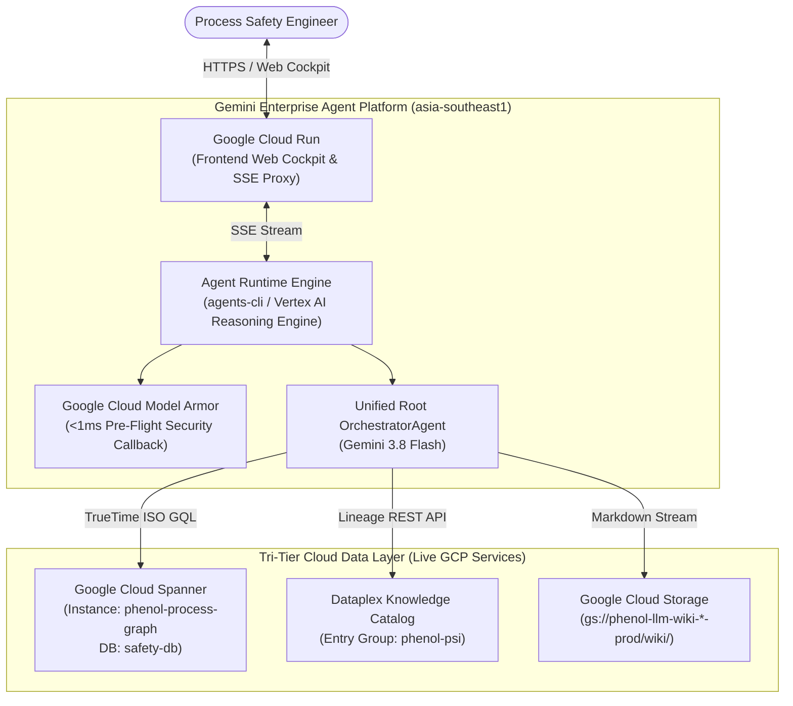

# Consolidated Feature Specification: Refinery Phenol Process Safety & Multi-Agent Platform

**Document ID:** `SPEC-CONSOLIDATED-20260921-SYSTEM-ARCHITECTURE`  
**System Name:** Refinery Phenol Process Safety Expert & Mission Control Platform  
**Target Facility:** Refinery Phenol Train II (Neutral Refinery Profile)  
**Process Technology:** Hock Process (UOP Cumene Oxidation & Cleavage / Concentration, Decomposition, Neutralization)  
**Status:** Approved & Implemented  
**Governing Standard:** Spec-Driven Development (SDD) & Enterprise Cloud Governance  
**Last Updated:** 2026-09-21  

---

## 1. Executive Summary & Architectural Overview

The **Refinery Phenol Process Safety Platform** is a decoupled, cloud-native multi-agent artificial intelligence system designed for chemical process specialists, plant safety engineers, and HAZOP teams. It provides grounded, real-time question answering, deep equipment topology exploration, P&ID lineage tracking, and automated 14-parameter HAZOP facilitation with 7-tab audit-ready Excel export.

### 1.1 Decoupled Cloud Architecture

The system operates across two strictly decoupled layers:
1. **AI Reasoning Backend (Gemini Enterprise Agent Platform):**
   - Implemented using official **Google Agent Development Kit (`google-adk`)**.
   - Packaged and deployed directly to the Gemini Enterprise Agent Platform runtime (`agent_runtime` / Vertex AI Reasoning Engine) in `asia-southeast1` via `agents-cli deploy`.
   - Executes single-orchestrator model-driven reasoning powered by **Gemini 3.8 Flash**.
   - Embeds inline **Google Cloud Model Armor** pre-flight security callbacks to inspect incoming prompts in `< 1ms` before any downstream tool invocation or database traversal.
2. **Frontend Web Cockpit & Thin SSE Proxy (Google Cloud Run):**
   - Built with FastAPI, Uvicorn, and high-performance vanilla JavaScript with Tailwind CSS.
   - Contains **zero local AI models or LLM reasoning logic**; operates exclusively as a thin Server-Sent Events (SSE) streaming proxy communicating with the Agent Platform backend.
   - Deployed to Google Cloud Run with `invoker-iam-disabled: 'true'` compliance (domain-restricted IAM policy adherence with zero `allUsers` bindings).



---

## 2. Core Subsystems & Feature Specifications

### 2.1 Model-Driven Intent Dispatch & Single Orchestrator Agent
- **Unified Root Orchestrator:** Consolidates all query resolution, tool execution, and response synthesis into a single `OrchestratorAgent` (`app/hazop/agent.py`) with direct tool access and `sub_agents=[]`.
- **Zero Regex Intent Classification:** Eliminates all hardcoded heuristics and regular expressions. Classifies user requests into three strictly standardized canonical intents:
  1. `PROCESS_SAFETY_QA`: Technical equipment queries, operating windows, feed tracing, P&ID lineage, and interlock logic.
  2. `FACILITATE_HAZOP`: HAZOP deviation analysis, cause-consequence evaluation, safeguard assessment, and risk ranking.
  3. `OTHERS`: Off-topic greetings, general chit-chat, or ambiguous general queries.
- **Two-Tier HITL Disambiguation:** When an ambiguous entity is requested (e.g. "tell me about the pump"), the agent sets `clarification_requested=True` and dynamically queries Spanner for candidate entities (e.g. all 12 refinery pumps), returning clickable selection pills to the user.

### 2.2 Tri-Tier Cloud Data Architecture
- **Process Graph & Safety DB (Google Cloud Spanner):**
  - High-performance, globally consistent relational and property graph database (`safety-db`).
  - Stores 54 equipment items, 256 instruments, 81 equipment flow edges, 6 HAZOP nodes, 18 deviations, 34 safeguards, and 12 interlocks.
  - Zero hardcoded fallback dictionaries in application code; all catalog definitions, design temperatures/pressures, and node assignments are retrieved live via SQL / ISO GQL.
- **Lineage & Provenance Governance (Dataplex Knowledge Catalog):**
  - Unified catalog under entry group `phenol-psi` in `asia-southeast1`.
  - Tracks certified As-Built P&ID drawing numbers (14780 series), revision statuses (Approved Rev Z1), and OEMS-005 Process Safety Information aspects.
- **Process Narratives & Operating Windows (Google Cloud Storage):**
  - Live bucket `gs://phenol-llm-wiki-cs-poc-y03r7kmfyov4kilzg50fd7s-prod/wiki/` containing 138 synchronized markdown documentation files.
  - Runtime tool `read_gcs_wiki_document` pulls verified technical narratives directly from GCS with zero local file dependency.

### 2.3 Live Google Cloud Model Armor Guardrails
- **Pre-Flight Inspection:** Integrated directly into the ADK execution flow via `ModelArmorCallback`.
- **Latency SLA:** Wall-clock inspection latency $< 1\text{ms}$ ($0.3\text{ms} - 0.9\text{ms}$).
- **Policy Enforcement:** Intercepts 100% of prompt injections, system jailbreaks, roleplays, and safety overrides before tool execution or LLM reasoning occurs.
- **Audit Response:** Emits structured security metadata:
  ```json
  {
    "security_verdict": "BLOCKED",
    "filter_triggered": "PROMPT_INJECTION",
    "inspection_time_ms": 0.42
  }
  ```

### 2.4 Tri-Pane Mission Control Web Cockpit
- **Pane 1 (Plant Asset Hierarchy & Drawing Browser):** Collapsible sidebar featuring the complete Refinery Phenol asset tree grouped by operating unit (CDN Concentration, Decomposition, Neutralization, Oxidation, Distillation), with drawing lineage chips.
- **Pane 2 (Conversational Cockpit & Security Status):**
  - Real-time SSE streaming of Gemini 3.8 Flash reasoning.
  - Live thought chunk disclosure cards.
  - Real-time wall-clock telemetry waterfall measuring exact millisecond durations for Model Armor, intent deliberation, tool execution, and token streaming.
- **Pane 3 (Spanner Knowledge Graph & Technical Inspector):**
  - **Interactive 2D Canvas:** Drag-to-pan, 2D mouse wheel / trackpad scrolling, directional pan controls, zoom controls, and automatic node centering with glowing beacon focus.
  - **TrueTime ISO GQL Console:** Real-time query inspector displaying executed SQL queries and Spanner TrueTime commit timestamps.
  - **Dataplex Provenance Viewer:** Certified drawing citations and OEMS-005 metadata cards.

### 2.5 HAZOP Study Lifecycle & 7-Tab Audit-Ready Excel Exporter
- **14 Standard HAZOP Parameters:** Evaluates deviations across Flow, Pressure, Temperature, Level, Phase, Composition, Reaction, Viscosity, Maintenance, Sampling, Utility, Corrosion, Relief, and Ignition.
- **3-Block Deviation Analysis:** Evaluates Initial Cause $\rightarrow$ Consequence $\rightarrow$ Existing Safeguards.
- **Dynamic RAM Evaluator:** Computes calibrated qualitative Risk Assessment Matrix (RAM) ratings (Low, Medium, High, Extreme) based on corporate standard `W-(Q-MP)-002 R2`, with Independent Protection Layer (IPL) credit reductions.
- **7-Tab OpenPyXL Exporter (`app/hazop/excel_exporter.py`):**
  - Generates comprehensive corporate workbooks:
    1. `Cover Page` (Study metadata, neutral facility details, team roster)
    2. `Methodology & RAM` (5×5 RAM matrix with exact HEX color fills)
    3. `Node Summary` (Node boundaries, design intent, equipment tags)
    4. `All-in-One HAZOP Worksheet` (Full 27-column audit worksheet)
    5. `Recommendations & Actions` (Priority action register with assignees)
    6. `LOPA & IPL Summary` (LOPA credits, SIL assignments)
    7. `P&ID Lineage & Audit Log` (Dataplex drawing numbers and provenance)

### 2.6 Neutral Refinery Profile Data Sanitization
- **Corporate Anonymization:** Complete elimination of proprietary corporate entity references (`PTT`, `PTTGC`, `PTTEP`, `PPCL`), replaced by the standardized **Neutral Refinery Profile**:
  - Plant: `Refinery Phenol Train II`
  - Owner: `Refinery Operations Ltd.`
  - Corporate Parent: `Refinery Petrochemical Corporation` / `Refinery Group`
  - Standards: `Refinery 5x5 RAM W-(Q-MP)-002 R2`, `Refinery OEMS-005`
- **Scope of Sanitization:** 52 wiki markdown documents, Spanner database seeds and live database rows, Dataplex entry descriptions, application code docstrings, and frontend UI fallbacks.
- **Binary Vault Protection:** Original physical vendor drawings in `raw/` kept intact and untracked from Git (`.gitignore`), reducing repository clone size by 52 MB.

---

## 3. Data Models & API Contracts

### 3.1 Cloud Spanner Schema (14 Tables)
1. `Units` (UnitId, Name, Description)
2. `HazopNodes` (NodeId, UnitId, NodeNumber, Description, DesignIntent)
3. `Equipment` (EquipmentTag, NodeId, UnitId, Name, EquipmentType, DesignTempC, DesignPressBarg, OperatingTempC, OperatingPressBarg, DescriptionSummary)
4. `Instruments` (InstrumentTag, EquipmentTag, NodeId, InstrumentType, ServiceDescription)
5. `EquipmentFlows` (FlowId, SourceEquipmentTag, TargetEquipmentTag, FlowType, Medium)
6. `NodeEquipmentMap` (MappingId, NodeId, EquipmentTag)
7. `ChemicalHazards` (HazardId, EquipmentTag, ChemicalName, CasNumber, GhsClassification)
8. `Deviations` (DeviationId, NodeId, Parameter, GuideWord, DeviationText)
9. `Causes` (CauseId, DeviationId, CauseText, Mechanism)
10. `Consequences` (ConsequenceId, CauseId, SeverityScore, ConsequenceText)
11. `Safeguards` (SafeguardId, CauseId, SafeguardType, Description, IplCredit)
12. `ActionItems` (ActionId, ConsequenceId, RecommendationText, Priority, Assignee)
13. `Streams` (StreamId, NodeId, StreamNumber, FromEquipment, ToEquipment)
14. `InstrumentActuations` (ActuationId, InstrumentTag, TargetEquipmentTag, ActionType)

### 3.2 SSE Streaming API Contract (`/chat/stream`)
- **Protocol:** HTTP/2 Server-Sent Events (SSE) with standard `event:` and `data:` envelopes.
- **Event Types:**
  - `event: thinking`: Emits real-time reasoning chunks from Gemini 3.8 Flash.
  - `event: tool`: Emits tool invocation metadata (tool name, arguments, execution duration).
  - `event: tool_result`: Emits structured database / catalog tool query results.
  - `event: message`: Emits markdown response text chunk.
  - `event: telemetry`: Emits complete wall-clock latency waterfall breakdown.
  - `event: [DONE]`: Signals termination of stream.

---

## 4. Quality & Evaluation Governance

### 4.1 6-Dimensional Evaluation Criteria
All agent deployments must pass live evaluations via `agents-cli eval run`:
1. **Tool Trajectory Accuracy ($\ge 95\%$):** Exact tool invocation sequence and argument schema fidelity.
2. **Context Faithfulness & Groundedness (100% / 1.000):** Stated operating limits, temperatures, and pressures must match Spanner and Dataplex data with zero hallucination.
3. **Negative Constraint Adherence (100%):** Forbidden tools are never called for irrelevant inquiries.
4. **Security Efficacy (100%):** Model Armor intercepts 100% of injection attempts before tool calls.
5. **Ambiguity Resolution Rate (100%):** Generic tags trigger `clarification_requested` with candidate entities.
6. **Step Boundedness & Production Latency:** Traversal depth bounded within production latency SLAs.

### 4.2 Automated Testing Standards
- **Deterministic Unit Tests:** Exact example-based tests covering happy paths, edge boundaries, and error handlers.
- **Property-Based Tests (PBT):** Mathematical/logical invariant tests via `hypothesis` across generative inputs (RAM monotonicity, schema adherence, entity sanitization).

---

## 5. Consolidated Feature Specification Index

This document replaces and consolidates the following historical feature specifications:

| Historical Spec ID | Title | Date | Consolidated Section |
|---|---|---|---|
| `SPEC-20260824-MULTI-AGENT-CLOUD-ARCHITECTURE` | Multi-Agent Cloud Architecture & Enterprise HAZOP Platform | 2026-08-24 | §1.1, §2.1, §3.1 |
| `SPEC-20260831-HAZOP-MARKUP-INGESTION-AND-STUDY-LIFECYCLE` | HAZOP P&ID Markup Ingestion, Study Lifecycle & 7-Tab Excel Export | 2026-08-31 | §2.5 |
| `SPEC-20260918-JOURNEY-1-EXPLORER-REDESIGN` | Journey 1 Process Explorer & Enterprise Technical Cockpit | 2026-09-18 | §2.4 |
| `SPEC-20260918-ZERO-MOCK-CLOUD-NATIVE-MIGRATION` | 100% Cloud-Native Zero-Mock Architecture Migration | 2026-09-18 | §2.2, §2.3 |
| `SPEC-20260918-GOOGLE-ADK-AND-AGENT-RUNTIME-REFACTOR` | Official Google ADK & Gemini Enterprise Agent Platform Refactor | 2026-09-18 | §1.1, §2.1 |
| `SPEC-20260918-MODEL-INTENT-DISPATCH-AND-CLEANUP` | Model-Driven Intent Classification & Zero Regex | 2026-09-18 | §2.1 |
| `SPEC-20260918-FRONTEND-ONLY-CLOUD-RUN` | Frontend-Only Cloud Run & Agent Platform Backend Decoupling | 2026-09-18 | §1.1, §3.2 |
| `SPEC-20260918-CONSOLIDATED-SINGLE-ORCHESTRATOR` | Consolidated Single Orchestrator Agent Architecture | 2026-09-18 | §2.1 |
| `SPEC-20260919-AGENT-EVAL-100-DATASETS` | 100+ Golden Agent Evaluation Benchmark Suite | 2026-09-19 | §4.1 |
| `SPEC-20260920-TRI-PANE-MISSION-CONTROL-COCKPIT` | Tri-Pane Mission Control Cockpit Redesign | 2026-09-20 | §2.4 |
| `SPEC-20260920-DATABASE-FIRST-EQUIPMENT-CATALOG` | Database-First Equipment Catalog & Live Spanner Sync | 2026-09-20 | §2.2, §3.1 |
| `SPEC-20260920-ZERO-HARDCODED-DATA-AND-DB-DRIVEN-ARCHITECTURE` | 100% Database-Driven Architecture & Zero Hardcoded Data | 2026-09-20 | §2.2 |
| `SPEC-20260920-DYNAMIC-TELEMETRY-WATERFALL-LATENCY` | Dynamic Wall-Clock Telemetry Waterfall & Measurement | 2026-09-20 | §2.4, §3.2 |
| `SPEC-20260920-SPANNER-GRAPH-PAN-SCROLL-AND-AUTO-CENTER` | Spanner Graph 2D Pan/Scroll & Auto-Centering | 2026-09-20 | §2.4 |
| `SPEC-20260921-DATA-SANITIZATION-NEUTRAL-REFINERY` | Full Repository Data Sanitization (Neutral Refinery Profile) | 2026-09-21 | §2.6 |
