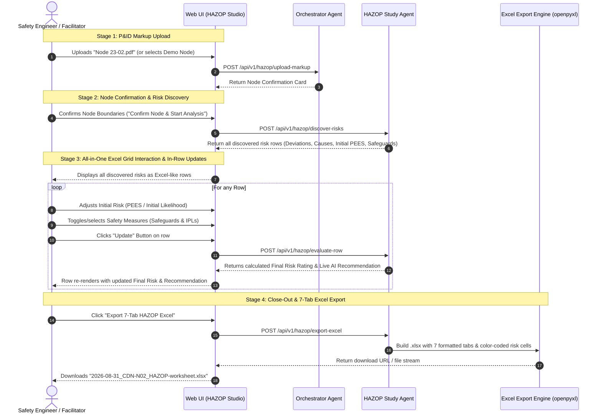

# Specification Document: HAZOP P&ID Markup Ingestion, Interactive Study Lifecycle & 7-Tab Audit-Ready Excel Export

**Document ID:** `SPEC-20260831-HAZOP-MARKUP-INGESTION-AND-STUDY-LIFECYCLE`  
**Status:** In Review / Ready for Implementation  
**Author(s):** Process Safety AI Architecture Team  
**Governing Standard:** Spec-Driven Development (SDD) Protocol (`_agents/rules/spec_driven_development.md`)  
**Parent Baseline:** [`specs/baseline/system-overview.md`](../baseline/system-overview.md) & [`specs/features/SPEC-20260824-MULTI-AGENT-CLOUD-ARCHITECTURE.md`](./SPEC-20260824-MULTI-AGENT-CLOUD-ARCHITECTURE.md)  
**Reference Artifacts:** `hazop-example/HAZOP-SKILLS.md`, `hazop-example/Node 23-02.pdf`, `hazop-example/Node 23-03.pdf`, `hazop-example/2026-06-18_CDN-N02_HAZOP-worksheet.xlsx`, `hazop-example/2026-06-18_CDN-N03_HAZOP-worksheet.xlsx`  
**Target Date:** 2026-08-31  

---

## 1. Problem Statement & Objectives

### 1.1 Context & Background
In industrial chemical manufacturing facilities such as **PTT Phenol Train II (PPCL)**, HAZOP studies are strictly bounded by process segments marked up directly on Piping & Instrumentation Diagrams (P&IDs) by experienced lead process safety engineers.

As demonstrated in `hazop-example/`, the engineer supplies:
1. **Expert-Marked P&IDs (PDFs):** Color-coded boundaries (e.g., Yellow for `Node 23-02`, Green for `Node 23-03`) defining physical node limits, related drawings, and equipment tags.
2. **HAZOP Skill Contract (`HAZOP-SKILLS.md`):** Non-negotiable safety rules (Anti-Bias rule, Node Boundary rule, Standards Primacy rule, 3-risk-block schema, IPL credit tables).
3. **Official GC 7-Tab Excel Deliverables:** Exact workbook structures (`Cover Page`, `HAZOP Information`, `WorkSheet Index`, `WorkSheet <Node>`, `Action Items`, `Risk Ranking`, `Interlock-ESD Summary`).

### 1.2 Core Objectives
1. **PDF Markup Ingestion & Boundary Extraction:** Allow the user to upload engineer-marked P&ID PDFs (`Node 23-02.pdf`, `Node 23-03.pdf`). Extract node identifiers, color codes, drawing numbers, boundary lines, and included equipment tags.
2. **Human-in-the-Loop Node Confirmation Gate:** Generate a structured **Node Definition Preview** (design intent, inlet/outlet boundaries, equipment list, operating parameters) and require user confirmation.
3. **All-in-One Discovered Risks Excel Grid:** Instead of isolated step-by-step cards, display all discovered deviations/risks simultaneously in an interactive Excel-like worksheet grid.
4. **Interactive In-Row Adjustments & Dynamic Calculation:**
   - **Initial 1st Risk Rating:** Allow users to adjust Initial Likelihood (1-5) and PEES Severity (People, Environment, Economic, Social 1-5) per row.
   - **Safety Measure Selection:** Allow users to select/deselect specific safety measures (SIS/ESD trips, BPCS alarms) and view IPL credits per row.
   - **Automatic Final 2nd Risk Calculation on "Update":** Automatically re-evaluate mitigated likelihood ($L_{\text{w}} = \max(1, L_{\text{wo}} - \sum \text{IPL}_{\text{selected}})$), compute 5x5 RAM Final Risk, and refresh AI Recommendations upon clicking the **"Update"** button.
5. **7-Tab Audit-Ready Excel Export:** Export complete, styled workbooks matching the layout, merged headers, formula-compatible risk columns, and color coding of `hazop-example/*.xlsx`.
6. **No Speculative Generation / Anti-Bias Invariant:** Strictly preserve the Anti-Bias check and standards primacy.

---

## 2. End-to-End User Journey & State Machine



---

## 3. Data Models & Schemas

### 3.1 Node Boundary & Drawing Metadata Schema (`NodeDefinition`)
```json
{
  "node_id": "CDN-N02",
  "markup_label": "Node 23-02 (engineer P&ID markup)",
  "colour_code": "Yellow",
  "unit": "CDN",
  "name": "Preflash Column Feed-Heating / Steam-Condensate Circuit",
  "pid_drawings": ["14780-8120-25-23-0005", "14780-8120-25-23-0005A"],
  "boundary_crossings": ["14780-8120-25-23-0004", "14780-8120-25-23-0007"],
  "inlet_boundary": "Oxidate feed to E-2302A/B tube side (from feed filters X-2302A/B / Node 23-01) + hot OXI recirculate to E-2302A/B shell + SC1.5 steam supply to E-2303 tube (via UXV-0501/0502)",
  "outlet_boundary": "Heated oxidate to V-2301 (Preflash Column) + OXI recirculate shell return to OXI + steam condensate from P-2308A/B to condensate return system (66-0056)",
  "equipment_tags": ["E-2302A/B", "E-2303", "D-2308", "P-2308A/B"],
  "design_intent": "Heat oxidate feed to Preflash Column target temp: recover heat in E-2302A/B, trim with SC1.5 steam in E-2303, deliver to V-2301; collect/return E-2303 condensate.",
  "parameters": [
    {
      "tag": "E-2302A/B tube",
      "stream": "Fresh oxidate feed (CHP ~22.6 wt%)",
      "design_condition": "12 kg/cm²g / FV @ 83→120 °C",
      "operating_condition": "~82–83 °C; feed flow part of S229 1,076,643 kg/h total",
      "source": "E-2302AB; PFD-0001"
    },
    {
      "tag": "E-2303 shell",
      "stream": "Oxidate (process, CHP)",
      "design_condition": "3.5 kg/cm²g / FV @ 195/250 °C",
      "operating_condition": "in ~82 °C → out ~83 °C target to V-2301",
      "source": "E-2303"
    }
  ],
  "status": "CONFIRMED"
}
```

### 3.2 3-Risk-Block Worksheet Row Schema (27 Columns)
Matches `WorkSheet CDN-N02` and `WorkSheet CDN-N03` in `hazop-example/*.xlsx`:

| Col # | Field Name | Type | Description / Constraints |
|---|---|---|---|
| **1** | `ref` | String | Hierarchical reference (e.g. `1.1.1`, `1.2.1`, `2.1.1`) |
| **2** | `parameter` | String | Flow, Pressure, Temperature, Level, Reaction, etc. |
| **3** | `deviation` | String | No / Low Flow, More Flow, High Temperature, etc. |
| **4** | `cause` | String | Specific root cause with equipment/instrument tags |
| **5** | `consequence` | String | Unmitigated causal chain to endpoint |
| **6..10** | `wo_l`, `wo_p`, `wo_en`, `wo_ec`, `wo_s` | Int (1..5) | Without Safeguards Likelihood & PEES Severity |
| **11** | `wo_rr` | Enum | Without Safeguards Risk Rating (`Extreme`, `High`, `Medium`, `Low`, `Very Low`) |
| **12** | `existing_safeguards` | List[Object] | Tagged setpoints and trip actions |
| **13** | `il_esd` | String (`Yes`/`No`) | `Yes` strictly for SIS/ESD interlock trips |
| **14** | `ipl` | Int (0..3) | Independent Protection Layer credit |
| **15..19** | `w_l`, `w_p`, `w_en`, `w_ec`, `w_s` | Int (1..5) | With Safeguards Likelihood & PEES Severity |
| **20** | `w_rr` | Enum | With Safeguards Risk Rating (`Extreme`, `High`, `Medium`, `Low`, `Very Low`) |
| **21** | `recommendation` | String | `R-xxx: Action verb + Target + Purpose` (or `None - risk acceptable`) |
| **22..26** | `after_l`, `after_p`, `after_en`, `after_ec`, `after_s` | Int (1..5) | Residual Likelihood & Severity (populated at action close-out) |
| **27** | `after_rr` | Enum | Residual Risk Rating (`Low`, `Very Low`) |

### 3.3 7-Tab Excel Workbook Architecture
The export engine generates the 7 sheets identical to `hazop-example/`:
1. **`Cover Page`:** Formatted title, plant metadata, unit, node, drawings, disclaimer, and revision block.
2. **`HAZOP Information`:** Project/MOC details, scope, chemical hazards (CHP peroxide onset 80°C), RAM citation, licensor limits, anti-bias declaration.
3. **`WorkSheet Index`:** Node No, Description, Design Intention, Design/Operating Conditions, Colour code, Related Drawings, Status.
4. **`WorkSheet <Node>`:** Grouped two-tier headers, freeze pane at row 3, color-coded risk rank cells (Extreme = Maroon `#800000`/White, High = Red `#FF0000`/White, Medium = Orange `#FFC000`/Black, Low = Yellow `#FFFF00`/Black, Very Low = Green `#92D050`/Black).
5. **`Action Items`:** Recommendation register (`Rec#`, `Node`, `Deviation Ref`, `Action Detail`, `Risk Rank`, `Discipline`, `Owner Type`, `Responsible`, `Due Date`, `Approver`, `Completion Date`, `Approved Date`, `Status`).
6. **`Risk Ranking`:** 5x5 RAM lookup matrix and PTT GC PEES criteria (BU economic tier: $\ge$100M THB).
7. **`Interlock-ESD Summary`:** Rollup table of all credited SIS trips (`IL/ESD = Yes`).

---

## 4. API Endpoints

### 4.1 `POST /api/v1/hazop/upload-markup`
* **Request:** `multipart/form-data` with `file: UploadFile` (PDF) and optional `unit: str`.
* **Behavior:** Extractor scans the PDF annotations, title blocks, and drawing boundaries, then queries Retriever to hydrate equipment design/operating parameters.
* **Response:** Returns hydrated `NodeDefinition` with preliminary status `AWAITING_CONFIRMATION`.

### 4.2 `POST /api/v1/hazop/confirm-node`
* **Request:** JSON payload containing confirmed `NodeDefinition`.
* **Behavior:** Saves node definition to `wiki/hazop/nodes/<node_id>.md`, adds node to `wiki/hazop/study-info.md`, and returns session state.

### 4.3 `POST /api/v1/hazop/discover-risks`
* **Request:** JSON payload with `node_id: str` and `equipment_tags: List[str]`.
* **Behavior:** Generates all candidate deviations, causes, consequences, initial PEES severity & likelihood, and available safeguards for the confirmed node.
* **Response:** Returns `List[DiscoveredRiskRow]` populated with candidate risk data.

### 4.4 `POST /api/v1/hazop/evaluate-row`
* **Request:** JSON payload containing `ref`, `deviation`, `cause`, `consequence`, `people`, `env`, `econ`, `social`, `initial_likelihood`, and `selected_safeguards`.
* **Behavior:** Computes 1st Risk (PEES + L), tallies active IPL credits, calculates mitigated 2nd Likelihood ($L_{\text{w}} = \max(1, L_{\text{wo}} - \sum \text{IPL})$), determines Mitigated 2nd Risk, and generates actionable AI recommendation if Risk $\ge$ Medium.
* **Response:** Returns complete evaluated row structure ready for live Excel-grid rendering and workbook export.

### 4.5 `POST /api/v1/hazop/export-excel`
* **Request:** JSON payload with `node_id`, `study_metadata`, and `worksheet_rows`.
* **Behavior:** Generates 7-tab Excel workbook via `openpyxl` with exact formatting and returns download file stream / path.

---

## 5. Non-Negotiable Safety Invariants & Testing Strategy

### 5.1 Invariants
1. **Anti-Bias Invariant:** Prior Phenol HAZOP reports in `raw/` trigger immediate execution halt.
2. **Node Boundary Invariant:** Node analysis cannot begin without confirmed boundaries from the marked-up P&ID.
3. **Severity Invariance:** Unmitigated Severity $\equiv$ Mitigated Severity $\equiv$ Residual Severity ($S_{\text{wo}} = S_{\text{w}} = S_{\text{after}}$).
4. **Monotonic Risk Invariant:** Risk decreases monotonically as likelihood is reduced by verified IPL credits.
5. **IPL Safeguard Independence Invariant:** Only SIS trips and certified independent devices earn likelihood reduction credits (SIL 1 = 1, SIL 2 = 2, SIL 3 = 3; basic alarms and procedures = 0).

### 5.2 Unit & Property-Based Test Matrix
* **Unit Tests (`tests/test_hazop_markup_and_study.py`, `tests/test_server_endpoints.py`):**
  - `UT-MARKUP-01`: PDF upload of `Node 23-02.pdf` extracts node `CDN-N02`, drawing `0005/0005A`, and equipment `E-2302A/B`, `E-2303`, `D-2308`, `P-2308A/B`.
  - `UT-CONFIRM-01`: Node confirmation persists markdown frontmatter and itemized operating parameters.
  - `UT-DISCOVER-01`: Discover risks returns all credible deviations and causes for Node CDN-N02 and CDN-N03.
  - `UT-EVAL-ROW-01`: In-row evaluation adjusts initial risk and recalculates mitigated risk when safeguards are toggled.
  - `UT-EXCEL-01`: Exported workbook has exactly 7 sheets with identical header structure to `hazop-example/*.xlsx`.
* **Property-Based Tests (Hypothesis):**
  - `PBT-RAM-MONO`: Monotonic risk reduction across all generative $(S, L_1, L_2)$ tuples.
  - `PBT-IPL-BOUNDS`: Mitigated likelihood clamped strictly in $[1, 5]$.
  - `PBT-SCHEMA-ROUNDTRIP`: Node definition and worksheet row serialization/deserialization idempotence.

---

## 6. Implementation Plan Breakdown

| Step # | Task / Module | Target Files | Dependencies | Completion Criteria |
|---|---|---|---|---|
| **1.0** | **Risk Discovery & Row Evaluation Engine** | `agents/hazop/agent.py`, `agents/hazop/ram_evaluator.py` | None | Implements `discover_node_risks` and `evaluate_row` with deterministic RAM & IPL calculations. |
| **2.0** | **FastAPI Endpoints for All-in-One Grid** | `server/main.py` | Step 1.0 | Exposes `POST /api/v1/hazop/discover-risks` and `POST /api/v1/hazop/evaluate-row`. |
| **3.0** | **All-in-One Discovered Risks Excel-Style UI** | `server/static/index.html` | Step 2.0 | Renders all discovered risks simultaneously in Excel-like table with in-row PEES/L inputs, safeguard checkboxes, Update button, and instant recalculation. |
| **4.0** | **Unit & Property-Based Test Matrix** | `tests/test_hazop_markup_and_study.py`, `tests/test_server_endpoints.py` | Step 1.0-3.0 | 100% tests pass for discovery, in-row adjustment, IPL calculation, and 7-tab Excel export. |
| **5.0** | **Living Spec & Plan Progress Tracking** | `specs/plan/PROGRESS_REPORT_20260831.md` | Step 1.0-4.0 | Synchronize progress report with test metrics and verification results. |
