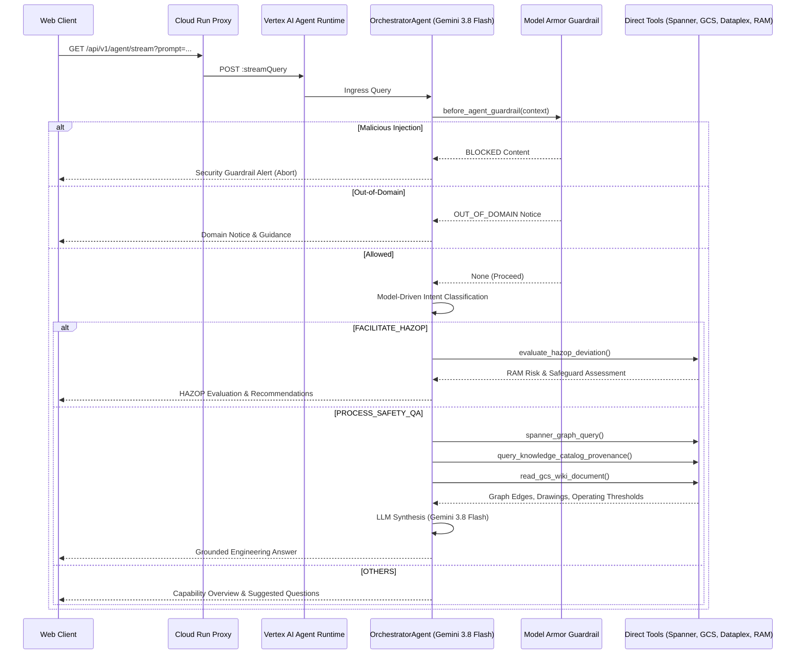

# SPEC-20260918-CONSOLIDATED-SINGLE-ORCHESTRATOR: Consolidated Single Orchestrator Agent Architecture

**Document ID:** `SPEC-20260918-CONSOLIDATED-SINGLE-ORCHESTRATOR`  
**Status:** APPROVED  
**Author(s):** Antigravity Agent & Core Architecture Team  
**Governed by:** `GEMINI.md` (Rules 1, 3, 4, 11, 12), `_agents/rules/spec_driven_development.md`, `_agents/rules/google_adk_and_agent_runtime.md`, `_agents/rules/no_hardcoded_or_regex_in_agents.md`  
**Target Environment:** Non-Prod (`development`) & Prod (`production`)  
**GenAI Model:** `gemini-3.8-flash` (strictly enforced repository-wide)  
**Date:** September 18, 2026  

---

## 1. Problem Statement & Goals

### 1.1 Context & Background
In the previous architecture, the multi-agent system utilized an `OrchestratorAgent` as a top-level dispatcher that delegated tasks to two active ADK sub-agents:
- `RetrieverAgent`: Handled Tri-Hybrid Spanner Graph, vector, keyword, GCS wiki, and Dataplex catalog queries.
- `HazopAgent`: Handled 5x5 RAM matrix evaluations and LOPA safeguard risk assessments.
- `DatabaseAgent` & `ExtractorAgent`: Disabled per architectural mandate.

While functional, this multi-agent dispatch hierarchy introduced:
1. **Subagent Transfer Latency:** Delegating to sub-agents via multi-hop transfers increased round-trip latency and token overhead.
2. **Context Fragmentation:** Separate sub-agents maintain isolated instructions, requiring cross-agent summarization and context re-framing.
3. **Orchestration Simplicity Mandate:** The domain queries for Phenol Process Safety directly converge on ISO GQL graph lookups, chemical safety limits (CHP 80°C threshold), and 5x5 RAM matrix assessments. A single, unified, highly-grounded cognitive agent can directly manage the 6 specialized ADK tools without subagent transfer friction.

### 1.2 Problem Statement
How do we consolidate `OrchestratorAgent`, `RetrieverAgent`, and `HazopAgent` into a **single, unified `OrchestratorAgent`** that directly holds all 6 process safety and HAZOP tools with zero subagent dispatch overhead, while preserving:
- Strict adherence to the Google Agent Development Kit (ADK) `v2.9+` standard (`Agent`, `App`, `before_agent_guardrail`),
- Deployment to the Gemini Enterprise Agent Platform runtime (`agent_runtime`) via `agents-cli deploy`,
- Decoupled Frontend-only Cloud Run web cockpit proxying to Vertex AI Reasoning Engine,
- Strict model-driven intent classification across the 3 canonical intents (`PROCESS_SAFETY_QA`, `FACILITATE_HAZOP`, `OTHERS`),
- Full test suite fidelity (all 90 unit, property-based, and benchmark tests passing)?

### 1.3 Goals
- **Single Root Agent:** `root_agent = Agent(name="OrchestratorAgent", ...)` with `sub_agents=[]` and direct mounting of all 6 process safety tools.
- **Eliminated Subagent Hops:** Direct tool execution and cognitive answer synthesis without intermediate `subagent_dispatch` hops.
- **Inline Security Guardrail:** Google Cloud Model Armor (`before_agent_guardrail`) directly guarding the unified `OrchestratorAgent`.
- **Zero Inactive Agent Resuscitation:** `DatabaseAgent` and `ExtractorAgent` remain strictly disabled.
- **Frontend Cockpit Alignment:** `server/main.py` `/api/v1/adk/info` reports 1 root agent and 0 subagents (`sub_agents: []`).
- **Comprehensive Verification:** 100% test pass rate across unit and property-based tests (PBT).
- **Production Redeployment:** Deploy the consolidated agent to Vertex AI Agent Platform via `agents-cli deploy` and redeploy Cloud Run frontend cockpit.

### 1.4 Non-Goals
- Changing the underlying Cloud Spanner Graph schema or Dataplex Knowledge Catalog entry groups.
- Modifying the 5x5 RAM matrix logic or LOPA calculation rules.
- Re-enabling `DatabaseAgent` or `ExtractorAgent`.

---

## 2. System Architecture & Component Interactions

### 2.1 Subsystem Boundaries

```
┌─────────────────────────────────────────────────────────────────────────────────────────┐
│                                CLIENT TIER (Web Browser)                                │
│                         Process Safety Cockpit (SPA / SSE Stream)                       │
└─────────────────────────────────────────┬───────────────────────────────────────────────┘
                                          │ HTTPS / SSE
                                          ▼
┌─────────────────────────────────────────────────────────────────────────────────────────┐
│                    FRONTEND TIER (Google Cloud Run Web Cockpit)                         │
│                                                                                         │
│  - Static Asset Serving: / (server/static/index.html)                                  │
│  - Liveness & Readiness Probes: /healthz                                                │
│  - Hierarchy Metadata: /api/v1/adk/info (reports 1 root agent, 0 subagents)            │
│  - Interactive Graph Topology: /api/v1/graph/topology                                   │
│  - SSE Streaming Proxy: /api/v1/agent/stream (proxies to Vertex AI Reasoning Engine)    │
└─────────────────────────────────────────┬───────────────────────────────────────────────┘
                                          │ Vertex AI ADC OAuth2 HTTPS (:streamQuery)
                                          ▼
┌─────────────────────────────────────────────────────────────────────────────────────────┐
│             BACKEND AGENT PLATFORM (Vertex AI Reasoning Engine / agent_runtime)         │
│                                                                                         │
│  - App: App(name="phenol-process-safety", root_agent=root_agent)                        │
│  - Model: Gemini 3.8 Flash (gemini-3.8-flash)                                           │
│  - Pre-flight Guardrail: before_agent_guardrail (Model Armor RAI: LOW_AND_ABOVE)         │
│                                                                                         │
│  +───────────────────────────────────────────────────────────────────────────────────+  │
│  │                    UNIFIED CONSOLIDATED ORCHESTRATOR AGENT                        │  │
│  │                            (OrchestratorAgent)                                    │  │
│  │                                                                                   │  │
│  │  Cognitive Capabilities:                                                          │  │
│  │  - Model-Driven Intent Routing (PROCESS_SAFETY_QA, FACILITATE_HAZOP, OTHERS)       │  │
│  │  - Dynamic Equipment Disambiguation & Breadcrumb Cascades                        │  │
│  │  - Direct Tool Execution (Zero Subagent Delegation)                               │  │
│  │  - Synthesized Process Safety Engineering Answers (CHP 80°C limit, 1oo2, ESD)     │  │
│  │                                                                                   │  │
│  │  Mounted Direct Tools:                                                            │  │
│  │  1. spanner_graph_query (ISO GQL SIS trips, voting logic, and upstream feeds)     │  │
│  │  2. spanner_keyword_search (Full-text equipment and instrument token search)      │  │
│  │  3. spanner_vector_search (768-dim Vertex AI text-embedding-004 cosine search)   │  │
│  │  4. query_knowledge_catalog_provenance (Dataplex P&ID drawing lineage)            │  │
│  │  5. read_gcs_wiki_document (GCS operational procedures & chemical thresholds)    │  │
│  │  6. evaluate_hazop_deviation (5x5 RAM matrix evaluation & LOPA credits)           │  │
│  +───────────────────────────────────────────────────────────────────────────────────+  │
└─────────────────────────────────────────────────────────────────────────────────────────┘
```

### 2.2 Component Responsibilities

| Component | Responsibility | Inputs | Outputs |
|-----------|----------------|--------|---------|
| `app/agent.py` | Google ADK root agent configuration with 6 direct tools and `sub_agents=[]` | User message / context | ADK execution stream / tools output |
| `agents/orchestrator/agent.py` | Direct tool coordination, model intent classification, and streaming synthesis without subagent hops | User query string, session ID | Telemetry events (`armor_inspection`, `thought`, `tool_invoked`, `tool_result`, `gql_executed`, `message_delta`, `telemetry_waterfall`) |
| `server/main.py` | Cloud Run web cockpit, SSE streaming proxy, and `/api/v1/adk/info` metadata endpoint | HTTP requests | SSE stream, JSON responses, HTML assets |
| `server/proxy.py` | Authenticated proxy to Vertex AI Agent Platform Reasoning Engine (`:streamQuery`) | User query | Forwarded SSE events |

---

## 3. Data Models & Schema Definitions

### 3.1 ADK Agent Hierarchy Schema
```python
root_agent = Agent(
    name="OrchestratorAgent",
    model=MODEL_NAME,  # "gemini-3.8-flash"
    description="Lead Process Safety & HAZOP Single Consolidated Agent governing Refinery Phenol Plant safety operations.",
    instruction="...",
    sub_agents=[],  # STRICTLY EMPTY: Consolidated architecture
    tools=[
        spanner_graph_query,
        spanner_keyword_search,
        spanner_vector_search,
        query_knowledge_catalog_provenance,
        read_gcs_wiki_document,
        evaluate_hazop_deviation,
    ],
    before_agent_callback=before_agent_guardrail,
)
```

### 3.2 ADK Info Response Schema (`/api/v1/adk/info`)
```json
{
  "status": "SUCCESS",
  "adk_version": "2.9.0",
  "app_name": "phenol-process-safety",
  "runtime_target": "agent_runtime",
  "role": "frontend-web-cockpit",
  "remote_agent_runtime_id": "projects/.../reasoningEngines/...",
  "region": "asia-southeast1",
  "root_agent": {
    "name": "OrchestratorAgent",
    "description": "Lead Process Safety & HAZOP Single Consolidated Agent governing Refinery Phenol Plant safety operations.",
    "tools": [
      "spanner_graph_query",
      "spanner_keyword_search",
      "spanner_vector_search",
      "query_knowledge_catalog_provenance",
      "read_gcs_wiki_document",
      "evaluate_hazop_deviation"
    ],
    "sub_agents": []
  }
}
```

### 3.3 Core Invariants
- **Invariant 1 (Subagent Emptiness):** `root_agent.sub_agents` is strictly empty (`len(root_agent.sub_agents) == 0`).
- **Invariant 2 (Tool Preservation):** All 6 process safety tools remain registered and functional on `root_agent`.
- **Invariant 3 (Intent Completeness):** Model-driven classification strictly partitions prompts into `{PROCESS_SAFETY_QA, FACILITATE_HAZOP, OTHERS}`.
- **Invariant 4 (Zero Hardcoded Logic):** No regular expressions or static tag lists for routing decisions (`_agents/rules/no_hardcoded_or_regex_in_agents.md`).

---

## 4. API Contracts & Workflow Specifications

### 4.1 Orchestrator Execution Flow


---

## 5. Security, DevOps & Non-Functional Requirements

1. **Security & Guardrails:** Google Cloud Model Armor policy `phenol-safety-armor-template` actively enforces pre-execution inspection with `filterMatchState == "MATCH_FOUND"` blocking prompt injections before tool execution.
2. **Infrastructure Compliance:** Cloud Run operates with `run.googleapis.com/invoker-iam-disabled=true` conforming to organization policy.
3. **Deployment Lifecycle:** Deployment to Vertex AI Agent Platform via `agents-cli deploy`, followed by Cloud Run frontend build and deployment via `./scripts/deploy.sh prod --all`.

---

## 6. Granular Implementation Plan

| Step | Component / Action | Description | Dependencies | Definition of Done |
|------|--------------------|-------------|--------------|-------------------|
| **1.0** | **SDD Spec Authoring** | Author `specs/features/SPEC-20260918-CONSOLIDATED-SINGLE-ORCHESTRATOR.md` and update `specs/README.md` | None | Spec approved and indexed |
| **2.0** | **ADK Agent Definition** | Modify `app/agent.py`: consolidate tools directly on `root_agent`, set `sub_agents=[]` | Step 1.0 | `root_agent.sub_agents == []`, all 6 tools mounted |
| **3.0** | **Orchestrator Agent Logic** | Update `agents/orchestrator/agent.py`: remove subagent dispatch hops, route directly through consolidated tools | Step 2.0 | Telemetry stream runs cleanly with direct tool events |
| **4.0** | **Server ADK Info** | Update `server/main.py`: ensure `/api/v1/adk/info` reflects 1 root agent and 0 subagents | Step 2.0 | `GET /api/v1/adk/info` returns `sub_agents: []` |
| **5.0** | **Test Suite Alignment** | Update `tests/test_adk_agents.py` and `tests/test_orchestrator_agent.py` to assert consolidated topology | Steps 2.0–4.0 | 90/90 tests passing |
| **6.0** | **Redeployment & Verification** | Deploy backend via `agents-cli deploy` and frontend via `./scripts/deploy.sh prod --app` | Step 5.0 | Live Cloud Run `/healthz` and query tests verified |
| **7.0** | **Progress Report** | Author `specs/plan/PROGRESS_REPORT_20260918_CONSOLIDATED_SINGLE_ORCHESTRATOR.md` | Step 6.0 | Living plan updated |

---

## 7. Mandatory Testing Strategy (Every Step)

### 7.1 Unit Testing Matrix
| Test ID | Implementation Step | Target Function / Unit | Scenario Description | Expected Output / Assertion |
|---------|---------------------|------------------------|----------------------|-----------------------------|
| UT-ADK-01 | Step 2.0 | `app.agent` | Validate root agent structure | `root_agent.name == "OrchestratorAgent"` and `len(root_agent.sub_agents) == 0` |
| UT-ADK-02 | Step 2.0 | `app.agent` | Validate tool mounting | All 6 tools (`spanner_graph_query`, `spanner_keyword_search`, `spanner_vector_search`, `query_knowledge_catalog_provenance`, `read_gcs_wiki_document`, `evaluate_hazop_deviation`) mounted on `root_agent.tools` |
| UT-ORC-01 | Step 3.0 | `stream_orchestration` | HAZOP review query | Directly processes deviation evaluation with `thought` and `message_delta`, without `subagent_dispatch` |
| UT-ORC-02 | Step 3.0 | `stream_orchestration` | Process safety query | Direct tool invocation events with `invoking_subagent="OrchestratorAgent"` |
| UT-SRV-01 | Step 4.0 | `GET /api/v1/adk/info` | Hierarchy metadata probe | Returns `root_agent.sub_agents: []` |

### 7.2 Property-Based Testing (PBT) Matrix
| Test ID | Implementation Step | Invariant Under Test | Generative Input Space | Shrinking / Assertion Strategy |
|---------|---------------------|------------------------|----------------------|--------------------------------|
| PBT-ADK-01 | Step 2.0 | Subagent Emptiness Invariant | App root agent inspect | `root_agent.sub_agents == []` always holds |
| PBT-ORC-01 | Step 3.0 | 3 Canonical Intents Invariant | Arbitrary fuzzed prompt text | Classified intent always in `{PROCESS_SAFETY_QA, FACILITATE_HAZOP, OTHERS}` |
| PBT-ARM-01 | Step 2.0 | Model Armor Invariant | Adversarial injection strings | `before_agent_guardrail` intercepts and aborts execution |

---

## 8. Living Spec Synchronization Log

| Date | Author | Section Modified | Reason for Change |
|------|--------|------------------|-------------------|
| 2026-09-18 | Antigravity Agent | Initial Specification | Initial authoring for Consolidated Single Orchestrator Agent Architecture |
