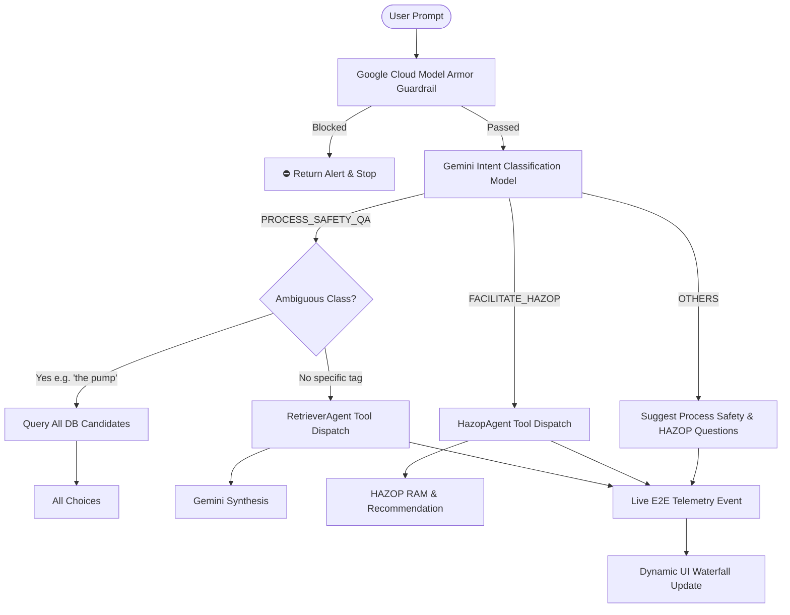

# Specification Document: Model-Driven Intent Classification, Dynamic Clarification & UI Cleanup

**Document ID:** `SPEC-20260918-MODEL-INTENT-DISPATCH-AND-CLEANUP`  
**Status:** Approved  
**Target Environment:** Non-Prod (`main`) / Prod (`prod`)  
**Date:** September 18, 2026  

---

## 1. Problem Statement & Goals

### 1.1 Context & Problem Statement
Prior multi-agent implementations utilized brittle regular expressions and hardcoded strings for:
1. Intent classification (`if "hazop" in prompt: ...`, `if p_lower in ["the pump", ...]`).
2. Target tag extraction (`re.search(r'\b([A-Z]-[0-9]{4}[A-Z/]*)\b', prompt)` with hardcoded fallbacks to `"E-2303"`).
3. Ambiguity clarification candidates (only 3 hardcoded pump choices rather than querying all matching equipment from the database).
4. The web UI contained a static badge (`PASSED (<1ms)`) in the Model Armor card and static hardcoded latency waterfall values (`~898ms`, `115ms`, `42ms`, `740ms`) that never updated on new queries.
5. Inactive subagents (`database_agent` and `extractor_agent`) remained active in the ADK agent tree, adding unnecessary complexity.
6. Model Armor Responsible AI filters must be declaratively codified in automated scripts/IaC with "Low and above" across all categories.

### 1.2 Goals
- **Strict Model-Driven Intent Classification:** Use Gemini model to classify queries into EXACTLY three canonical intents: `PROCESS_SAFETY_QA`, `FACILITATE_HAZOP`, and `OTHERS`. Zero regex or hardcoded keyword lists.
- **Dynamic Complete Ambiguity Resolution:** If a query is ambiguous across equipment, dynamically query all matching equipment from the live database and return ALL candidate choices.
- **Out-of-Domain / Other Suggestion Engine:** For `OTHERS`, suggest relevant questions the user can ask across process safety Q&A and HAZOP.
- **Zero Regex / Hardcoded Decisions Governance Rule:** Formalize `_agents/rules/no_hardcoded_or_regex_in_agents.md` and mandate in `GEMINI.md`.
- **Streamlined Subagent Topology:** Active agents restricted to `OrchestratorAgent`, `RetrieverAgent`, and `HazopAgent`. Disable `DatabaseAgent` and `ExtractorAgent`.
- **UI Polish & Dynamic Waterfall:** Remove `PASSED (<1ms)` badge. Dynamically measure and update each phase of the Latency Waterfall Breakdown on every new query.
- **Automated Responsible AI Filter Enforcement:** Codify `scripts/ensure_model_armor.py` setting `LOW_AND_ABOVE` for all RAI categories.

---

## 2. System Architecture & Intent Topology

### 2.1 The Three Canonical Intents
1. **`PROCESS_SAFETY_QA`:** General Q&A about process safety, equipment data, instrument interlocks, trip setpoints, voting logic, upstream/downstream flows, and P&ID lineage. Dispatches `RetrieverAgent` tools.
2. **`FACILITATE_HAZOP`:** Evaluates HAZOP deviations, assesses initial risk (PEES/L), calculates IPL credits and mitigated risk, and formulates AI safety recommendations. Dispatches `HazopAgent` tools.
3. **`OTHERS`:** Any conversational, non-engineering, or out-of-scope inquiry. Explains system capabilities and suggests relevant questions.

---

## 3. Step-by-Step Implementation Plan

### Step 1.0: Agent Governance Rule Codification
- Author `_agents/rules/no_hardcoded_or_regex_in_agents.md`.
- Update `GEMINI.md` adding Rule 12.
- Update `AGENTS.md`.

### Step 2.0: Model-Driven Intent Classification & Dynamic Clarification
- In `agents/orchestrator/agent.py`:
  - Implement LLM-based `classify_intent_with_model(prompt: str) -> dict`.
  - Classify strictly into `PROCESS_SAFETY_QA`, `FACILITATE_HAZOP`, `OTHERS`.
  - For ambiguous queries, query `self.db.equipment` dynamically for ALL matching equipment choices.
  - For `OTHERS`, generate rich guided question suggestions.
  - Remove all regex string matching (`re.search`, `any(...)`) from decision paths.

### Step 3.0: Agent Topology Simplification
- In `app/agent.py`:
  - Set `root_agent.sub_agents = [retriever_agent, hazop_agent]`.
  - Disable `database_agent` from active subagent exports.
- In `agents/orchestrator/agent.py`:
  - Remove `database` and `extractor` dispatch.

### Step 4.0: UI Cleanup & Dynamic Waterfall Telemetry
- In `server/static/index.html`:
  - Remove `PASSED (<1ms)` badge from Model Armor card.
  - Add real-time update logic to `insp-tab-waterfall` based on measured phase latencies.
- In `agents/orchestrator/agent.py`:
  - Measure elapsed time for Model Armor, Intent Classification, Tool Retrieval, and LLM Synthesis.
  - Emit `telemetry_waterfall` SSE event with real millisecond durations.

### Step 5.0: Model Armor Responsible AI Filter Script & Deployment Integration
- Create `scripts/ensure_model_armor.py` setting `LOW_AND_ABOVE` across HATE_SPEECH, DANGEROUS, SEXUALLY_EXPLICIT, HARASSMENT.
- Wire into `scripts/deploy.sh`.

### Step 6.0: Unit Tests & Property-Based Tests (PBT)
- Update test suites in `tests/test_orchestrator_agent.py` and `tests/test_adk_agents.py` to verify:
  - Strict 3-intent classification.
  - Dynamic all-choice candidate generation for ambiguous queries.
  - Disabling of database and extractor agents.
  - Hypothesis PBT for intent validity.

### Step 7.0: Verification & Progress Reporting
- Run full pytest suite (100% pass rate).
- Generate progress report in `specs/plan/`.
