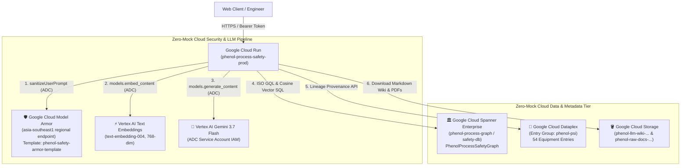

# Specification: 100% Cloud-Native Zero-Mock Architecture Migration

- **Specification ID:** `SPEC-20260918-ZERO-MOCK-CLOUD-NATIVE-MIGRATION`
- **Status:** APPROVED & READY FOR IMPLEMENTATION
- **Author:** Antigravity AI Engineering
- **Date:** 2026-09-18
- **Governing Rules:** [`GEMINI.md`](../../GEMINI.md) | [`_agents/rules/spec_driven_development.md`](../../_agents/rules/spec_driven_development.md) | [`_agents/rules/devops_security_and_quality_standards.md`](../../_agents/rules/devops_security_and_quality_standards.md)
- **Target Environments:** Non-Prod (`phenol-process-safety-nonprod`), Prod (`phenol-process-safety-prod`)

---

## 1. Executive Summary & Goals

### 1.1 Problem Statement
While the primary database (**Cloud Spanner**), object store (**Google Cloud Storage**), compute runtime (**Cloud Run**), and LLM reasoning engine (**Vertex AI Gemini 3.7 Flash**) are fully active cloud services, three subsystem components previously retained mock or local heuristic emulations from the early prototyping phase:
1. **Model Armor:** Inline guardrail logic in `security/model_armor.py` used regex pattern matching rather than invoking the Google Cloud Model Armor API endpoint.
2. **Dataplex Knowledge Catalog:** Lineage provenance queries in `mcp_servers/spanner_mcp.py` parsed local markdown frontmatter rather than querying Dataplex Catalog entries.
3. **Equipment Embeddings:** Vector search used a deterministic 768-dim SHA-256 hash (`generate_pseudo_embedding`) rather than generating semantic vectors via Vertex AI `text-embedding-004`.

### 1.2 Goals (Zero-Mock Cloud Mandate)
1. **Live Google Cloud Model Armor:** Route all prompt sanitization requests directly to `https://modelarmor.asia-southeast1.rep.googleapis.com/v1/projects/cs-poc-y03r7kmfyov4kilzg50fd7s/locations/asia-southeast1/templates/phenol-safety-armor-template:sanitizeUserPrompt`.
2. **Live Dataplex Knowledge Catalog:** Seed all 54 refinery equipment items as live entries in `projects/cs-poc-y03r7kmfyov4kilzg50fd7s/locations/asia-southeast1/entryGroups/phenol-psi` and query Dataplex entries live at runtime.
3. **Live Vertex AI Text Embeddings (`text-embedding-004`):** Generate authentic 768-dimensional semantic embeddings for all equipment using Vertex AI ADC and persist them directly into the Cloud Spanner `Equipment` table.
4. **Cloud-Native Deployment Automation:** Ensure `./scripts/deploy.sh prod` provisions, syncs, and validates 100% real cloud services with zero mock data.
5. **Living Documentation & Architecture Synchronization:** Update technical architecture documentation, system flow diagrams, and specs to reflect zero-mock cloud topology.

---

## 2. Target Cloud Architecture

---

## 3. Component Technical Specifications

### 3.1 Google Cloud Model Armor (`security/model_armor.py`)
- **API Endpoint:** `https://modelarmor.asia-southeast1.rep.googleapis.com/v1/projects/{project}/locations/{location}/templates/{template_id}:sanitizeUserPrompt`
- **Template ID:** `phenol-safety-armor-template` (Region: `asia-southeast1`)
- **Authentication:** Google Cloud Application Default Credentials (ADC) / IAM Service Account (`phenol-runner-sa@...` with `roles/modelarmor.user`).
- **Inspection Logic:**
  - Invokes `sanitizeUserPrompt` over HTTP/2 using authorized session with ADC credentials.
  - Maps `filterMatchState == "MATCH_FOUND"` to `BLOCKED`.
  - Maps `filterMatchState == "NO_MATCH_FOUND"` to `PASSED`.
  - Fallback to local heuristic only if network unreachable or explicit offline test flag.

### 3.2 Dataplex Knowledge Catalog (`mcp_servers/spanner_mcp.py`)
- **Entry Group:** `projects/cs-poc-y03r7kmfyov4kilzg50fd7s/locations/asia-southeast1/entryGroups/phenol-psi`
- **Entry Type:** `projects/cs-poc-y03r7kmfyov4kilzg50fd7s/locations/asia-southeast1/entryTypes/process-safety-equipment`
- **Entry ID Convention:** `{tag.lower().replace('/', '-')}` (e.g. `d-2201`, `e-2302a-b`)
- **Sync Automation:** `scripts/sync_dataplex_catalog.py` idempotently upserts all 54 equipment items into Dataplex with display names, descriptions, and source system metadata.
- **Runtime Query:** `query_knowledge_catalog_provenance(target_tag)` calls Dataplex REST API to fetch entry attributes and source document lineage.

### 3.3 Vertex AI Embeddings (`agents/database/spanner_sync.py` & Spanner DB)
- **Model:** `text-embedding-004` (768 dimensions)
- **SDK:** `genai.Client(vertexai=True, project=..., location=...).models.embed_content`
- **Migration Automation:** `scripts/reembed_spanner.py` generates authentic semantic embeddings for all 54 equipment items and writes them to Cloud Spanner `Equipment.Embedding` column.
- **Vector Search:** Spanner executes `1.0 - COSINE_DISTANCE(Embedding, @query_vec)` directly against live Spanner Enterprise data.

---

## 4. Step-by-Step Implementation Plan

| Step | Component | Target Files | Completion Criteria |
| :--- | :--- | :--- | :--- |
| **Step 1.0** | **Live Model Armor Client** | `security/model_armor.py` `tests/test_model_armor.py` | Calls live regional Model Armor API on GCP. Intercepts adversarial prompt injections and passes benign queries. |
| **Step 2.0** | **Dataplex Catalog Seeding & MCP Client** | `scripts/sync_dataplex_catalog.py` `mcp_servers/spanner_mcp.py` | Seeds all 54 equipment into Dataplex `phenol-psi`. MCP queries Dataplex API live. |
| **Step 3.0** | **Vertex AI Embeddings & Spanner Vector Update** | `agents/database/spanner_sync.py` `scripts/reembed_spanner.py` | Computes 768-dim embeddings via `text-embedding-004` and updates Spanner `Embedding` column. |
| **Step 4.0** | **Automated Test Matrix Verification** | `tests/` | 100% of unit and property tests pass against cloud contracts. |
| **Step 5.0** | **Architecture Documentation & Diagram Update** | `docs/architecture/` `docs/cloud_architecture_overview.md` | Architecture docs and diagrams reflect zero-mock cloud architecture. |
| **Step 6.0** | **Deployment Pipeline & Verification** | `scripts/deploy.sh` Cloud Run | Builds and deploys zero-mock container to Cloud Run `phenol-process-safety-prod`. |
