# Specification Document: Dynamic Wall-Clock Telemetry Waterfall & Model Armor Measurement

**Document ID:** `SPEC-20260920-DYNAMIC-TELEMETRY-WATERFALL-LATENCY`  
**Status:** Approved  
**Author(s):** Antigravity & Lead Process Safety Architect  
**Target Environment:** Non-Prod (`main`) / Prod (`prod`)  
**Last Updated:** 2026-09-20  

---

## 1. Problem Statement & Goals

### 1.1 Context & Background
In the Phenol Process Safety Web Cockpit, the right pane features a **Per-Step Latency Waterfall Card** visualizing the end-to-end execution breakdown across four distinct phases:
1. **Model Armor Pre-Flight Inspection**
2. **Intent & Cognitive Reasoning**
3. **ADK Tool Execution (Spanner/Wiki/RAM)**
4. **Gemini 3.8 Flash Synthesis**

Additionally, each tool card in the **Invoked Tool Execution Drawer** displays the execution latency of that tool in milliseconds.

### 1.2 Problem Statement
Live user observations revealed that the Right Pane Telemetry Waterfall displayed static, repetitive numbers on every single turn:
1. **Phase 1 (Model Armor):** Always displayed `0.5 ms (0.1%)`.
2. **Phase 2 (Intent & Cognitive Reasoning):** Always displayed `120.0 ms`.
3. **Phase 3 (Tool Execution):** Always displayed `200.0 ms`.

#### Root Cause Analysis:
- **Phase 1 Root Cause (`server/main.py:496`, `554`):**
  The endpoint invoked `before_agent_guardrail(None)`. Because `None` was passed instead of the incoming user `prompt`, the guardrail hook evaluated an empty string and returned `None` in under 0.001 ms. The code then applied `armor_ms = max(0.5, (time.time() - t_armor_start) * 1000.0)`, artificially pinning the latency to `0.5 ms` 100% of the time, while completely failing to execute live Model Armor prompt sanitization.
- **Phase 2 & Phase 3 Root Cause (`server/main.py:534-535`):**
  When streaming through `agent_proxy.stream_query`, the waterfall calculation used arbitrary synthetic caps:
  ```python
  p2 = min(120.0, reasoning_pool * 0.25)   # Hardcoded cap at 120.0 ms!
  p3 = min(200.0, reasoning_pool * 0.35)   # Hardcoded cap at 200.0 ms!
  ```
  Because an LLM streaming turn typically lasts 5,000 to 12,000 ms, `reasoning_pool * 0.25` is 1,200–3,000 ms, causing `min(120.0, ...)` to evaluate to **exactly 120.0 ms** on every request. Similarly, `reasoning_pool * 0.35` evaluates to **exactly 200.0 ms** on every request.
- **Tool Result Event Missing Live Latency (`server/proxy.py:195`):**
  `agent_proxy.stream_query` yielded `event: tool_result` without calculating the duration between `function_call` and `function_response`, leaving individual tool cards without live execution timings.

### 1.3 Goals
- Eliminate all hardcoded caps (`min(120.0, ...)`, `min(200.0, ...)`) and artificial floors (`max(0.5, ...)`).
- Execute genuine, live Google Cloud Model Armor prompt inspection (`_model_armor.sanitize_user_prompt(prompt)`) and measure real wall-clock latency.
- Measure Phase 2 (Cognitive Reasoning / Intent Analysis) as the actual elapsed time from dispatch until the first cognitive thought, tool invocation, or token is received from the backend.
- Measure Phase 3 (Tool Execution) dynamically from `function_call` to `function_response` in both `server/proxy.py` and `server/main.py`.
- Ensure all four phases dynamically sum to total elapsed wall-clock time (`total_ms = p1 + p2 + p3 + p4`) with mathematically accurate percentage contributions summing to 100%.

### 1.4 Non-Goals
- Changing the frontend DOM element IDs or SSE event schema (`event: telemetry_waterfall`, `event: armor_inspection`, `event: tool_result`).
- Modifying Cloud Spanner schema or property graph topology.

---

## 2. System Architecture & Timing Model

### 2.1 Wall-Clock Measurement Pipeline

```mermaid
sequenceDiagram
    autonumber
    actor User as Web Cockpit
    participant Server as Cloud Run (server/main.py)
    participant Armor as Model Armor Guardrail
    participant Proxy as Proxy (server/proxy.py)
    participant Backend as Vertex AI Reasoning Engine

    User->>Server: GET /api/v1/agent/stream?prompt=...
    Note over Server: t0 = time.perf_counter()
    
    rect rgb(20, 40, 20)
    Note over Server,Armor: Phase 1: Model Armor Pre-Flight
    Server->>Armor: sanitize_user_prompt(prompt)
    Armor-->>Server: ModelArmorInspectionResult (PASSED/BLOCKED)
    Note over Server: p1_ms = (t_armor_done - t0) * 1000
    Server-->>User: event: armor_inspection {inspection_time_ms: p1_ms}
    end

    rect rgb(20, 20, 50)
    Note over Server,Backend: Phase 2: Intent & Cognitive Reasoning
    Server->>Proxy: stream_query(prompt, session_id)
    Proxy->>Backend: POST /v1/projects/...:streamQuery
    Backend-->>Proxy: First Chunk (thought / function_call)
    Note over Proxy: p2_ms = (t_first_event - t_proxy_start) * 1000
    Proxy-->>Server: event: thought / tool_invoked
    Server-->>User: event: thought / tool_invoked
    end

    rect rgb(20, 50, 50)
    Note over Proxy,Backend: Phase 3: Tool Execution (Spanner / Wiki)
    Note over Proxy: t_call = time.perf_counter()
    Backend-->>Proxy: function_response
    Note over Proxy: tool_dur = (time.perf_counter() - t_call) * 1000<br/>p3_ms += tool_dur
    Proxy-->>Server: event: tool_result {latency_ms: tool_dur}
    Server-->>User: event: tool_result {latency_ms: tool_dur}
    end

    rect rgb(40, 20, 50)
    Note over Server,Backend: Phase 4: Gemini Flash Synthesis
    Backend-->>Proxy: message_delta chunks
    Proxy-->>Server: event: message_delta
    Server-->>User: event: message_delta
    Note over Server: p4_ms = (t_done - t_synth_start) * 1000
    end

    Note over Server: total_ms = p1 + p2 + p3 + p4
    Server-->>User: event: telemetry_waterfall {total_ms, phase1_ms, phase2_ms, phase3_ms, phase4_ms, ...}
    Server-->>User: event: message_done
```



---

## 3. Data Models & Event Contracts

### 3.1 `telemetry_waterfall` SSE Payload Schema
```json
{
  "total_ms": 5420.3,
  "phase1_ms": 1480.9,
  "phase2_ms": 1240.2,
  "phase3_ms": 86.4,
  "phase4_ms": 2612.8,
  "phase1_pct": 27.3,
  "phase2_pct": 22.9,
  "phase3_pct": 1.6,
  "phase4_pct": 48.2
}
```

### 3.2 Invariants
1. **Zero Hardcoded Floors or Caps:** No `min(120.0, ...)`, `min(200.0, ...)`, or `max(0.5, ...)`.
2. **Phase Additivity:** For all executions, `abs(total_ms - (phase1_ms + phase2_ms + phase3_ms + phase4_ms)) <= 0.2 ms`.
3. **Percentage Sum:** `abs((phase1_pct + phase2_pct + phase3_pct + phase4_pct) - 100.0) <= 0.5%`.
4. **Security Block Invariant:** If `_model_armor.sanitize_user_prompt(prompt)` detects an injection, execution terminates immediately with `phase2_ms = 0.0, phase3_ms = 0.0, phase4_ms = 0.0`, emitting `status: 'BLOCKED'`.

---

## 4. Granular Implementation Plan

| Step | Component | Description | Dependencies | Definition of Done |
|------|-----------|-------------|--------------|-------------------|
| 1.0 | `security/model_armor.py` & `server/main.py` | Connect `_model_armor.sanitize_user_prompt(prompt)` with real prompt string and `time.perf_counter()` duration | None | Prompt inspection runs live and emits real inspection milliseconds |
| 2.0 | `server/proxy.py` | Add wall-clock measurement for tool latency (`function_call` to `function_response`), pass dynamic `latency_ms` in `tool_result`, and capture phase timings | Step 1.0 | `tool_result` contains true tool latency; remote phases measured dynamically |
| 3.0 | `server/main.py` | Implement live phase tracking across proxy and direct paths, calculating real `p1, p2, p3, p4` without synthetic caps | Step 2.0 | `telemetry_waterfall` emits genuine dynamic milliseconds for every query |
| 4.0 | Verification & Deployment | Run unit and property tests, deploy frontend container to Cloud Run prod, and verify live endpoints | Step 3.0 | Tests pass 100%; live probe returns dynamic latencies |

---

## 5. Mandatory Testing Strategy

### 5.1 Unit Testing Matrix
| Test ID | Step | Target | Scenario | Expected Assertion |
|---------|------|--------|----------|-------------------|
| UT-TIMING-01 | 1.0 | `server/main.py` | Normal safe query | `phase1_ms > 0.5` and `verdict == 'ALLOWED'` |
| UT-TIMING-02 | 1.0 | `server/main.py` | Prompt injection input | Guardrail returns `BLOCKED`, `phase2_ms == 0.0`, zero backend calls |
| UT-TIMING-03 | 2.0 | `server/proxy.py` | Tool invocation stream | `tool_result` contains non-zero, dynamic `latency_ms` |
| UT-TIMING-04 | 3.0 | `server/main.py` | Waterfall payload generation | `phase2_ms != 120.0` and `phase3_ms != 200.0` under varying durations |

### 5.2 Property-Based Testing (PBT) Matrix
| Test ID | Step | Invariant | Generative Input Space | Assertion Strategy |
|---------|------|-----------|------------------------|--------------------|
| PBT-TIMING-01 | 3.0 | Additivity Invariant | Randomized phase durations `p1, p2, p3, p4 in [0.1, 10000.0]` | `abs(total_ms - (p1 + p2 + p3 + p4)) <= 0.2` |
| PBT-TIMING-02 | 3.0 | Percentage Normalization | Random durations across generative ranges | `abs(sum(pcts) - 100.0) <= 0.5` |
| PBT-TIMING-03 | 3.0 | Monotonic Non-Negative Invariant | Arbitrary stream timing events | All `phase_ms >= 0.0` |

---

## 6. Living Spec Synchronization Log
| Date | Author | Section Modified | Reason for Change |
|------|--------|------------------|-------------------|
| 2026-09-20 | Antigravity | Initial Document | Formal SDD for eliminating static 0.5ms / 120ms / 200ms latency caps |
