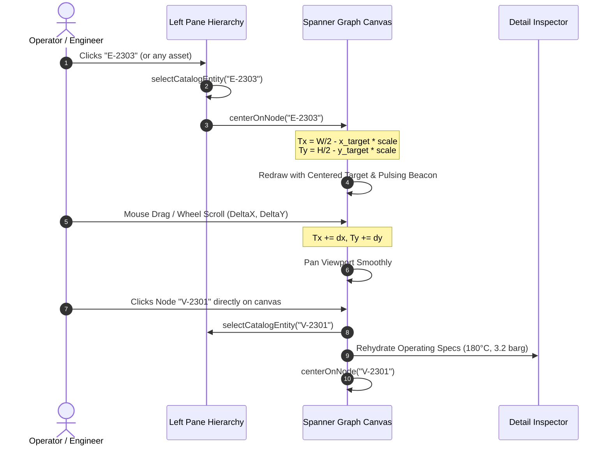

# Specification Document: Spanner Graph 2D Pan/Scroll Navigation & Automatic Node Centering

**Document ID:** `SPEC-20260920-SPANNER-GRAPH-PAN-SCROLL-AND-AUTO-CENTER`  
**Status:** Approved  
**Author(s):** Antigravity & Lead UI/UX Architect  
**Target Environment:** Non-Prod (`main`) / Prod (`prod`)  
**Last Updated:** 2026-09-20  

---

## 1. Problem Statement & Goals

### 1.1 Context & Background
In the Phenol Process Safety Web Cockpit, the right pane features a live **Spanner Property Graph Canvas Visualizer** displaying the plant equipment topology (54 equipment nodes, 256 instruments, and 81 flow/interlock edges). 

### 1.2 Problem Statement
Users reported significant difficulty navigating the knowledge graph:
1. **No Scroll / Pan Capability:** The graph canvas was strictly locked into fixed viewport coordinates with only digital zoom buttons (`🔍+`, `🔍-`). Users could not pan, scroll, or drag in any direction (left, right, up, down).
2. **Missing Offscreen Nodes:** Because plant equipment spans coordinates over 1,200px in height and the canvas container is fixed at 340px, more than 70% of plant equipment nodes were permanently offscreen and unreachable.
3. **No Automatic Centering on Selection:** When a user selects an equipment node from the Left Pane Plant Asset Hierarchy tree, the canvas did not center on that node. Users had no visual feedback indicating where the selected asset was located within the graph topology.

### 1.3 Goals
- **Full 2D Pan & Scroll Navigation:** Enable mouse drag (`mousedown` + `mousemove`), two-finger trackpad scroll, wheel scroll, touch gestures, and directional toolbar controls (⬅️, ➡️, ⬆️, ⬇️) to smoothly navigate across the entire plant graph space.
- **Automatic Viewport Centering:** When an equipment node is selected—via the Left Pane Asset Hierarchy, chat query suggestions, or clicking directly on the canvas—the viewport must automatically and mathematically center the target node at the midpoint of the canvas.
- **Visual Focus & Target Highlight:** Render a glowing target ring with pulsating beacon animation around the active centered node so users immediately identify the asset.
- **Direct Canvas Node Selection:** Allow users to click directly on any node in the canvas to select it, update the Left Pane inspector, and center the camera on it.
- **Zoom at Pointer & Reset:** Support wheel zoom centered at cursor position, as well as a one-click 🎯 "Focus / Center" button.

### 1.4 Non-Goals
- Modifying backend Cloud Spanner GQL queries or graph schema.
- Replacing the lightweight HTML5 2D Canvas with heavyweight external WebGL 3D libraries.

---

## 2. Mathematical Coordinate & Viewport Model

### 2.1 Coordinate Transformation Pipeline

Let $(x_{\text{node}}, y_{\text{node}})$ be the world coordinate of a graph node, and $(W_{\text{canvas}}, H_{\text{canvas}})$ be the client canvas dimensions.
The screen coordinate $(X_{\text{screen}}, Y_{\text{screen}})$ is:

$$X_{\text{screen}} = T_x + x_{\text{node}} \times S$$
$$Y_{\text{screen}} = T_y + y_{\text{node}} \times S$$

where $T_x, T_y$ are the translation offsets (`window.graphTransform.x`, `window.graphTransform.y`), and $S$ is the scale (`window.graphTransform.scale`).

### 2.2 Centering Invariant

To position the selected node $(x_{\text{target}}, y_{\text{target}})$ exactly at the canvas center $\left(\frac{W_{\text{canvas}}}{2}, \frac{H_{\text{canvas}}}{2}\right)$:

$$T_x = \frac{W_{\text{canvas}}}{2} - x_{\text{target}} \times S$$
$$T_y = \frac{H_{\text{canvas}}}{2} - y_{\text{target}} \times S$$

Applying this transformation guarantees that:
$$\text{Distance}\left((X_{\text{target, screen}}, Y_{\text{target, screen}}), (\text{Center}_x, \text{Center}_y)\right) = 0$$

### 2.3 Pan Invariant (Scroll Left/Right/Up/Down)

When dragging or scrolling with differential $(\Delta x, \Delta y)$:
$$T_x' = T_x + \Delta x$$
$$T_y' = T_y + \Delta y$$

---

## 3. UI/UX Interaction Design

---

## 4. Granular Implementation Plan

| Step | Component | Description | Dependencies | Definition of Done |
|---|---|---|---|---|
| 1.0 | `server/static/index.html` (Math & State) | Implement `centerOnNode(targetTag)` computing exact midpoint translation vectors | None | Given any node coordinates, translation places node at canvas center |
| 2.0 | `server/static/index.html` (Mouse & Wheel) | Add `mousedown`, `mousemove`, `mouseup`, `wheel`, and touch listeners to `spanner-graph-canvas` | Step 1.0 | Smooth click-and-drag and trackpad/wheel panning in all 4 directions |
| 3.0 | `server/static/index.html` (Toolbar & Controls) | Add directional pan buttons (⬅️, ➡️, ⬆️, ⬇️), 🎯 Focus button, and keyboard arrow key listeners | Step 2.0 | Toolbar controls pan the graph and reset focus to target |
| 4.0 | `server/static/index.html` (Node Click Hit-test) | Add hit-testing on canvas click to select and auto-center on clicked nodes | Step 2.0 | Clicking a node selects it in left hierarchy and centers viewport |
| 5.0 | Testing & Deployment | Add automated unit & property tests verifying coordinate math and deployment | Step 4.0 | 100% tests green; deployed to Cloud Run prod |

---

## 5. Mandatory Testing Strategy

### 5.1 Unit Testing Matrix
| Test ID | Step | Target | Scenario | Expected Assertion |
|---|---|---|---|---|
| UT-GRAPH-01 | 1.0 | `centerOnNode` math | Arbitrary node $(x, y)$ on canvas $(W, H)$ | Screen position equals $(W/2, H/2)$ |
| UT-GRAPH-02 | 2.0 | Pan offset delta | Drag delta $(\Delta x, \Delta y)$ | Translation increases exactly by $(\Delta x, \Delta y)$ |
| UT-GRAPH-03 | 4.0 | Click hit-test | Click within node radius $r$ | Returns matching node ID |
| UT-GRAPH-04 | 4.0 | Click hit-test | Click in empty space | Returns `null` |

### 5.2 Property-Based Testing (PBT) Matrix
| Test ID | Step | Invariant | Generative Input Space | Assertion Strategy |
|---|---|---|---|---|
| PBT-GRAPH-01 | 1.0 | Centering Invariant | Random node $(x, y) \in [-2000, 2000]$, canvas $(W, H) \in [100, 1920]$, scale $S \in [0.2, 3.0]$ | Screen target coordinates equal $(\frac{W}{2}, \frac{H}{2})$ within $0.001\text{px}$ |
| PBT-GRAPH-02 | 2.0 | Pan Translation Linearity | Arbitrary sequences of pan deltas | $T_{\text{final}} = T_{\text{initial}} + \sum \Delta$ |
| PBT-GRAPH-03 | 2.0 | Zoom Scale Monotonicity & Clamping | Arbitrary zoom factors | Scale strictly bounded in $[0.3, 3.0]$ |

---

## 6. Living Spec Synchronization Log
| Date | Author | Section Modified | Reason for Change |
|---|---|---|---|
| 2026-09-20 | Antigravity | Initial Document | Authoring SDD for 2D pan/scroll navigation and auto-centering on selected equipment |
