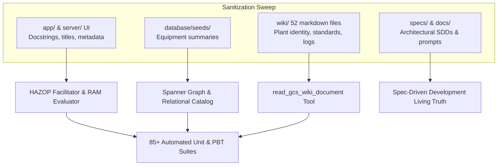

# Specification Document: Full Repository Data Sanitization (Neutral Refinery Profile)

**Document ID:** `SPEC-20260921-DATA-SANITIZATION-NEUTRAL-REFINERY`  
**Status:** Approved  
**Author(s):** Antigravity AI  
**Target Environment:** Non-Prod (`main`) / Prod (`prod`)  
**Last Updated:** 2026-09-21  

---

## 1. Problem Statement & Goals

### 1.1 Context & Background
The repository contains process safety intelligence, risk assessment models, knowledge graphs, and documentation developed around a chemical processing facility (specifically the Cumene / Decomposition / Neutralization process). Throughout the codebase, database seed catalogs, specifications, and the markdown engineering wiki (`wiki/`), direct references exist to proprietary and corporate entity names, specifically:
- `PTT` / `PTTGC` (PTT Global Chemical)
- `PTTEP`
- `PTT Phenol` / `PPCL` (PTT Phenol Company Limited)

To enable generic deployment, client privacy, open benchmarking, and IP sanitization while preserving 100% of engineering calculations, risk matrices, and tool execution functionality, all references to these specific proprietary identifiers must be thoroughly and systematically sanitized.

### 1.2 Problem Statement
Proprietary corporate and plant identifiers are interspersed across 96+ files (code docstrings, UI templates, Spanner catalog descriptions, 52 wiki knowledge articles, and architectural specifications). A simple blind find-and-replace risks breaking URLs, git tracking, test fixtures, or subtle text layout constraints. Sanitization must be conducted systematically without any adverse impact on application functionality, API contracts, or test verification.

### 1.3 Goals
- **G-1 (Zero Proprietary Identifiers):** Remove all occurrences of `PTT`, `PTTGC`, `PTTEP`, and `PPCL` from active system assets (code, database seed catalogs, frontend UI, wiki knowledge base, specs, and docs).
- **G-2 (Consistent Neutral Refinery Profile):** Adopt a cohesive, standardized Neutral Refinery entity taxonomy:
  - **Plant:** `Refinery Phenol Train II` (or `Refinery Phenol`)
  - **Operating Entity / Owner:** `Refinery Operations Ltd.` (replacing `PPCL` / `PTT Phenol Company Limited`)
  - **Parent Corporation:** `Refinery Petrochemical Corporation` / `Refinery Group` (replacing `PTT Global Chemical` / `PTT GC` / `PTTGC`)
  - **Governing Risk Matrix & Standards:** `Refinery 5x5 RAM W-(Q-MP)-002 R2`, `Refinery OEMS-005`, `Refinery PEES criteria`
  - **RAM Frequency Thresholds:** "Has happened in the Refinery group OR more than once/year in the Industry"
  - **Technical Division:** `Technical Safety Service Division (Q-TS-TS), Refinery Petrochemical Corporation`
- **G-3 (Zero Functional Regression):** Maintain 100% test pass rate across all unit tests, property-based tests (PBT), HAZOP PDF parsing, and golden agent benchmarks (85+ tests).
- **G-4 (Integrity of Certified Binary Assets):** Keep `raw/` binary PDFs completely intact and unaltered (maintaining vendor AS-BUILT provenance). Preserve valid git remote configuration.

### 1.4 Non-Goals (Out of Scope)
- Binary modification or hexadecimal byte altering of raw PDFs in `raw/` (these represent original physical vendor documentation and are protected).
- Changing mathematical risk algorithms (RAM 5x5 matrix dimensions, LOPA IPL credit levels, or severity rankings).
- Renaming physical local directories that map to external host workspace bindings (`/usr/local/google/home/pantana/lab/pttep-kg`).

---

## 2. System Architecture & Component Interactions

---

## 3. Data Models & Translation Mapping

### 3.1 Canonical Entity Translation Dictionary

| Original Identifier | Sanitized Neutral Replacement | Context / Scope |
|---------------------|-------------------------------|-----------------|
| `PTT Phenol Train II (PPCL)` | `Refinery Phenol Train II` | Plant identity, equipment headers, P&ID metadata |
| `PTT Phenol Train II` | `Refinery Phenol Train II` | Plant title, project descriptions |
| `PTT Phenol` | `Refinery Phenol` | General facility mentions |
| `PPCL` | `Refinery Operations Ltd.` (or `Refinery Unit` in tables) | Owner / Operating company, economic BU classification |
| `PTT Phenol Company Limited (PPCL)` | `Refinery Operations Ltd.` | Client / Owner identity |
| `PTT Phenol Company Limited` | `Refinery Operations Ltd.` | Client / Owner identity |
| `PTT Global Chemical Public Company Limited` | `Refinery Petrochemical Corporation` | Standards issuer, corporate governance |
| `PTT Global Chemical PCL` | `Refinery Petrochemical Corporation` | Training division owner, issuer |
| `PTT Global Chemical (PTT GC)` | `Refinery Petrochemical Corporation (Refinery Group)` | System overview, executive summaries |
| `PTT Global Chemical` | `Refinery Petrochemical Corporation` | Corporate standards owner |
| `PTT GC` / `PTTGC` | `Refinery Group` (or `Refinery`) | Corporate group, standards prefix |
| `PTTEP` | `Refinery` (e.g. `Refinery OEMS-005`) | UI safety standards citation |
| `PTT GC Operational RAM W-(Q-MP)-002 R2` | `Refinery 5x5 RAM W-(Q-MP)-002 R2` | Governing risk matrix title |
| `PTT GC OEMS-005` | `Refinery OEMS-005` | HAZOP corporate procedure title |
| `PTT GC PEES criteria` | `Refinery PEES criteria` | Risk evaluation criteria |
| `PTT GC 7-Tab HAZOP Excel Workbook Exporter` | `Refinery 7-Tab HAZOP Excel Workbook Exporter` | Exporter docstrings |
| `PTTGC group` | `Refinery group` | Likelihood definitions in RAM grid |

---

## 4. API Contracts & Safety Invariants

### 4.1 Functional Invariants
- **INV-1 (RAM Determinism):** `lookup_ram_risk(severity, likelihood)` must produce identical outputs regardless of metadata string labels.
- **INV-2 (LOPA Safeguard Credits):** `calculate_ipl_credit` and `evaluate_safeguards_lopa` must continue to calculate exact numerical credits.
- **INV-3 (Excel Structure):** `export_hazop_study_to_excel` must output identical 7 tabs with 27 columns on the worksheet tabs.
- **INV-4 (Markdown Tag Extraction):** `markup_parser.py` regex extraction of equipment tags `|[0-9A-Z-]+|` must remain unaffected.

---

## 5. Granular Implementation Plan

| Step | Component / Action | Description | Dependencies | Definition of Done |
|------|--------------------|-------------|--------------|-------------------|
| **1.0** | **Spec Authoring** | Create `SPEC-20260921-DATA-SANITIZATION-NEUTRAL-REFINERY.md` | None | Spec approved and committed |
| **2.0** | **Application Code & Frontend UI** | Sanitize `app/hazop/ram_evaluator.py`, `app/hazop/agent.py`, `app/hazop/excel_exporter.py`, and `server/static/index.html` | Step 1.0 | Zero PTT references in `app/` and `server/`; UI tooltip sanitized |
| **3.0** | **Database Seed Catalog** | Sanitize equipment description summaries in `database/seeds/spanner_catalog.json` | Step 1.0 | Spanner seeds use `Refinery Phenol Train II` |
| **4.0** | **Knowledge Base Wiki** | Sanitize 52 markdown files across `wiki/` (plant identity, standards, equipment, training, risk matrix, logs) | Step 1.0 | Zero disallowed entities in `wiki/` markdown files |
| **5.0** | **Specifications & Docs** | Sanitize `specs/baseline/`, `specs/features/`, `specs/plan/`, and `docs/` | Step 1.0 | Full repository documentation aligned to Neutral Refinery |
| **6.0** | **Automated Invariant & Test Verification** | Implement PBT invariant test for zero proprietary entity leakage; execute full test suite | Steps 2.0–5.0 | 85+ tests pass with 100% green status |
| **7.0** | **Living Spec Sync & Progress Report** | Author `specs/plan/PROGRESS_REPORT_20260921_DATA_SANITIZATION.md` and sync `specs/README.md` | Step 6.0 | Progress report filed and verified |

---

## 6. Mandatory Testing Strategy

### 6.1 Unit Testing Matrix
| Test ID | Implementation Step | Target Function / Unit | Scenario Description | Expected Output / Assertion |
|---------|---------------------|------------------------|----------------------|-----------------------------|
| UT-SAN-01 | Step 2.0 | `ram_evaluator.lookup_ram_risk` | Standard risk lookups (1..5) | Correct rating ('Low'..'Extreme') preserved |
| UT-SAN-02 | Step 2.0 | `excel_exporter.export_hazop_study_to_excel` | 7-tab export with node data | Generates valid workbook with all 7 tabs and 27 columns |
| UT-SAN-03 | Step 4.0 | `markup_parser.resolve_node_metadata` | Wiki markdown node parameter hydration | Correctly parses equipment tags and boundaries |

### 6.2 Property-Based Testing (PBT) Matrix
| Test ID | Implementation Step | Invariant Under Test | Generative Input Space | Shrinking / Assertion Strategy |
|---------|---------------------|------------------------|----------------------|--------------------------------|
| PBT-SAN-01 | Step 6.0 | Disallowed Entity Invariant | Generative file scan across all active `.py`, `.json`, `.md`, `.html` files (excluding `raw/`, `.git/`, `.venv/`) | Disallowed regex `\b(PTT|PTTGC|PTTEP|PPCL)\b` matches count == 0 |
| PBT-SAN-02 | Step 6.0 | RAM Risk Monotonicity | Arbitrary Severity & Likelihood integers (1..5) | Preserved risk monotonic bounds |

---

## 7. Living Spec Synchronization Log

| Date | Author | Section Modified | Reason for Change |
|------|--------|------------------|-------------------|
| 2026-09-21 | Antigravity AI | Initial Version | Initial specification for Neutral Refinery data sanitization |
