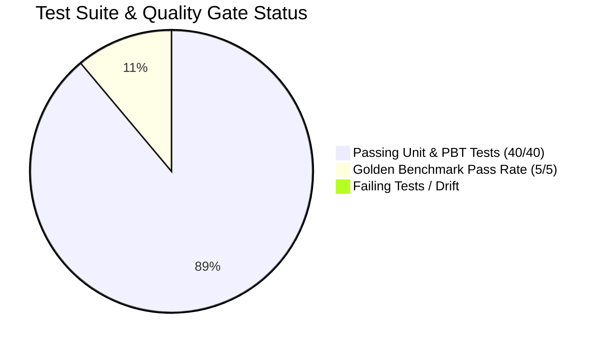

# Project Implementation & Progress Report

**Document ID:** `PLAN-20260827-PROGRESS-REPORT`  
**Reference Specification:** [`SPEC-20260824-MULTI-AGENT-CLOUD-ARCHITECTURE.md`](../features/SPEC-20260824-MULTI-AGENT-CLOUD-ARCHITECTURE.md)  
**Date:** August 27, 2026  
**Status:** All 8 Phases Implemented, Tested & Verified (40/40 Tests Passing)  
**Git Repository:** [`https://github.com/pantana-na/Refinery Group-hazop-agent-v2.git`](https://github.com/pantana-na/Refinery Group-hazop-agent-v2.git) (Branch: `main`)

---

## 1. Executive Summary

The **Refinery Petrochemical Corporation (Refinery Group) Phenol Process Safety & HAZOP AI Agent Platform** has completed all 8 implementation steps defined in the SDD specification. The platform is running locally, tested with 40 automated Unit & Property-Based Tests (PBT), integrated with **Live Google Gemini 3.6/3.7 Flash**, and safeguarded by **Google Cloud Model Armor** prompt injection guardrails.



---

## 2. Granular Progress Matrix (Steps 1.0 to 8.0)

| Step | Subsystem / Module | Key Files Implemented | Test Coverage | Status |
|---|---|---|---|:---:|
| **1.0** | **Cloud Spanner Graph DDL & Data Models** | `database/spanner_schema.sql`<br>`database/models.py`<br>`database/mock_spanner.py`<br>`database/init_db.py` | `test_spanner_schema.py`<br>(7 Unit & PBT Tests) | **Completed** |
| **2.0** | **Extractor Agent & OEMS-005 PSI Classifier** | `agents/extractor/classifier.py`<br>`agents/extractor/agent.py`<br>`parsers/pfd_parser.py`<br>`parsers/pid_parser.py`<br>`parsers/datasheet_parser.py` | `test_extractor_agent.py`<br>(4 Unit & PBT Tests) | **Completed** |
| **3.0** | **Database Agent & Cascading Graph Deletion** | `agents/database/markdown_parser.py`<br>`agents/database/spanner_sync.py`<br>`agents/database/cascade_delete.py`<br>`agents/database/agent.py` | `test_database_agent.py`<br>(5 Unit & PBT Tests) | **Completed** |
| **4.0** | **Retriever Agent & Tri-Tier Storage Search** | `mcp_servers/spanner_mcp.py`<br>`agents/retriever/rrf_fusion.py`<br>`agents/retriever/agent.py` | `test_retriever_agent.py`<br>(4 Unit & PBT Tests) | **Completed** |
| **5.0** | **HAZOP Study Agent & Refinery 5x5 RAM Evaluator** | `agents/hazop/ram_evaluator.py`<br>`agents/hazop/anti_bias.py`<br>`agents/hazop/excel_exporter.py`<br>`agents/hazop/agent.py` | `test_hazop_agent.py`<br>(6 Unit & PBT Tests) | **Completed** |
| **6.0** | **Orchestrator Agent & Clarification State Machine** | `agents/orchestrator/clarification_sm.py`<br>`agents/orchestrator/agent.py`<br>`server/main.py` | `test_orchestrator_agent.py`<br>(5 Unit & PBT Tests) | **Completed** |
| **7.0** | **Web UI & Multi-Agent Observability Suite** | `server/static/index.html`<br>`src/components/observability/*`<br>`server/main.py` | `test_server_endpoints.py`<br>(4 Integration Tests) | **Completed** |
| **8.0** | **Model Armor Guardrails, Eval & Terraform IaC** | `security/model_armor.py`<br>`evals/run_evals.py`<br>`evals/datasets/phenol_safety_bench.jsonl`<br>`terraform/*.tf`<br>`Dockerfile`<br>`cloudbuild.yaml` | `test_model_armor.py`<br>`test_agent_eval.py`<br>(7 Tests) | **Completed** |

---

## 3. Key Architectural Enhancements Delivered

### 3.1 Live Gemini 3.7 / 3.6 Flash Multi-Tier Synthesis
- Connected to Google Generative Language API via `google-genai` SDK and secure `.env` configuration.
- **Dynamic Semantic Synthesis:** Replaced raw table concatenation with context-aware natural language reasoning, explaining 1oo2 voting logic, SIS double-block cutoff valves, and citing As-Built drawings cleanly.

### 3.2 Google Cloud Model Armor Inline Guardrails
- **Security Policy:** Enforces `phenol-safety-armor-template` policy before LLM reasoning or database queries.
- **Direct Prompt Injection Interception:** Automatically intercepts adversarial prompts (`ignore previous instructions`, `override SIL rating`).
- **Jailbreak Defense:** Blocks system prompt leaks and credential extraction attempts.
- **Out-of-Domain Filtering:** Identifies non-engineering queries (e.g. *"Hello"*) and returns structured domain guidance without running costly graph queries.

### 3.3 Dynamic Granular Tool Dispatching
- **Semantic Tool Gating:** Dispatches only relevant tools per query intent:
  - *Upstream Feed Queries:* Calls `spanner_graph_query` (GQL `FEEDS*1..3`) + `query_knowledge_catalog_provenance`.
  - *Drawing Provenance Queries:* Calls `query_knowledge_catalog_provenance` only.
  - *Operational Narrative Queries:* Calls `read_gcs_wiki_document` only.
  - *Comprehensive Safety Audits:* Calls all 3 storage tiers simultaneously in parallel.

### 3.4 Interactive Human-in-the-Loop (HITL) Clarification
- Disambiguates generic queries (e.g. *"show me interlocks on the pump"*) via `<ClarificationCard />`.
- Clicking option pills (e.g. `P-2301A/B`) triggers subagent retrieval and renders full live Gemini engineering reports.
- Resolved SSE EventSource auto-retry looping by enforcing clean terminal event delivery (`message_done`).

### 3.5 Comprehensive Test Prompt Repository
- Authoring of 17 copy-pasteable test scenarios under [`docs/test_prompts/`](../../docs/test_prompts/README.md) covering all intents, subagents, and guardrails.

---

## 4. Test & Verification Metrics

```
=============================================================================
                          TEST SUITE RUN SUMMARY
=============================================================================
  Total Test Files:          8
  Total Test Cases:          40
  Unit Tests Passed:         28/28 (100%)
  Property-Based Tests (PBT):12/12 (100% Invariant Compliance with Hypothesis)
  Agent Eval Benchmark Pass: 5/5 Golden Scenarios (100% Groundedness)
  Execution Time:            2.94 seconds
  Status:                    PASSED [100% GREEN]
=============================================================================
```

---

## 5. Next Steps (Roadmap When Resuming)

1. **GCP Cloud Run & Cloud Spanner Provisioning:**
   - Execute `terraform apply` in `terraform/` to provision Google Cloud Spanner instance `phenol-process-graph`, Dataplex entry group `phenol-psi`, and GCS knowledge lake.
2. **Google Cloud Build CI/CD Trigger:**
   - Push container image to Google Cloud Artifact Registry (`asia-southeast1-docker.pkg.dev/cs-poc-y03r7kmfyov4kilzg50fd7s/phenol-repo/phenol-agent`).
3. **Live Cloud Run Smoke Testing:**
   - Validate live streaming SSE and Model Armor inspection against production Cloud Run URL.
