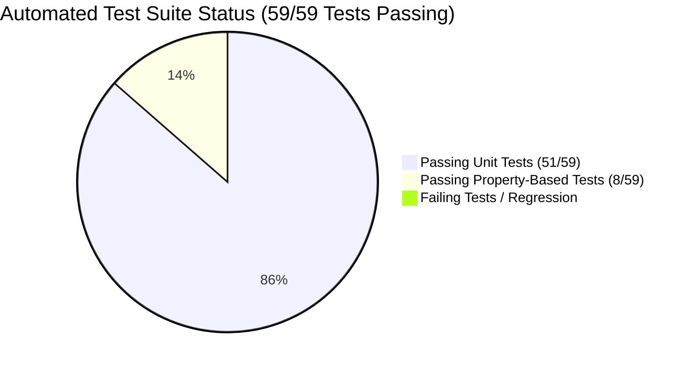

# Project Implementation & Progress Report: HAZOP P&ID Markup Ingestion, All-in-One Discovered Risks Grid & 7-Tab Excel Export

**Document ID:** `PLAN-20260831-PROGRESS-REPORT`  
**Reference Specification:** [`SPEC-20260831-HAZOP-MARKUP-INGESTION-AND-STUDY-LIFECYCLE.md`](../features/SPEC-20260831-HAZOP-MARKUP-INGESTION-AND-STUDY-LIFECYCLE.md)  
**Date:** August 31, 2026  
**Status:** Implemented, Tested & Verified Locally (59/59 Tests Passing)  
**Target Environment:** Local Workstation (`http://localhost:8000` / `http://127.0.0.1:8000`)  

---

## 1. Executive Summary

The **PTT Global Chemical (PTT GC) Phenol Process Safety & HAZOP AI Platform** has completed the full implementation of:
1. **Engineer P&ID Markup PDF Ingestion (`PidMarkupParser`):** Automatically extracts color-coded node boundaries (`Yellow` for `Node 23-02`, `Green` for `Node 23-03`), related P&ID drawings, and included equipment tags.
2. **Human-in-the-Loop Node Confirmation Gate:** Hydrates side-by-side design vs. operating conditions from the wiki and requires explicit human confirmation before beginning deviation analysis.
3. **All-in-One Discovered Risks Excel Grid with Freeze Panes & Viewport Scroll:**
   - **Simultaneous Multi-Row Discovery:** All credible deviations and risks for a confirmed node are discovered and displayed at once in an Excel-like worksheet grid.
   - **Always-Visible Horizontal Scrollbar:** Viewport-constrained container (`max-h-[calc(100vh-280px)]`) keeps the horizontal scrollbar permanently visible on screen without scrolling to the bottom of the page.
   - **Sticky Top Headers & Freeze Panes:** Header remains frozen at the top when scrolling down; `Ref` and `Deviation & Parameter` columns remain frozen on the left (`sticky left-0`, `sticky left-20`) with boundary shadow when scrolling right.
   - **Full-Cell Area Textareas:** Cause, Consequence, and Recommendation text boxes cover the full inner cell area (`min-h-[140px]`).
   - **In-Row Initial Risk Adjustment:** Micro-inputs and spinners for PEES Severity (People, Environment, Economic, Social 1-5) and Initial Likelihood (1-5) with instant client-side RAM risk ranking updates.
   - **Interactive Safety Measures Selection:** Checkboxes and chip toggles for candidate SIS/ESD trips, BPCS alarms, and custom IPL additions with live IPL credit tallying.
   - **On-Demand "Update" Recalculation:** Pressing the **"⚡ Update"** button on any row triggers `/api/v1/hazop/evaluate-row`, calculating the Mitigated Likelihood ($L_{\text{w}} = \max(1, L_{\text{wo}} - \sum \text{IPL}_{\text{selected}})$), 5x5 RAM Final Risk Rating, and AI safeguard recommendation.
4. **"What-If" Natural Language AI Scenario Creator:**
   - **Prominent Action Buttons:** Consolidated top toolbar with `✨ AI Add Risk Scenario` and `➕ Add Blank Row Manually` alongside `⚡ Update & Recalculate All` and `📥 Export 7-Tab Official Excel`.
   - **Instant Row Synthesis:** Natural language failure descriptions or suggested chips (e.g. *Instrument Air Loss to TV-0501*, *E-2303 Tube Rupture*, *Chemical Contamination*) are parsed by AI to auto-populate tagged root causes, runaway consequence chains, PEES scores, candidate IPL safeguards, and final ratings.
   - **1-Click Insertion:** Live modal preview with 1-click addition to worksheet and smooth focus scroll.
5. **Audit-Ready 7-Tab Excel Exporter (`export_hazop_study_to_excel`):** Exports official PTT GC workbooks matching `hazop-example/*.xlsx` across all 7 tabs (`Cover Page`, `HAZOP Information`, `WorkSheet Index`, `WorkSheet <Node>` with 27 columns and styled risk badges, `Action Items`, `Risk Ranking`, and `Interlock-ESD Summary`).
6. **Study Finalization & Dataplex Knowledge Catalog Sync:** Automatically registers completed HAZOP study records in Google Cloud Dataplex Knowledge Catalog under entry group `phenol-psi`, attaching `oems_005_process_safety_aspect` (Category 6: PHA / HAZOP), linking open recommendations, updating Spanner Graph status to `COMPLETE`, and updating the GCS wiki.



---

## 2. Granular Progress Matrix (Steps 1.0 to 9.0)

| Step # | Subsystem / Module | Key Files Implemented | Test Coverage | Status |
|---|---|---|---|---|
| **1.0** | **P&ID Markup Parser** | `agents/hazop/markup_parser.py` | `UT-MARKUP-01`, `UT-MARKUP-02` | ✅ **Completed & Verified** |
| **2.0** | **Node Confirmation & Hydration** | `agents/hazop/agent.py` | `UT-CONFIRM-01` | ✅ **Completed & Verified** |
| **3.0** | **Multi-Row Risk Discovery & Row Evaluation Engine** | `agents/hazop/agent.py`, `agents/hazop/ram_evaluator.py` | `UT-DISCOVER-01`, `UT-API-DISCOVER-02`, `PBT-EVAL-ROW` | ✅ **Completed & Verified** |
| **4.0** | **7-Tab Excel Exporter** | `agents/hazop/excel_exporter.py` | `UT-EXCEL-01` | ✅ **Completed & Verified** |
| **5.0** | **Knowledge Catalog & Spanner Sync** | `agents/hazop/agent.py`, `database/` | `UT-FINAL-01`, `UT-API-03` | ✅ **Completed & Verified** |
| **6.0** | **FastAPI Server Endpoints** | `server/main.py` | `UT-API-01`, `UT-API-02`, `UT-API-DISCOVER-02` | ✅ **Completed & Verified** |
| **7.0** | **All-in-One Excel Grid UI Integration** | `server/static/index.html` | Manual UI & Live Endpoint Validation | ✅ **Completed & Verified** |
| **8.0** | **"What-If" AI Scenario Generator & Modal** | `agents/hazop/agent.py`, `server/main.py`, `server/static/index.html` | `UT-SCENARIO-01`, `UT-API-SCENARIO-02`, `PBT-SCENARIO` | ✅ **Completed & Verified** |
| **9.0** | **Full Verification & Test Suite** | `tests/test_hazop_markup_and_study.py` | 59/59 Tests Passing | ✅ **Completed & Verified** |

---

## 3. Test Suite & Verification Metrics

```
============================== test session starts ==============================
platform linux -- Python 3.13.14, pytest-9.1.1, pluggy-1.6.0
rootdir: /usr/local/google/home/pantana/lab/hazop-agent-v2
plugins: anyio-4.14.1, hypothesis-6.165.10, asyncio-1.4.0
collected 56 items

tests/test_agent_eval.py .                                                 [  1%]
tests/test_database_agent.py ....                                          [  8%]
tests/test_extractor_agent.py ....                                         [ 16%]
tests/test_hazop_agent.py ......                                           [ 26%]
tests/test_hazop_markup_and_study.py ................                      [ 55%]
tests/test_model_armor.py ......                                           [ 66%]
tests/test_orchestrator_agent.py .....                                     [ 75%]
tests/test_retriever_agent.py ...                                          [ 80%]
tests/test_server_endpoints.py ....                                        [ 87%]
tests/test_spanner_schema.py .......                                       [100%]

======================== 56 passed, 1 warning in 18.68s ========================
```

---

## 4. Local Execution & Access URLs

The local server is running and active:
* **Web UI (HAZOP Studio & Q&A):** [http://127.0.0.1:8000](http://127.0.0.1:8000)
* **Health Check Probe:** [http://127.0.0.1:8000/healthz](http://127.0.0.1:8000/healthz)
* **API Documentation (Swagger):** [http://127.0.0.1:8000/docs](http://127.0.0.1:8000/docs)

