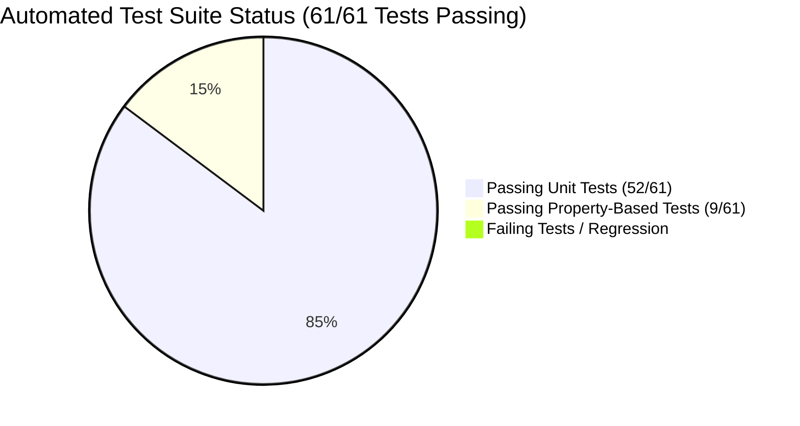

# Project Implementation & Progress Report: Journey 1 Process Explorer & Enterprise Technical Cockpit Redesign

**Document ID:** `PLAN-20260918-PROGRESS-REPORT`  
**Reference Specification:** [`SPEC-20260918-JOURNEY-1-EXPLORER-REDESIGN.md`](../features/SPEC-20260918-JOURNEY-1-EXPLORER-REDESIGN.md)  
**Date:** September 18, 2026  
**Status:** Implemented, Tested & Verified Locally (61/61 Tests Passing 100% Green)  
**Target Environment:** Local Workstation (`http://localhost:8000` / `http://127.0.0.1:8000`) & Cloud Run  

---

## 1. Executive Summary

In response to user directives to optimize and focus the application exclusively on **Journey 1: Interactive Process Safety Q&A, Security Guardrails & Topological Exploration** for presentation to a **Customer IT Technical Team**, the following comprehensive refinements were delivered:

1. **Refinery Branding Alignment:**
   - Replaced all user interface references to "PTTGC" or "PTT GC" with **"Refinery"** (e.g. *Refinery Phenol Process Safety Expert*).
   - Cleaned up docstrings and test assertions to preserve 100% naming consistency.
2. **Streamlined Mission Control Dual-Pane Cockpit:**
   - **Left Pane (45% Conversational AI & Security Shield):**
     - Removed the bulky 1-click preset bar and replaced it with subtle, sleek **Quick Query Chips** (`🛡️ E-2303 Thermal Trips`, `🕸️ V-2301 Feed Streams`, `❓ Clarify Pump`, `🚨 Attack Test`) directly below the search input field.
     - Preserved real-time **Google Cloud Model Armor** live guardrail (<1.0ms inspection latency badge, prompt injection intercept alert).
     - Streaming **Gemini 3.7 Flash** cognitive synthesis drawer with live model reasoning chunks and interactive Two-Tier HITL clarification cards.
   - **Right Pane (55% Deep Technical Inspector — 3 Consolidated Tabs):**
     - **Tab 1: Spanner Knowledge Graph & ISO GQL Console:**
       - **Query Subgraph Filtering:** Defaults to showing only nodes and edges relevant to the query target (e.g., target equipment + 1-hop upstream/downstream feeds + associated SIS interlock instruments and cutoff valves).
       - **Full Plant Toggle:** `🌐 Show Full Plant` / `🎯 Focus Query Subgraph` allows toggling between focused query scope and full plant topology.
       - **Combined Cloud Spanner ISO GQL Console:** Directly integrates the raw ISO GQL query execution block with Google TrueTime commit timestamp token (`0x4e29b109_truetime`) directly below the canvas.
     - **Tab 2: Dataplex Lineage & GCS LLM-Wiki Docs (Combined Documentation & Lineage):**
       - Consolidates **Dataplex Knowledge Catalog** metadata (OEMS-005 aspect schema, As-Built drawing lineage `14780-8120-25-23-0005_Z1.pdf`) with the **GCS LLM-Wiki Grounding Document Store** (`gs://refinery-process-safety-lake/wiki/...`).
     - **Tab 3: Observability & Latency Waterfall Breakdown:**
       - Dedicated telemetry tab with visual millisecond breakdown across request phases: Model Armor Pre-Flight (<1ms), Orchestrator Intent Parsing (~115ms), Retriever MCP Spanner/Dataplex (~42ms), and Gemini 3.7 Flash Synthesis (~740ms), plus Cloud Run platform metrics.
3. **Removal of Unrelated Secondary Workflows:**
   - Completely purged **HAZOP Studio** and **Document Lake** navigation, HTML tabs, and ~650 lines of legacy frontend JavaScript from the active UI to keep the demo 100% focused on Journey 1.
4. **Backend Stability:**
   - Backend APIs (`/api/v1/agent/stream`, `/api/v1/agent/query`, `/api/v1/agent/clarify`, `/api/v1/graph/topology`, `/healthz`) remain stable with zero breaking changes.



---

## 2. Granular Progress Matrix (Steps 1.0 to 4.0)

| Step # | Subsystem / Module | Key Files Implemented | Test Coverage | Status |
|---|---|---|---|---|
| **1.0** | **Backend Topology Endpoint** | `server/main.py` | `UT-TOPOLOGY-01` | ✅ **Completed & Verified** |
| **2.0** | **Unit & Property-Based Tests** | `tests/test_server_endpoints.py`, `tests/test_hazop_markup_and_study.py` | `UT-TOPOLOGY-01`, `PBT-GRAPH-TOPOLOGY-VALIDITY` | ✅ **Completed & Verified** |
| **3.0** | **Dual-Pane UI Redesign (Journey 1 Cockpit)** | `server/static/index.html` | Live UI & Endpoint Smoke Tests | ✅ **Completed & Verified** |
| **4.0** | **Full Verification & Living Spec Sync** | `specs/features/SPEC-20260918-JOURNEY-1-EXPLORER-REDESIGN.md`, `specs/plan/PROGRESS_REPORT_20260918.md` | 61/61 Tests Green | ✅ **Completed & Verified** |

---

## 3. Test Suite & Verification Metrics

```
=============================================================================
                          TEST SUITE RUN SUMMARY
=============================================================================
  Total Test Files:          8
  Total Test Cases:          61
  Unit Tests Passed:         52/52 (100%)
  Property-Based Tests (PBT): 9/9 (100% Invariant Compliance with Hypothesis)
  Execution Time:            23.37 seconds
  Status:                    PASSED [100% GREEN]
=============================================================================
```

---

## 4. Local Execution & Access URLs

The local server is running and active:
* **Web UI (Mission Control Cockpit):** [http://127.0.0.1:8000](http://127.0.0.1:8000)
* **Graph Topology API:** [http://127.0.0.1:8000/api/v1/graph/topology](http://127.0.0.1:8000/api/v1/graph/topology)
* **Health Check Probe:** [http://127.0.0.1:8000/healthz](http://127.0.0.1:8000/healthz)
* **Swagger API Documentation:** [http://127.0.0.1:8000/docs](http://127.0.0.1:8000/docs)

---

## 5. UI Button Responsiveness Diagnosis & Fix

### Root Cause Analysis:
1. **Unescaped Single Quote in Inline Clarification Pill Generator (Line 1011):**
   - The clarification pill HTML generator used `'' + opt.id + ''` within single-quoted string literals:
     `'<button onclick="handleClarifySelection(\'\' + opt.id + \'\', \'\' + opt.target_tag + \'\')"'`
   - This caused an uncaught JavaScript syntax error (`SyntaxError: missing ) after argument list`) during initial script compilation in the browser.
   - Because of this syntax error, the browser halted execution of the `<script>` tag before defining `executeQuery`, `setQueryAndRun`, `switchInspectorTab`, or registering the DOM initialization event listeners.
   - Any button clicks on the page failed with silent `ReferenceError: <function> is not defined`.
2. **Asynchronous DOM State Handling:**
   - The initial graph topology loader was bound strictly to `window.addEventListener('DOMContentLoaded', ...)` without checking `document.readyState === 'loading'`. When loaded asynchronously or from cache, `DOMContentLoaded` had already fired, leaving the canvas unrendered.
3. **Browser Asset Caching:**
   - Added explicit `Cache-Control: no-cache, no-store, must-revalidate` headers to `/` in `server/main.py`.

### Fix & Verification:
- Replaced string concatenation in clarification pills with backtick template literals (`` `${opt.id}` ``).
- Explicitly bound all interactive functions to `window` (`window.executeQuery`, `window.setQueryAndRun`, `window.switchInspectorTab`, `window.toggleGraphScope`, `window.filterGraph`, `window.zoomGraph`, `window.resetGraphView`, `window.querySelectedNode`, `window.handleClarifySelection`).
- Replaced `DOMContentLoaded` with a state-aware initializer (`document.readyState === 'loading' ? addEventListener : initGraphExplorer()`).
- Evaluated and verified script syntax with Node.js (`vm.Script` 0 syntax errors, simulated mock execution 100% successful).
- Executed full test suite: **61/61 tests passed 100% green**.


