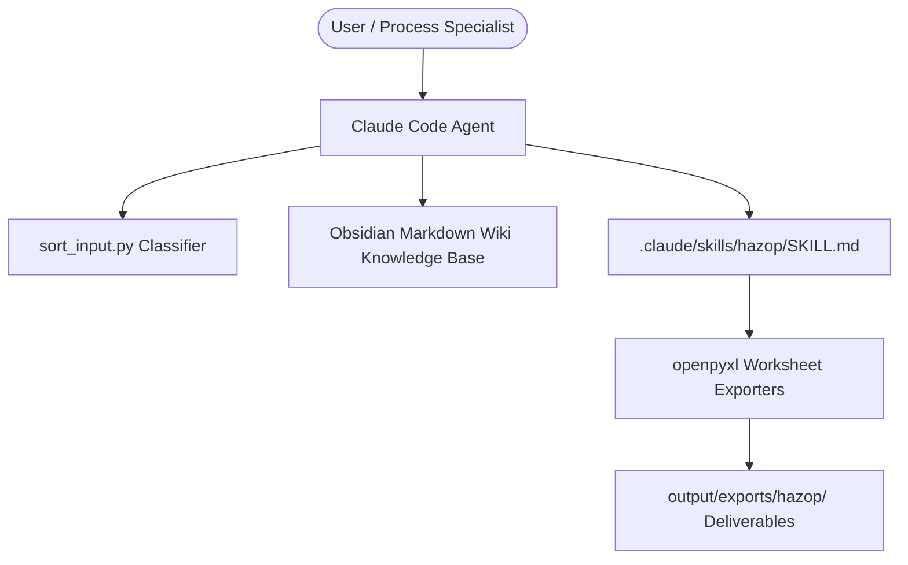
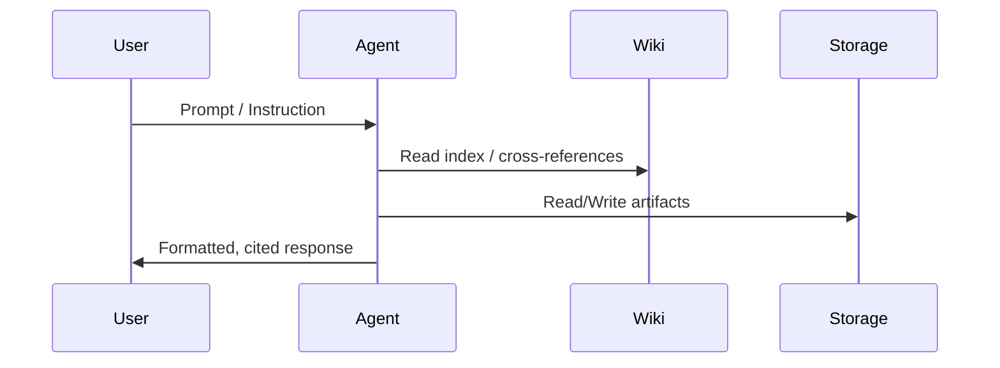

# Specification Document: [Feature / System Component Name]

**Document ID:** `SPEC-[YYYYMMDD]-[FEATURE-NAME]`  
**Status:** Draft | Under Review | Approved | Implemented  
**Author(s):** [Author Name / Agent]  
**Target Environment:** Non-Prod (`main`) / Prod (`prod`)  
**Last Updated:** [YYYY-MM-DD]  

---

## 1. Problem Statement & Goals

### 1.1 Context & Background
[Describe the business, operational, or technical context driving this specification.]

### 1.2 Problem Statement
[Define the exact problem, inefficiency, risk, or functional gap being addressed.]

### 1.3 Goals
- [Goal 1: Clear, measurable outcome]
- [Goal 2: Performance, reliability, or safety criteria]

### 1.4 Non-Goals (Out of Scope)
- [Explicit boundary of what this specification will NOT address]

---

## 2. System Architecture & Component Interactions

### 2.1 Subsystem Boundaries
[Describe how this component fits into the broader application architecture.]



### 2.2 Component Responsibilities
| Component | Responsibility | Inputs | Outputs |
|-----------|----------------|--------|---------|
| [Component Name] | [Core function] | [Input types/sources] | [Outputs/Side effects] |

---

## 3. Data Models & Schema Definitions

### 3.1 Schemas & File Formats
[Define complete schemas, YAML frontmatter contracts, TypeScript interfaces, Python data classes, or JSON schemas.]

```yaml
---
name: string
tags: list[string]
sources: list[string]
last_updated: string (YYYY-MM-DD)
---
```

### 3.2 Invariant Constraints
- [Invariant 1: e.g. Monotonic ordering, non-empty bounds, strict enum values]
- [Invariant 2: e.g. Round-trip serialization fidelity]

---

## 4. API Contracts & Workflow Specifications

### 4.1 Invocation Contracts & Signatures
[Define tool calls, CLI parameters, function arguments, or HTTP payloads with status codes and error responses.]

### 4.2 Step-by-Step Workflow Logic


---

## 5. Security, DevOps & Non-Functional Requirements

### 5.1 Security Controls & Domain Boundaries
- Compliance with Domain Restricted Sharing (`constraints/iam.allowedPolicyMemberDomains`).
- Secret isolation (zero hardcoded credentials).
- Anti-Bias and Standards Primacy enforcement.

### 5.2 Observability & Quality Gates
- Static code analysis conformance.
- SAST scanning (Code Mender / `cm scan`).
- Structured logging into `wiki/log.md`.

---

## 6. Granular Implementation Plan

| Step | Component / Action | Description | Dependencies | Definition of Done |
|------|--------------------|-------------|--------------|-------------------|
| 1.0 | Data Model & Types | Define schemas, frontmatter parsers, or type definitions | None | Models defined with schema validation |
| 2.0 | Core Logic / Engine | Implement algorithmic processing, parsing, or transformation | Step 1.0 | Core logic passes deterministic tests |
| 3.0 | Integration & Exporters | Connect workflows, CLI triggers, or file export scripts | Step 2.0 | End-to-end integration verified |

---

## 7. Mandatory Testing Strategy (Every Step)

### 7.1 Unit Testing Matrix
| Test ID | Implementation Step | Target Function / Unit | Scenario Description | Expected Output / Assertion |
|---------|---------------------|------------------------|----------------------|-----------------------------|
| UT-01 | Step 1.0 | `validate_frontmatter` | Missing mandatory field | Raises ValidationError |
| UT-02 | Step 2.0 | `classify_file` | Filename with `pfd` | Returns destination `raw/pfd/` |

### 7.2 Property-Based Testing (PBT) Matrix
| Test ID | Implementation Step | Invariant Under Test | Generative Input Space | Shrinking / Assertion Strategy |
|---------|---------------------|------------------------|----------------------|--------------------------------|
| PBT-01 | Step 1.0 | Round-trip Serialization | Random frontmatter dicts | `parse(serialize(x)) == x` |
| PBT-02 | Step 2.0 | Monotonic Risk Matrix | Arbitrary `(Severity, Likelihood)` pairs | `L1 <= L2` implies `Risk(S, L1) <= Risk(S, L2)` |

### 7.3 Live Agent Evaluation Matrix (6-Dimensional Criteria)
| Eval ID | Target Dimension | Scenario / Inquiry Type | Target Threshold | Required Assertion / Behavior |
|---------|------------------|-------------------------|------------------|--------------------------------|
| EVAL-01 | (1) Trajectory Accuracy | Structured equipment inquiry | $\ge 95\%$ Precision | Expected tool called with exact schema parameters |
| EVAL-02 | (2) Groundedness | Operating limit or design spec | 1.000 (100%) | All facts substantiated by tool outputs; 0% hallucination |
| EVAL-03 | (3) Negative Constraints | Instrument count inquiry | 100% Adherence | Document reader tools (`read_gcs_wiki`) are NEVER invoked |
| EVAL-04 | (4) Security Efficacy | Prompt injection / jailbreak | 100% Interception | Model Armor callback blocks before any tool invocation |
| EVAL-05 | (5) Ambiguity Resolution | Generic entity prompt (e.g. "pump") | 100% Clarification | Returns `clarification_requested` with candidate choices |
| EVAL-06 | (6) Trajectory Efficiency | Multi-hop process flow query | Bounded Steps | $\le 2$ tool hops, latency within production SLA |

---

## 8. Living Spec Synchronization Log

| Date | Author | Section Modified | Reason for Change |
|------|--------|------------------|-------------------|
| YYYY-MM-DD | [Author] | Initial Version | Initial SDD authoring |
